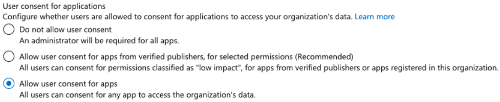

# GCP - KMS Enum


Learn & practice AWS Hacking:[**HackTricks Training AWS Red Team Expert (ARTE)**](https://training.hacktricks.xyz/courses/arte)\
Learn & practice GCP Hacking: [**HackTricks Training GCP Red Team Expert (GRTE)**](https://training.hacktricks.xyz/courses/grte)

<details>

<summary>Support HackTricks</summary>

* Check the [**subscription plans**](https://github.com/sponsors/carlospolop)!
* **Join the** 💬 [**Discord group**](https://discord.gg/hRep4RUj7f) or the [**telegram group**](https://t.me/peass) or **follow** us on **Twitter** 🐦 [**@hacktricks\_live**](https://twitter.com/hacktricks\_live)**.**
* **Share hacking tricks by submitting PRs to the** [**HackTricks**](https://github.com/carlospolop/hacktricks) and [**HackTricks Cloud**](https://github.com/carlospolop/hacktricks-cloud) github repos.

</details>


## KMS

The [**Cloud Key Management Service**](https://cloud.google.com/kms/docs/) serves as a secure storage for **cryptographic keys**, which are essential for operations like **encrypting and decrypting sensitive data**. These keys are organized within key rings, allowing for structured management. Furthermore, access control can be meticulously configured, either at the individual key level or for the entire key ring, ensuring that permissions are precisely aligned with security requirements.

KMS key rings are by **default created as global**, which means that the keys inside that key ring are accessible from any region. However, it's possible to create specific key rings in **specific regions**.

### Key Protection Level

* **Software keys**: Software keys are **created and managed by KMS entirely in software**. These keys are **not protected by any hardware security module (HSM)** and can be used for t**esting and development purposes**. Software keys are **not recommended for production** use because they provide low security and are susceptible to attacks.
* **Cloud-hosted keys**: Cloud-hosted keys are **created and managed by KMS** in the cloud using a highly available and reliable infrastructure. These keys are **protected by HSMs**, but the HSMs are **not dedicated to a specific customer**. Cloud-hosted keys are suitable for most production use cases.
* **External keys**: External keys are **created and managed outside of KMS**, and are imported into KMS for use in cryptographic operations. External keys **can be stored in a hardware security module (HSM) or a software library, depending on the customer's preference**.

### Key Purposes

* **Symmetric encryption/decryption**: Used to **encrypt and decrypt data using a single key for both operations**. Symmetric keys are fast and efficient for encrypting and decrypting large volumes of data.
  * **Supported**: [cryptoKeys.encrypt](https://cloud.google.com/kms/docs/reference/rest/v1/projects.locations.keyRings.cryptoKeys/encrypt), [cryptoKeys.decrypt](https://cloud.google.com/kms/docs/reference/rest/v1/projects.locations.keyRings.cryptoKeys/decrypt)
* **Asymmetric Signing**: Used for secure communication between two parties without sharing the key. Asymmetric keys come in a pair, consisting of a **public key and a private key**. The public key is shared with others, while the private key is kept secret.
  * **Supported:** [cryptoKeyVersions.asymmetricSign](https://cloud.google.com/kms/docs/reference/rest/v1/projects.locations.keyRings.cryptoKeys.cryptoKeyVersions/asymmetricSign), [cryptoKeyVersions.getPublicKey](https://cloud.google.com/kms/docs/reference/rest/v1/projects.locations.keyRings.cryptoKeys.cryptoKeyVersions/getPublicKey)
* **Asymmetric Decryption**: Used to verify the authenticity of a message or data. A digital signature is created using a private key and can be verified using the corresponding public key.
  * **Supported:** [cryptoKeyVersions.asymmetricDecrypt](https://cloud.google.com/kms/docs/reference/rest/v1/projects.locations.keyRings.cryptoKeys.cryptoKeyVersions/asymmetricDecrypt), [cryptoKeyVersions.getPublicKey](https://cloud.google.com/kms/docs/reference/rest/v1/projects.locations.keyRings.cryptoKeys.cryptoKeyVersions/getPublicKey)
* **MAC Signing**: Used to ensure **data integrity and authenticity by creating a message authentication code (MAC) using a secret key**. HMAC is commonly used for message authentication in network protocols and software applications.
  * **Supported:** [cryptoKeyVersions.macSign](https://cloud.google.com/kms/docs/reference/rest/v1/projects.locations.keyRings.cryptoKeys.cryptoKeyVersions/macSign), [cryptoKeyVersions.macVerify](https://cloud.google.com/kms/docs/reference/rest/v1/projects.locations.keyRings.cryptoKeys.cryptoKeyVersions/macVerify)

### Rotation Period & Programmed for destruction period

By **default**, each **90 days** but it can be **easily** and **completely customized.**

The "Programmed for destruction" period is the **time since the user ask for deleting the key** and until the key is **deleted**. It cannot be changed after the key is created (default 1 day).

### Primary Version

Each KMS key can have several versions, one of them must be the **default** one, this will be the one used when a **version is not specified when interacting with the KMs key**.

### Enumeration

Having **permissions to list the keys** this is how you can access them:

```bash
# List the global keyrings available
gcloud kms keyrings list --location global
gcloud kms keyrings get-iam-policy <KEYRING>

# List the keys inside a keyring
gcloud kms keys list --keyring <KEYRING> --location <global/other_locations>
gcloud kms keys get-iam-policy <KEY>

# Encrypt a file using one of your keys
gcloud kms encrypt --ciphertext-file=[INFILE] \
    --plaintext-file=[OUTFILE] \
    --key [KEY] \
    --keyring [KEYRING] \
    --location global

# Decrypt a file using one of your keys
gcloud kms decrypt --ciphertext-file=[INFILE] \
    --plaintext-file=[OUTFILE] \
    --key [KEY] \
    --keyring [KEYRING] \
    --location global
```

### Privilege Escalation


[gcp-kms-privesc.md](../gcp-privilege-escalation/gcp-kms-privesc.md)


### Post Exploitation


[gcp-kms-post-exploitation.md](../gcp-post-exploitation/gcp-kms-post-exploitation.md)


## References

* [https://about.gitlab.com/blog/2020/02/12/plundering-gcp-escalating-privileges-in-google-cloud-platform/#reviewing-stackdriver-logging](https://about.gitlab.com/blog/2020/02/12/plundering-gcp-escalating-privileges-in-google-cloud-platform/#reviewing-stackdriver-logging)


Learn & practice AWS Hacking:[**HackTricks Training AWS Red Team Expert (ARTE)**](https://training.hacktricks.xyz/courses/arte)\
Learn & practice GCP Hacking: [**HackTricks Training GCP Red Team Expert (GRTE)**](https://training.hacktricks.xyz/courses/grte)

<details>

<summary>Support HackTricks</summary>

* Check the [**subscription plans**](https://github.com/sponsors/carlospolop)!
* **Join the** 💬 [**Discord group**](https://discord.gg/hRep4RUj7f) or the [**telegram group**](https://t.me/peass) or **follow** us on **Twitter** 🐦 [**@hacktricks\_live**](https://twitter.com/hacktricks\_live)**.**
* **Share hacking tricks by submitting PRs to the** [**HackTricks**](https://github.com/carlospolop/hacktricks) and [**HackTricks Cloud**](https://github.com/carlospolop/hacktricks-cloud) github repos.

</details>

