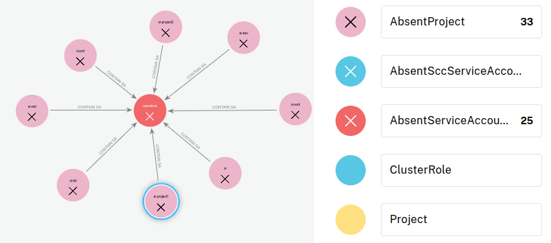

# OpenShift - Missing Service Account

## Missing Service Account

It happens that cluster is deployed with preconfigured template automatically setting Roles, RoleBindings and even SCC to service account that is not yet created. This can lead to privilege escalation in the case where you can create them. In this case, you would be able to get the token of the SA newly created and the role or SCC associated. Same case happens when the missing SA is part of a missing project, in this case if you can create the project and then the SA you get the Roles and SCC associated.

<figure><figcaption></figcaption></figure>

In the previous graph we got multiple AbsentProject meaning multiple project that appears in Roles Bindings or SCC but are not yet created in the cluster. In the same vein we also got an AbsentServiceAccount.

If we can create a project and the missing SA in it, the SA will inherited from the Role or the SCC that were targeting the AbsentServiceAccount. Which can lead to privilege escalation.

The following example show a missing SA which is granted node-exporter SCC:

<figure><figcaption></figcaption></figure>

## Tools

The following tool can be use to enumerate this issue and more generally to graph an OpenShift cluster:


