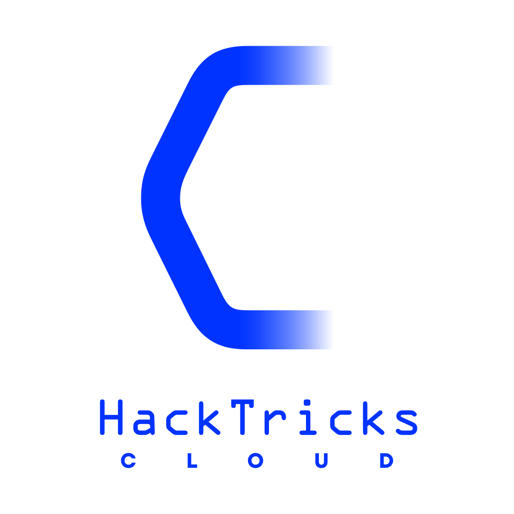

# Pentesting CI/CD Methodology

{{#include ../banners/hacktricks-training.md}}

<figure><figcaption></figcaption></figure>

## VCS

VCS означає **Систему Контролю Версій**, ця система дозволяє розробникам **управляти своїм вихідним кодом**. Найбільш поширеною є **git**, і ви зазвичай знайдете компанії, які використовують його на одній з наступних **платформ**:

- Github
- Gitlab
- Bitbucket
- Gitea
- Хмарні провайдери (вони пропонують свої власні платформи VCS)

## CI/CD Pipelines

CI/CD пайплайни дозволяють розробникам **автоматизувати виконання коду** для різних цілей, включаючи створення, тестування та розгортання додатків. Ці автоматизовані робочі процеси **ініціюються конкретними діями**, такими як пуші коду, запити на злиття або заплановані завдання. Вони корисні для спрощення процесу від розробки до виробництва.

Однак ці системи потрібно **виконувати десь** і зазвичай з **привілейованими обліковими даними для розгортання коду або доступу до чутливої інформації**.

## VCS Pentesting Methodology

> [!NOTE]
> Навіть якщо деякі платформи VCS дозволяють створювати пайплайни, у цьому розділі ми будемо аналізувати лише потенційні атаки на контроль вихідного коду.

Платформи, які містять вихідний код вашого проекту, містять чутливу інформацію, і людям потрібно бути дуже обережними з правами, наданими всередині цієї платформи. Ось деякі поширені проблеми на платформах VCS, які зловмисник може зловживати:

- **Витоки**: Якщо ваш код містить витоки в комітах, і зловмисник може отримати доступ до репозиторію (оскільки він публічний або тому, що у нього є доступ), він може виявити витоки.
- **Доступ**: Якщо зловмисник може **отримати доступ до облікового запису всередині платформи VCS**, він може отримати **більшу видимість і права**.
- **Реєстрація**: Деякі платформи дозволяють зовнішнім користувачам створювати обліковий запис.
- **SSO**: Деякі платформи не дозволяють користувачам реєструватися, але дозволяють будь-кому отримати доступ з дійсним SSO (тому зловмисник може використовувати свій обліковий запис github для входу, наприклад).
- **Облікові дані**: Ім'я користувача + пароль, особисті токени, ssh ключі, Oauth токени, куки... є кілька видів токенів, які користувач може вкрасти, щоб отримати доступ до репозиторію.
- **Webhooks**: Платформи VCS дозволяють генерувати вебхуки. Якщо вони **не захищені** невидимими секретами, **зловмисник може зловживати ними**.
- Якщо секрет не встановлений, зловмисник може зловживати вебхуком третьої сторони.
- Якщо секрет у URL, те ж саме відбувається, і зловмисник також має секрет.
- **Компрометація коду:** Якщо зловмисник має якийсь вид **доступу на запис** до репозиторіїв, він може спробувати **впровадити шкідливий код**. Щоб досягти успіху, йому може знадобитися **обійти захист гілок**. Ці дії можуть бути виконані з різними цілями на увазі:
- Компрометація основної гілки для **компрометації виробництва**.
- Компрометація основної (або інших гілок) для **компрометації машин розробників** (оскільки вони зазвичай виконують тести, terraform або інші речі всередині репозиторію на своїх машинах).
- **Компрометація пайплайна** (перевірте наступний розділ).

## Pipelines Pentesting Methodology

Найпоширеніший спосіб визначити пайплайн - це використання **файлу конфігурації CI, розміщеного в репозиторії**, який будує пайплайн. Цей файл описує порядок виконуваних завдань, умови, які впливають на потік, і налаштування середовища збірки.\
Ці файли зазвичай мають послідовну назву та формат, наприклад — Jenkinsfile (Jenkins), .gitlab-ci.yml (GitLab), .circleci/config.yml (CircleCI) та YAML файли GitHub Actions, розташовані під .github/workflows. Коли пайплайн ініціюється, завдання пайплайна **витягує код** з вибраного джерела (наприклад, коміт / гілка) і **виконує команди, зазначені у файлі конфігурації CI** проти цього коду.

Отже, остаточна мета зловмисника полягає в тому, щоб якимось чином **компрометувати ці файли конфігурації** або **команди, які вони виконують**.

### PPE - Poisoned Pipeline Execution

Шлях Poisoned Pipeline Execution (PPE) експлуатує права в репозиторії SCM для маніпуляції CI пайплайном і виконання шкідливих команд. Користувачі з необхідними правами можуть змінювати файли конфігурації CI або інші файли, які використовуються завданням пайплайна, щоб включити шкідливі команди. Це "отруює" CI пайплайн, що призводить до виконання цих шкідливих команд.

Щоб зловмисник успішно виконав атаку PPE, йому потрібно:

- Мати **доступ на запис до платформи VCS**, оскільки зазвичай пайплайни ініціюються, коли виконується пуш або запит на злиття. (Перевірте методологію пентестингу VCS для підсумку способів отримання доступу).
- Зверніть увагу, що іноді **зовнішній PR вважається "доступом на запис"**.
- Навіть якщо у нього є права на запис, йому потрібно бути впевненим, що він може **змінити файл конфігурації CI або інші файли, на які покладається конфігурація**.
- Для цього йому може знадобитися мати можливість **обійти захист гілок**.

Існує 3 варіанти PPE:

- **D-PPE**: Атака **Прямого PPE** відбувається, коли зловмисник **змінює файл конфігурації CI**, який буде виконано.
- **I-DDE**: Атака **Непрямого PPE** відбувається, коли зловмисник **змінює** **файл**, на який **покладається** файл конфігурації CI, що буде виконано (наприклад, make файл або конфігурацію terraform).
- **Public PPE або 3PE**: У деяких випадках пайплайни можуть бути **ініційовані користувачами, які не мають доступу на запис у репозиторії** (і які можуть навіть не бути частиною організації), оскільки вони можуть надіслати PR.
- **3PE Command Injection**: Зазвичай CI/CD пайплайни **встановлюють змінні середовища** з **інформацією про PR**. Якщо це значення може контролюватися зловмисником (наприклад, заголовок PR) і **використовується** в **небезпечному місці** (наприклад, виконуючи **sh команди**), зловмисник може **впроваджувати команди туди**.

### Exploitation Benefits

Знаючи 3 варіанти отруєння пайплайна, давайте перевіримо, що зловмисник може отримати після успішної експлуатації:

- **Секрети**: Як вже згадувалося раніше, пайплайни вимагають **привілеїв** для своїх завдань (отримання коду, його збірка, розгортання...) і ці привілеї зазвичай **надаються в секретах**. Ці секрети зазвичай доступні через **змінні середовища або файли всередині системи**. Тому зловмисник завжди намагатиметься ексфільтрувати якомога більше секретів.
- Залежно від платформи пайплайна зловмисник **може знадобитися вказати секрети в конфігурації**. Це означає, що якщо зловмисник не може змінити конфігурацію CI пайплайна (**I-PPE**, наприклад), він може **лише ексфільтрувати секрети, які має цей пайплайн**.
- **Обчислення**: Код виконується десь, залежно від того, де він виконується, зловмисник може мати можливість подальшого переміщення.
- **On-Premises**: Якщо пайплайни виконуються на місці, зловмисник може опинитися в **внутрішній мережі з доступом до більше ресурсів**.
- **Cloud**: Зловмисник може отримати доступ до **інших машин у хмарі**, але також може **ексфільтрувати** токени IAM ролей/облікових записів **з нього**, щоб отримати **додатковий доступ всередині хмари**.
- **Платформи машини**: Іноді завдання виконуються всередині **машин платформи пайплайнів**, які зазвичай знаходяться в хмарі з **без додаткового доступу**.
- **Вибрати це:** Іноді **платформа пайплайнів має налаштовані кілька машин**, і якщо ви можете **змінити файл конфігурації CI**, ви можете **вказати, де хочете виконати шкідливий код**. У цій ситуації зловмисник, ймовірно, запустить зворотний шелл на кожній можливій машині, щоб спробувати експлуатувати її далі.
- **Компрометація виробництва**: Якщо ви знаходитесь всередині пайплайна, і фінальна версія будується та розгортається з нього, ви можете **компрометувати код, який буде виконуватися в виробництві**.

## More relevant info

### Tools & CIS Benchmark

- [**Chain-bench**](https://github.com/aquasecurity/chain-bench) є інструментом з відкритим кодом для аудиту вашого стеку постачання програмного забезпечення на предмет відповідності безпеці на основі нового [**CIS Software Supply Chain benchmark**](https://github.com/aquasecurity/chain-bench/blob/main/docs/CIS-Software-Supply-Chain-Security-Guide-v1.0.pdf). Аудит зосереджується на всьому процесі SDLC, де він може виявити ризики від часу коду до часу розгортання.

### Top 10 CI/CD Security Risk

Перевірте цю цікаву статтю про топ 10 ризиків CI/CD відповідно до Cider: [**https://www.cidersecurity.io/top-10-cicd-security-risks/**](https://www.cidersecurity.io/top-10-cicd-security-risks/)

### Labs

- На кожній платформі, яку ви можете запустити локально, ви знайдете, як запустити її локально, щоб ви могли налаштувати її так, як вам потрібно, щоб протестувати.
- Лабораторія Gitea + Jenkins: [https://github.com/cider-security-research/cicd-goat](https://github.com/cider-security-research/cicd-goat)

### Automatic Tools

- [**Checkov**](https://github.com/bridgecrewio/checkov): **Checkov** є інструментом статичного аналізу коду для інфраструктури як коду.

## References

- [https://www.cidersecurity.io/blog/research/ppe-poisoned-pipeline-execution/?utm_source=github\&utm_medium=github_page\&utm_campaign=ci%2fcd%20goat_060422](https://www.cidersecurity.io/blog/research/ppe-poisoned-pipeline-execution/?utm_source=github&utm_medium=github_page&utm_campaign=ci%2fcd%20goat_060422)

{{#include ../banners/hacktricks-training.md}}
