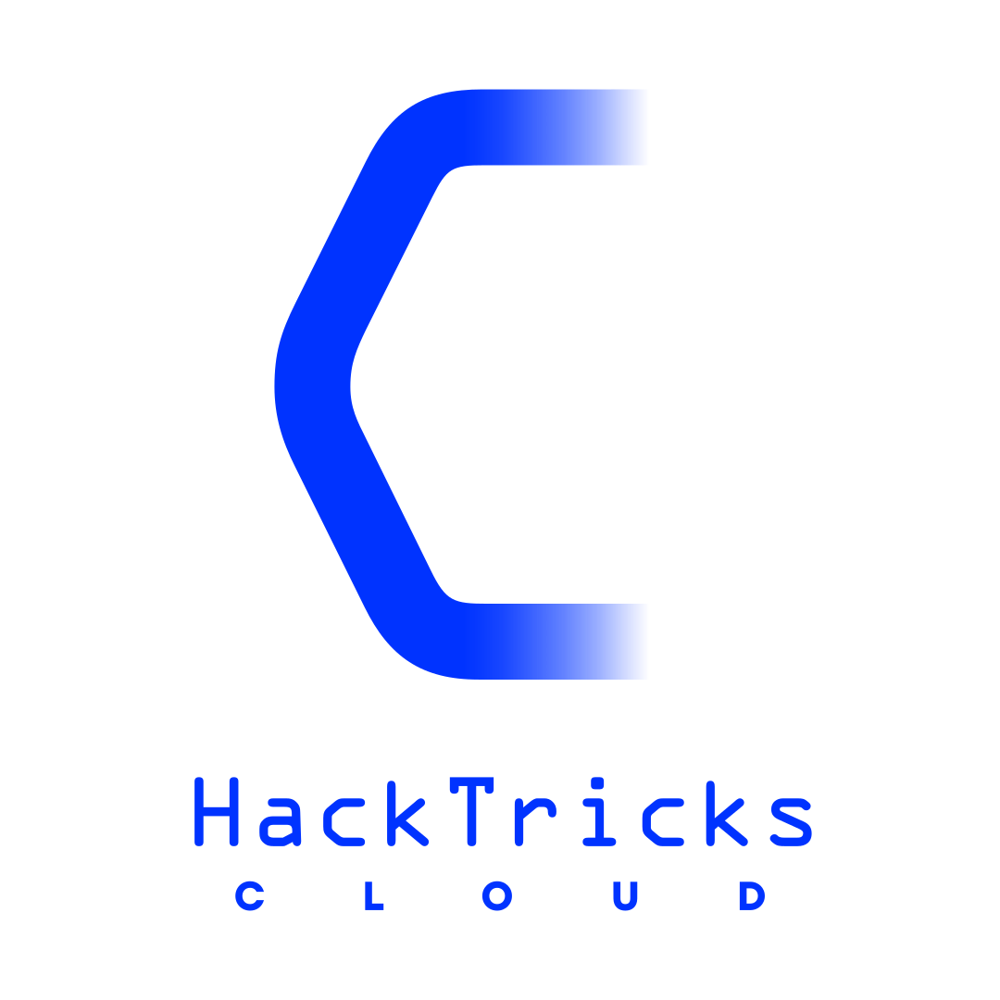

# Metodologia de Pentesting CI/CD

{{#include ../banners/hacktricks-training.md}}

<figure><figcaption></figcaption></figure>

## VCS

VCS significa **Version Control System**, este sistema permite que desenvolvedores **gerenciem seu código-fonte**. O mais comum é **git** e você normalmente encontrará empresas usando-o em uma das seguintes **plataformas**:

- Github
- Gitlab
- Bitbucket
- Gitea
- Gitblit
- Cloud providers (eles oferecem suas próprias plataformas de VCS)

## CI/CD Pipelines

CI/CD pipelines permitem que desenvolvedores **automatizem a execução de código** para vários propósitos, incluindo build, teste e deploy de aplicações. Esses fluxos de trabalho automatizados são **acionados por ações específicas**, como pushes de código, pull requests ou tarefas agendadas. Eles são úteis para simplificar o processo do desenvolvimento até a produção.

No entanto, esses sistemas precisam ser **executados em algum lugar** e, normalmente, com **credenciais privilegiadas para fazer deploy de código ou acessar informações sensíveis**.

## Metodologia de Pentesting de VCS

> [!NOTE]
> Mesmo que algumas plataformas de VCS permitam criar pipelines, para esta seção vamos analisar apenas ataques potenciais ao controle do código-fonte.

Plataformas que contêm o código-fonte do seu projeto contêm informações sensíveis e as pessoas precisam ser muito cuidadosas com as permissões concedidas dentro dessa plataforma. Estes são alguns problemas comuns em plataformas de VCS que um atacante poderia abusar:

- **Leaks**: Se o seu código contém leaks nos commits e o atacante pode acessar o repo (porque ele é público ou porque ele tem acesso), ele pode descobrir os leaks.
- **Access**: Se um atacante pode **acessar uma conta dentro da plataforma VCS**, ele pode ganhar **mais visibilidade e permissões**.
- **Register**: Algumas plataformas apenas permitem que usuários externos criem uma conta.
- **SSO**: Algumas plataformas não permitem que usuários se registrem, mas permitem que qualquer pessoa acesse com um SSO válido (então um atacante poderia usar sua conta do github para entrar, por exemplo).
- **Credentials**: Username+Pwd, personal tokens, ssh keys, Oauth tokens, cookies... há vários tipos de tokens que um usuário poderia roubar para acessar de alguma forma um repo.
- **Webhooks**: Plataformas de VCS permitem gerar webhooks. Se eles **não estiverem protegidos** com secrets invisíveis, um **atacante poderia abusar deles**.
- Se nenhum secret estiver em uso, o atacante poderia abusar do webhook da plataforma de terceiros
- Se o secret estiver na URL, a mesma coisa acontece e o atacante também terá o secret
- **Code compromise:** Se um ator malicioso tiver algum tipo de acesso de **write** sobre os repos, ele poderia tentar **injetar código malicioso**. Para ter sucesso, ele pode precisar **bypassar branch protections**. Essas ações podem ser realizadas com diferentes objetivos em mente:
- Comprometer a main branch para **comprometer a produção**.
- Comprometer a main (ou outras branches) para **comprometer as máquinas dos desenvolvedores** (já que eles normalmente executam test, terraform ou outras coisas dentro do repo em suas máquinas).
- **Comprometer o pipeline** (veja a próxima seção)

## Metodologia de Pentesting de Pipelines

A forma mais comum de definir um pipeline é usando um **arquivo de configuração CI hospedado no repositório** que o pipeline constrói. Esse arquivo descreve a ordem dos jobs executados, as condições que afetam o fluxo e as configurações do ambiente de build.\
Esses arquivos normalmente têm um nome e formato consistentes, por exemplo — Jenkinsfile (Jenkins), .gitlab-ci.yml (GitLab), .circleci/config.yml (CircleCI) e os arquivos YAML do GitHub Actions localizados em .github/workflows. Quando acionado, o job do pipeline **faz pull do código** da origem selecionada (por exemplo, commit / branch) e **executa os comandos especificados no arquivo de configuração CI** contra esse código.

Portanto, o objetivo final do atacante é de alguma forma **comprometer esses arquivos de configuração** ou os **comandos que eles executam**.

> [!TIP]
> Alguns builders hospedados permitem que contribuintes escolham o Docker build context e o caminho do Dockerfile. Se o context estiver sob controle do atacante, você pode defini-lo fora do repo (por exemplo, "..") para ingerir arquivos do host durante o build e exfiltrar secrets. Veja:
>
>{{#ref}}
>docker-build-context-abuse.md
>{{#endref}}

### PPE - Poisoned Pipeline Execution

O caminho Poisoned Pipeline Execution (PPE) explora permissões em um repositório SCM para manipular um pipeline CI e executar comandos maliciosos. Usuários com as permissões necessárias podem modificar arquivos de configuração CI ou outros arquivos usados pelo job do pipeline para incluir comandos maliciosos. Isso "envenena" o pipeline CI, levando à execução desses comandos maliciosos.

Para um ator malicioso ter sucesso ao realizar um ataque PPE, ele precisa ser capaz de:

- Ter **write access à plataforma VCS**, já que normalmente pipelines são acionados quando um push ou um pull request é realizado. (Veja a metodologia de pentesting de VCS para um resumo das formas de obter acesso).
- Note que às vezes um **external PR conta como "write access"**.
- Mesmo tendo permissões de write, ele precisa ter certeza de que pode **modificar o arquivo de configuração CI ou outros arquivos dos quais a config depende**.
- Para isso, ele pode precisar ser capaz de **bypassar branch protections**.

Existem 3 variações de PPE:

- **D-PPE**: Um ataque **Direct PPE** ocorre quando o ator **modifica o arquivo de configuração CI** que será executado.
- **I-DDE**: Um ataque **Indirect PPE** ocorre quando o ator **modifica** um **arquivo** do qual o arquivo de configuração CI que será executado **depende** (como um make file ou uma config terraform).
- **Public PPE or 3PE**: Em alguns casos os pipelines podem ser **acionados por usuários que não têm write access no repo** (e que talvez nem façam parte da org) porque eles podem enviar um PR.
- **3PE Command Injection**: Normalmente, CI/CD pipelines vão **definir variáveis de ambiente** com **informações sobre o PR**. Se esse valor puder ser controlado por um atacante (como o título do PR) e for **usado** em um **local perigoso** (como executar comandos **sh**), um atacante pode **injetar comandos ali**.

### Benefícios da Exploração

Conhecendo as 3 variações para envenenar um pipeline, vamos ver o que um atacante poderia obter após uma exploração bem-sucedida:

- **Secrets**: Como mencionado anteriormente, pipelines exigem **privilégios** para seus jobs (obter o código, buildá-lo, fazer deploy...) e esses privilégios geralmente são **concedidos em secrets**. Esses secrets normalmente ficam acessíveis via **variáveis de env ou arquivos dentro do sistema**. Portanto, um atacante sempre tentará exfiltrar o máximo de secrets possível.
- Dependendo da plataforma do pipeline, o atacante **pode precisar especificar os secrets na config**. Isso significa que, se o atacante não puder modificar a configuração CI do pipeline (**I-PPE**, por exemplo), ele poderá **apenas exfiltrar os secrets que esse pipeline possui**.
- **Computação**: O código é executado em algum lugar; dependendo de onde ele é executado, um atacante pode conseguir pivotar mais.
- **On-Premises**: Se os pipelines forem executados on premises, um atacante pode acabar em uma **rede interna com acesso a mais recursos**.
- **Cloud**: O atacante poderia acessar **outras máquinas na cloud**, mas também poderia **exfiltrar** tokens de IAM roles/service accounts **a partir dela** para obter **mais acesso dentro da cloud**.
- **Platforms machine**: Às vezes os jobs serão executados dentro das **máquinas da plataforma de pipelines**, que normalmente estão dentro de uma cloud com **sem mais acesso**.
- **Select it:** Às vezes a **plataforma de pipelines terá várias máquinas configuradas** e, se você puder **modificar o arquivo de configuração CI**, poderá **indicar onde quer executar o código malicioso**. Nessa situação, um atacante provavelmente executará uma reverse shell em cada máquina possível para tentar explorá-la mais.
- **Compromise production**: Se você estiver dentro do pipeline e a versão final for buildada e deployada a partir dele, você poderia **comprometer o código que vai acabar executando em produção**.

### Dependency & Registry Supply-Chain Abuse

Comprometer um CI/CD pipeline ou roubar credenciais dele pode permitir que um atacante vá de **pipeline execution** para **code execution em todo o ecossistema** ao backdoorar dependencies ou ferramentas de release:

- **Install-time code execution via package hooks**: publique uma versão de package que adicione `preinstall`, `postinstall`, `prepare` ou hooks similares para que o payload rode automaticamente nas máquinas dos developers e nos CI runners durante a instalação de dependências.
- **Secondary execution paths**: mesmo que os alvos instalem com `--ignore-scripts`, um package malicioso ainda pode registrar um nome de CLI comum no campo `bin`, fazendo com que o wrapper controlado pelo atacante seja vinculado via symlink em `PATH` e execute depois quando o comando for usado.
- **Runtime bootstrapping**: um pequeno installer pode baixar um segundo runtime ou toolchain durante a instalação (por exemplo Bun ou um interpreter empacotado) e então iniciar o payload principal com ele, evitando dependências locais.
- **Credential harvesting from build environments**: uma vez que o código rode dentro do CI, verifique variáveis de ambiente, `~/.npmrc`, `~/.git-credentials`, chaves SSH, configs de cloud CLI e ferramentas locais como `gh auth token`. No GitHub Actions, procure também secrets e artifacts específicos do runner.
- **Workflow injection with stolen GitHub tokens**: um token com permissões **`repo` + `workflow`** é suficiente para criar uma branch, fazer commit de um arquivo malicioso dentro de `.github/workflows/`, acioná-lo, coletar os artifacts/logs produzidos e depois apagar a branch temporária/execução do workflow para reduzir rastros.
- **Wormable registry propagation**: tokens npm roubados devem ser validados quanto a permissões de **publish** e se eles contornam 2FA. Se sim, enumere packages graváveis, baixe seus tarballs, injete um loader como `setup.mjs`, defina `preinstall` para executá-lo, incremente a versão patch e republique. Isso transforma um compromisso de CI em autoexecução downstream em outros ambientes.

#### Practical checks during an assessment

- Revise a automação de release em busca de hooks de package-manager adicionados ao `package.json`, entradas `bin` inesperadas ou bumps de versão que apenas modificam o artifact de release.
- Verifique se o CI armazena credenciais de registry de longa duração em arquivos de texto como `~/.npmrc` em vez de usar OIDC de curta duração ou trusted publishing.
- Verifique se tokens do GitHub disponíveis no CI podem escrever arquivos de workflow ou criar branches/tags.
- Se houver suspeita de um package comprometido, inspecione o tarball publicado e não apenas o repositório Git, porque o loader/runtime malicioso pode existir apenas no artifact publicado.
- Procure por execução inesperada de package-manager dentro do CI, como `npm install` em vez de `npm ci`, downloads/execução inesperados de Bun ou novos artifacts de workflow gerados a partir de branches temporárias.
- Revise engines de deploy GitOps também como alvos de CI/CD. Enumeração específica de Argo CD, abuso de repo-server e ataques de cache poisoning em Redis são cobertos em [Argo CD Security](argocd-security.md).

## Mais informações relevantes

### Tools & CIS Benchmark

- [**Chain-bench**](https://github.com/aquasecurity/chain-bench) é uma ferramenta open-source para auditar sua stack de software supply chain quanto à conformidade de segurança com base em um novo [**CIS Software Supply Chain benchmark**](https://github.com/aquasecurity/chain-bench/blob/main/docs/CIS-Software-Supply-Chain-Security-Guide-v1.0.pdf). A auditoria foca em todo o processo de SDLC, onde pode revelar riscos desde o code time até o deploy time.

### Top 10 CI/CD Security Risk

Confira este artigo interessante sobre os 10 principais riscos de CI/CD segundo a Cider: [**https://www.cidersecurity.io/top-10-cicd-security-risks/**](https://www.cidersecurity.io/top-10-cicd-security-risks/)

### Labs

- Em cada plataforma que você pode executar localmente, você encontrará como iniciá-la localmente para poder configurá-la como quiser para testá-la
- Gitea + Jenkins lab: [https://github.com/cider-security-research/cicd-goat](https://github.com/cider-security-research/cicd-goat)

### Automatic Tools

- [**Checkov**](https://github.com/bridgecrewio/checkov): **Checkov** é uma ferramenta de análise estática de código para infrastructure-as-code.

## References

- [https://www.cidersecurity.io/blog/research/ppe-poisoned-pipeline-execution/?utm_source=github\&utm_medium=github_page\&utm_campaign=ci%2fcd%20goat_060422](https://www.cidersecurity.io/blog/research/ppe-poisoned-pipeline-execution/?utm_source=github&utm_medium=github_page&utm_campaign=ci%2fcd%20goat_060422)
- [The npm Threat Landscape: Attack Surface and Mitigations](https://unit42.paloaltonetworks.com/monitoring-npm-supply-chain-attacks/)
- [Checkmarx Security Update: April 22, 2026](https://checkmarx.com/blog/checkmarx-security-update-april-22/?p=108469)

{{#include ../banners/hacktricks-training.md}}
