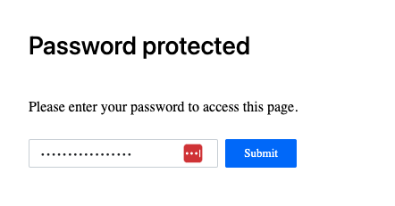

# Az - Static Web Apps

{{#include ../../../banners/hacktricks-training.md}}

## Informations de base sur les applications Web statiques

Azure Static Web Apps est un service cloud pour héberger **des applications web statiques avec CI/CD automatique à partir de dépôts comme GitHub**. Il offre une distribution de contenu mondiale, des backends sans serveur et HTTPS intégré, ce qui le rend sécurisé et évolutif. Cependant, les risques incluent des CORS mal configurés, une authentification insuffisante et une altération du contenu, ce qui peut exposer les applications à des attaques comme XSS et des fuites de données si elles ne sont pas correctement gérées.

> [!TIP]
> Lorsqu'une application statique est créée, vous pouvez choisir la **politique d'autorisation de déploiement** entre **jeton de déploiement** et **workflow GitHub Actions**.


### Authentification des applications Web

Il est possible de **configurer un mot de passe** pour accéder à l'application Web. La console web permet de le configurer pour protéger uniquement les environnements de staging ou à la fois les environnements de staging et de production.

Voici à quoi ressemble une application web protégée par mot de passe au moment de la rédaction :

<figure><figcaption></figcaption></figure>


Il est possible de voir **si un mot de passe est utilisé** et quels environnements sont protégés avec :
```bash
az rest --method GET \
--url "/subscriptions/<subscription-id>/resourceGroups/Resource_Group_1/providers/Microsoft.Web/staticSites/<app-name>/config/basicAuth?api-version=2024-04-01"
```
Cependant, cela **ne montrera pas le mot de passe en texte clair**, juste quelque chose comme : `"password": "**********************"`.

### Routes

Les routes définissent **comment les requêtes HTTP entrantes sont traitées** au sein d'une application web statique. Configurées dans le fichier **`staticwebapp.config.json`**, elles contrôlent la réécriture d'URL, les redirections, les restrictions d'accès et l'autorisation basée sur les rôles, garantissant un traitement approprié des ressources et la sécurité.

Quelques exemples :
```json
{
"routes": [
{
"route": "/",
"rewrite": "/index.html"
},
{
"route": "/about",
"rewrite": "/about.html"
},
{
"route": "/api/*",
"allowedRoles": ["authenticated"]
},
{
"route": "/admin",
"redirect": "/login",
"statusCode": 302
}
],
"navigationFallback": {
"rewrite": "/index.html",
"exclude": ["/api/*", "/assets/*"]
}
}
```
## Énumération
```bash
# List Static Webapps
az staticwebapp list --output table

# Get Static Webapp details
az staticwebapp show --name <name> --resource-group <res-group> --output table

# Get appsettings
az staticwebapp appsettings list --name <name>

# Get env information
az staticwebapp environment list --name <name>
az staticwebapp environment functions --name <name>

# Get API key
az staticwebapp secrets list --name <name>

# Get invited users
az staticwebapp users list --name <name>

# Get database connections
az rest --method GET \
--url "https://management.azure.com/subscriptions/<subscription-id>/resourceGroups/<res-group>/providers/Microsoft.Web/staticSites/<app-name>/databaseConnections?api-version=2021-03-01"

## Once you have the database connection name ("default" by default) you can get the connection string with the credentials
az rest --method POST \
--url "https://management.azure.com/subscriptions/<subscription-id>/resourceGroups/<res-group>/providers/Microsoft.Web/staticSites/<app-name>/databaseConnections/default/show?api-version=2021-03-01"
```
## Exemples pour générer des applications Web

Vous pouvez trouver un bel exemple pour générer une application web dans le lien suivant : [https://learn.microsoft.com/en-us/azure/static-web-apps/get-started-portal?tabs=react&pivots=github](https://learn.microsoft.com/en-us/azure/static-web-apps/get-started-portal?tabs=react&pivots=github)

1. Forkez le dépôt https://github.com/staticwebdev/react-basic/generate vers votre compte GitHub et nommez-le `my-first-static-web-app`
2. Dans le portail Azure, créez une Static Web App en configurant l'accès GitHub et en sélectionnant le nouveau dépôt forké précédemment
3. Créez-le, attendez quelques minutes et vérifiez votre nouvelle page !

## Post Exploitation

{{#ref}}
../az-privilege-escalation/az-static-web-apps-post-exploitation.md
{{#endref}}

## Références

- [https://learn.microsoft.com/en-in/azure/app-service/overview](https://learn.microsoft.com/en-in/azure/app-service/overview)
- [https://learn.microsoft.com/en-us/azure/app-service/overview-hosting-plans](https://learn.microsoft.com/en-us/azure/app-service/overview-hosting-plans)

{{#include ../../../banners/hacktricks-training.md}}
