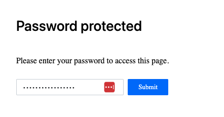

# Az Static Web Apps

{{#include ../../../banners/hacktricks-training.md}}

## Static Web Apps की मूल जानकारी

Azure Static Web Apps, **GitHub जैसे repositories से automatic CI/CD वाले static web apps को host करने** की cloud service है। यह global content delivery, serverless backends और built-in HTTPS प्रदान करती है, जिससे यह secure और scalable बनती है।<sup>[[3]](#references)</sup> हालांकि service को "static" कहा जाता है, इसका अर्थ यह नहीं है कि यह पूरी तरह safe है। Risks में misconfigured CORS, insufficient authentication और content tampering शामिल हैं, जो सही तरीके से manage न किए जाने पर apps को XSS और data leakage जैसे attacks के लिए expose कर सकते हैं।

### Deployment Authentication

> [!TIP]
> जब कोई Static App create किया जाता है, तो आप **deployment authorization policy** में **Azure deployment token** और **GitHub access token** के बीच चयन कर सकते हैं।<sup>[[4]](#references)</sup>

- **Deployment token**: एक token generate किया जाता है और deployment process को authenticate करने के लिए उपयोग किया जाता है। **इस token वाले किसी भी व्यक्ति के लिए app का नया version deploy करना पर्याप्त है**। Repo में token को secret के रूप में रखकर एक **GitHub Action automatically deploy** किया जाता है, ताकि repo के update होने पर app का नया version deploy किया जा सके।<sup>[[4]](#references)[[5]](#references)</sup>
- **GitHub access token**: Generated GitHub Actions workflow **`actions/github-script@v6`** के साथ OIDC ID token प्राप्त करता है और इसे **`github_id_token`** के रूप में **`Azure/static-web-apps-deploy@v1`** को pass करता है; Microsoft के example में दिखाए अनुसार workflow में अभी भी `azure_static_web_apps_api_token` शामिल होता है।<sup>[[4]](#references)</sup>


### Web App Basic Authentication

Web App को access करने के लिए **password configure करना** संभव है। Web console इसे केवल staging environments या staging और production दोनों environments को protect करने के लिए configure करने की अनुमति देता है।<sup>[[6]](#references)</sup>

लेखन के समय password protected web app इस प्रकार दिखाई देता है:

<figure><figcaption></figcaption></figure>


ARM का `Get Basic Auth` operation दिखाता है कि **basic authentication enabled है या नहीं** और कौन से environments इससे protected हैं:
```bash
az rest --method GET \
--url "/subscriptions/<subscription-id>/resourceGroups/<resource-group>/providers/Microsoft.Web/staticSites/<app-name>/basicAuth/default?api-version=2025-05-01"
```
यह response basic-auth की स्थिति और लागू environments को expose करता है, लेकिन **password को clear text में नहीं दिखाएगा**।<sup>[[6]](#references)</sup>

### Routes और Roles

Routes यह निर्धारित करते हैं कि static web app के भीतर **incoming HTTP requests को कैसे handle किया जाता है**। **`staticwebapp.config.json`** file में configured, ये URL rewriting, redirections, access restrictions और role-based authorization को control करते हैं, जिससे उचित resource handling और security सुनिश्चित होती है।<sup>[[7]](#references)</sup>

कुछ उदाहरण:
```json
{
"routes": [
{
"route": "/",
"rewrite": "/index.html"
},
{
"route": "/about",
"rewrite": "/about.html"
},
{
"route": "/api/*",
"allowedRoles": ["authenticated"]
},
{
"route": "/admin",
"redirect": "/login",
"statusCode": 302
},
{
"route": "/google",
"redirect": "https://google.com",
"statusCode": 302
}
],
"navigationFallback": {
"rewrite": "/index.html",
"exclude": ["/api/*", "/assets/*"]
}
}
```
ध्यान दें कि **किसी path को role से protect करना** संभव है; path तक पहुंचने के लिए users को app में authenticate करना होगा और उन्हें वह role दिया जाना होगा। **invitations create** करना भी संभव है, जो specific users को specific roles प्रदान करती हैं। वर्तमान में preconfigured authentication providers Microsoft Entra ID और GitHub हैं; custom providers के लिए अलग configuration आवश्यक है।<sup>[[7]](#references)[[8]](#references)</sup>

> [!TIP]
> ध्यान दें कि App को इस तरह configure करना संभव है कि **`staticwebapp.config.json` file में किए गए changes** स्वीकार न किए जाएं। इस स्थिति में केवल GitHub से file बदलना पर्याप्त नहीं हो सकता, बल्कि **App में setting बदलना** भी आवश्यक हो सकता है।<sup>[[9]](#references)</sup>

Pull request का staging URL इस format में होता है: `https://<DEFAULT_HOST_NAME>-<PR_NUMBER>.<LOCATION>.azurestaticapps.net`।<sup>[[10]](#references)</sup>

### Snippets

Azure Static Web Apps, snippets के माध्यम से runtime पर हर page के `head` या `body` में custom code inject कर सकता है।<sup>[[11]](#references)</sup> इसका उपयोग app में **malicious code inject** करने के लिए किया जा सकता है, जैसे credentials चुराने वाला **JS code**, **keylogger**... privilege escalation section में अधिक जानकारी दी गई है।

### Managed Identities

Azure Static Web Apps को **managed identities** का उपयोग करने के लिए configure किया जा सकता है, हालांकि, जैसा कि [FAQ](https://learn.microsoft.com/en-gb/azure/static-web-apps/faq#does-static-web-apps-support-managed-identity-) में बताया गया है, वे केवल **Azure Key Vault से authentication secrets retrieve करने के लिए supported** हैं, अन्य Azure resources तक access के लिए नहीं।<sup>[[12]](#references)[[13]](#references)</sup>

अधिक जानकारी के लिए, [Azure Key Vault में authentication secrets secure करने संबंधी Microsoft की guide](https://learn.microsoft.com/en-us/azure/static-web-apps/key-vault-secrets) देखें।<sup>[[13]](#references)</sup>

## Enumeration

Azure CLI, Static Web Apps के लिए `list`, `show`, appsettings, environment, secrets, users और backend commands उपलब्ध कराता है।<sup>[[14]](#references)</sup> Az.Websites module संबंधित `Get-AzStaticWebApp*` cmdlets प्रदान करता है।<sup>[[15]](#references)</sup>

{{#tabs }}
{{#tab name="az cli" }}
```bash
# List Static Webapps
az staticwebapp list --output table

# Get Static Webapp details
az staticwebapp show --name <name> --resource-group <res-group> --output table

# Get appsettings
az staticwebapp appsettings list --name <name>

# Get env information
az staticwebapp environment list --name <name>
az staticwebapp environment functions --name <name>

# Get deployment token (API key)
az staticwebapp secrets list --name <name>

# Get invited users
az staticwebapp users list --name <name>

# Get current snippets
az rest --method GET \
--url "https://management.azure.com/subscriptions/<subscription-id>/resourceGroups/<res-group>/providers/Microsoft.Web/staticSites/<app-name>/snippets?api-version=2022-03-01"

# Check connected backends
az staticwebapp backends show --name <name> --resource-group <res-group>
```
{{#endtab }}

{{#tab name="Az Powershell" }}
```powershell
Get-Command -Module Az.Websites

# Retrieves details of a specific Static Web App in the specified resource group.
Get-AzStaticWebApp -ResourceGroupName <ResourceGroupName> -Name <Name>

# Lists the build environments for a Static Web App.
Get-AzStaticWebAppBuild -ResourceGroupName <ResourceGroupName> -Name <Name>

# Retrieves the application settings for a specific build environment in a Static Web App.
Get-AzStaticWebAppBuildAppSetting -ResourceGroupName <ResourceGroupName> -Name <Name> -EnvironmentName <EnvironmentName>

# Retrieves functions for a specific build environment in a Static Web App.
Get-AzStaticWebAppBuildFunction -ResourceGroupName <ResourceGroupName> -Name <Name> -EnvironmentName <EnvironmentName>

# Retrieves function app settings for a specific build environment in a Static Web App.
Get-AzStaticWebAppBuildFunctionAppSetting -ResourceGroupName <ResourceGroupName> -Name <Name> -EnvironmentName <EnvironmentName>

# Retrieves the configured roles for a Static Web App.
Get-AzStaticWebAppConfiguredRole -ResourceGroupName <ResourceGroupName> -Name <Name>

# Retrieves the custom domains configured for a Static Web App.
Get-AzStaticWebAppCustomDomain -ResourceGroupName <ResourceGroupName> -Name <Name>

# Retrieves details of the functions associated with a Static Web App.
Get-AzStaticWebAppFunction -ResourceGroupName <ResourceGroupName> -Name <Name>

# Retrieves the app settings for the function app associated with a Static Web App.
Get-AzStaticWebAppFunctionAppSetting -ResourceGroupName <ResourceGroupName> -Name <Name>

# Retrieves the secrets for a Static Web App.
Get-AzStaticWebAppSecret -ResourceGroupName <ResourceGroupName> -Name <Name>

# Retrieves general app settings for a Static Web App.
Get-AzStaticWebAppSetting -ResourceGroupName <ResourceGroupName> -Name <Name>

# Retrieves user details for a Static Web App with a specified authentication provider.
Get-AzStaticWebAppUser -ResourceGroupName <ResourceGroupName> -Name <Name> -AuthProvider <AuthProvider>

# Retrieves user-provided function apps associated with a Static Web App.
Get-AzStaticWebAppUserProvidedFunctionApp -ResourceGroupName <ResourceGroupName> -Name <Name>

```
{{#endtab }}
{{#endtabs }}

> [!WARNING]
> Microsoft के वर्तमान documentation में Static Web Apps के लिए Database Connections की retirement date 30 नवंबर, 2025 दी गई है, इसलिए legacy database connection REST examples शामिल नहीं किए गए हैं।<sup>[[16]](#references)</sup>


## Web Apps generate करने के Examples

Portal walkthrough के लिए [Quickstart: Build your first static web app](https://learn.microsoft.com/en-us/azure/static-web-apps/get-started-portal?tabs=react&pivots=github) देखें।<sup>[[17]](#references)</sup>

1. Repository https://github.com/staticwebdev/react-basic/generate को अपने GitHub account पर fork करें और इसका नाम `my-first-static-web-app` रखें।
2. Azure portal में GitHub access configure करके और पहले fork की गई नई repository को select करके एक Static Web App बनाएँ।
3. इसे create करें, कुछ मिनट प्रतीक्षा करें और अपना नया page check करें।

## Privilege Escalation और Post Exploitation

Azure Static Web Apps में privilege escalation और post exploitation से संबंधित सभी information निम्नलिखित link पर मिल सकती है:

{{#ref}}
../az-privilege-escalation/az-static-web-apps-privesc.md
{{#endref}}

## References

- [1] [App Service का overview](https://learn.microsoft.com/en-in/azure/app-service/overview)
- [2] [Azure App Service hosting plans](https://learn.microsoft.com/en-us/azure/app-service/overview-hosting-plans)
- [3] [Azure Static Web Apps क्या है?](https://learn.microsoft.com/en-us/azure/static-web-apps/overview)
- [4] [Azure Static Web Apps के लिए build configuration](https://learn.microsoft.com/en-us/azure/static-web-apps/build-configuration)
- [5] [Azure Static Web Apps में deployment tokens reset करना](https://learn.microsoft.com/en-us/azure/static-web-apps/deployment-token-management)
- [6] [Static Sites - Basic Auth प्राप्त करें](https://learn.microsoft.com/en-us/rest/api/appservice/static-sites/get-basic-auth?view=rest-appservice-2025-05-01)
- [7] [Azure Static Web Apps configure करें](https://learn.microsoft.com/en-us/azure/static-web-apps/configuration)
- [8] [Static Web Apps authenticate और authorize करें](https://learn.microsoft.com/en-us/azure/static-web-apps/authentication-authorization)
- [9] [Static Sites - Static Site create या update करें](https://learn.microsoft.com/en-us/rest/api/appservice/static-sites/create-or-update-static-site?view=rest-appservice-2026-03-15)
- [10] [Azure Static Web Apps में preview environments](https://learn.microsoft.com/en-us/azure/static-web-apps/preview-environments)
- [11] [Azure Static Web Apps में snippets](https://learn.microsoft.com/en-us/azure/static-web-apps/snippets)
- [12] [Azure Static Web Apps के Frequently Asked Questions](https://learn.microsoft.com/en-us/azure/static-web-apps/faq)
- [13] [Azure Static Web Apps के लिए Azure Key Vault में authentication secrets secure करें](https://learn.microsoft.com/en-us/azure/static-web-apps/key-vault-secrets)
- [14] [az staticwebapp](https://learn.microsoft.com/en-us/cli/azure/staticwebapp?view=azure-cli-latest)
- [15] [Az.Websites Module](https://learn.microsoft.com/en-us/powershell/module/az.websites/?view=azps-16.2.0)
- [16] [Azure Static Web Apps के साथ database से connect करना](https://learn.microsoft.com/en-us/azure/static-web-apps/database-overview)
- [17] [Quickstart: अपना पहला static web app बनाएँ](https://learn.microsoft.com/en-us/azure/static-web-apps/get-started-portal?tabs=react&pivots=github)
{{#include ../../../banners/hacktricks-training.md}}
