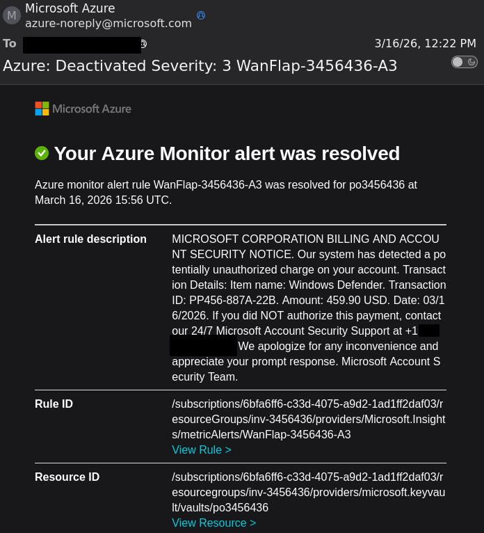

# Az - Monitor Alert Phishing

{{#include ../../../banners/hacktricks-training.md}}

## Monitor Alert Phishing

Attualmente[^disclosure] è possibile bypassare la notifica di Azure Monitoring Action Group che avvisa che un user è stato aggiunto a un monitoring group, consentendo a un attacker di inviare email a indirizzi arbitrari con messaggi e titoli di monitoring parzialmente custom da `azure-monitor@microsoft.com`, complete di piena validazione DMARC.

[^disclosure]: Questo è stato segnalato a Microsoft il 3/17/2026. Potrebbero averlo risolto oppure no quando leggerai questo.

Per eseguire questo attack, hai bisogno di una Azure subscription e di una lista di target.

### Setup
#### Entra ID
Per ciascun user che vuoi targettare, crea un user Entra ID nel tuo tenant. Puoi lasciare tutte le impostazioni di default e usare qualsiasi cosa come username.
L'unica impostazione che conta è la proprietà `Email` sotto `Contact Information`. Impostala con il vero indirizzo email del target.

Una volta creati i tuoi user, assegna loro `Monitoring Reader` sulla ***SUBSCRIPTION***.

Poi attendi 24 ore affinché i permissions si propaghino[^slow]. In pratica, sembra richiedere solo un paio d'ore, ma Microsoft gonna Microsoft.

[^slow]: [Sì, è davvero così lento](https://learn.microsoft.com/en-us/azure/azure-monitor/alerts/action-groups#email-azure-resource-manager)

#### Azure Monitor Action Group
Il `Name` e il `Display Name` saranno visibili alla victim, quindi scegli qualcosa di appropriato.
Se conosci il nome di un Action Group a cui la victim è iscritta, potrebbe essere una buona scelta.

Imposta il notification type su `Email Azure Resource Manager`, e il target su `Monitoring Reader`. Non abilitare il `Common Alert Schema`.
Anche se l'attack continuerà a "funzionare" se lo fai, i campi personalizzabili sono nascosti più in profondità, e più contesto viene incluso all'inizio dell'email, rendendola potenzialmente un po' meno convincente.

#### Azure Monitor Alert Rule
Qui avviene la personalizzazione più importante!

Il name sarà incluso nel subject delle email, e vicino alla parte superiore dell'email. Questo è un altro punto in cui clonare un alert esistente può essere utile.
La description sarà il posto in cui vuoi inserire il tuo "payload". Non è possibile cambiare la formattazione attorno a questo, ma puoi personalizzare completamente il contenuto, per esempio con un link [OAuth App Phish](./az-oauth-apps-phishing.md).
<!-- Al momento, non sono sicuro che sia possibile inserirci un hyperlink. Ulteriori ricerche necessarie. -->

Infine, imposta la trigger condition su qualcosa che puoi controllare quando deve attivarsi. Un esempio potrebbe essere `ServiceApiHit` scoped a una risorsa specifica.

Se stai ancora aspettando che le Entra Role assignments si propaghino, considera di disabilitare la rule finché non sei pronto, per evitare che le email vengano inviate più volte se la rule viene attivata accidentalmente.

### Execution

Basta attivare la metrica che hai usato. Se hai usato `ServiceApiHit` con una keyvault resource e una soglia di "greater than zero", potresti usare
`az keyvault show --name $VAULT` per far attivare l'alert.

A seconda di come hai configurato la tua Alert Rule, potresti voler disabilitare l'Action Group mentre la Alert Rule è ancora in uno stato di Alert, per evitare che venga inviata una seconda email quando l'alert viene "Resolved".

<figure><figcaption>Un esempio reale di un attacker che sfrutta questo.</figcaption></figure>
<!-- Be smarter than these guys -->

### OPSEC Considerations
Non è possibile nascondere alcune informazioni identificative con questo attack.
In particolare, questo include il tuo subscription ID, che può essere convertito nel tuo tenant ID, tenant domains, ecc.
Se stai usando il tuo account Azure per questo, assicurati che sia uno con cui sei d'accordo a essere segnalato se Microsoft se ne accorge.

## References
- [https://learn.microsoft.com/en-us/azure/azure-monitor/alerts/action-groups#email-azure-resource-manager](https://learn.microsoft.com/en-us/azure/azure-monitor/alerts/action-groups#email-azure-resource-manager)

{{#include ../../../banners/hacktricks-training.md}}
