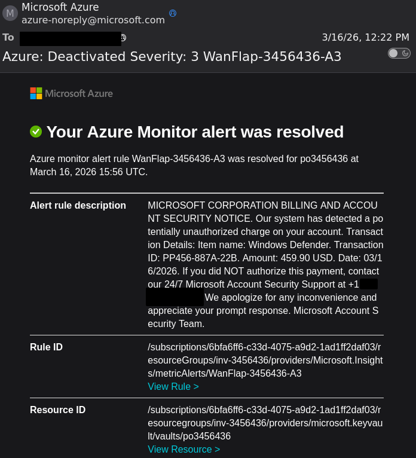

# Az - Monitor Alert Phishing

## Monitor Alert Phishing

U vreme prvobitnog izveštaja bilo je moguće zaobići Azure Monitor Action Group obaveštenje da je korisnik dodat u monitoring grupu. To je napadaču omogućavalo da šalje email na proizvoljne adrese, sa delimično prilagodljivim tekstom upozorenja i naslovima, sa adrese `azure-noreply@microsoft.com` i važećom Microsoft email autentikacijom.[[8]](#references)[[9]](#references)

Prvobitni istraživač, TheToddLuci0, prijavio je varijantu primaoca ARM-role kompaniji Microsoft 17. marta 2026.[[8]](#references) Aktuelna Microsoft dokumentacija i dalje navodi da primaoci ARM Role email poruka ne zahtevaju OTP verification, ali ne utvrđuje da li je Microsoft promenio ponašanje vezano za zaobilaženje obaveštenja; ponovo testirajte tehniku u autorizovanom tenant-u pre nego što se oslonite na nju.[[1]](#references)

Za izvođenje ovog napada potrebni su vam Azure subscription i lista meta.

### Podešavanje
#### Entra ID
Za svakog korisnika kog želite da targetirate, kreirajte Entra ID korisnika u svom tenant-u. Sve postavke možete ostaviti podrazumevane i kao korisničko ime koristiti bilo šta.  
Jedina važna postavka je svojstvo `Email` u okviru `Contact Information`. Postavite ga na stvarnu email adresu mete.[[1]](#references)

Kada kreirate korisnika ili korisnike, dodelite im `Monitoring Reader` na ***SUBSCRIPTION***.[[1]](#references)

Zatim sačekajte do 24 sata da se članstvo u roli propagira do action group-a.[[1]](#references)[[8]](#references)

#### Azure Monitor Action Group
`Name` i `Display Name` biće vidljivi žrtvi, zato izaberite nešto odgovarajuće.[[2]](#references)[[8]](#references)[[9]](#references)  
Ako znate naziv Action Group-a na koji je žrtva pretplaćena, to može biti dobar izbor.

Postavite tip obaveštenja na `Email Azure Resource Manager`, a metu na `Monitoring Reader`.[[1]](#references) Nemojte uključivati `Common Alert Schema`.  
Iako će napad i dalje „funkcionisati“ ako to uradite, prilagodljiva polja biće skrivena dublje u poruci, a na početku email-a biće uključen dodatni kontekst, zbog čega poruka može biti nešto manje uverljiva.  
Common alert schema standardizuje šablone email upozorenja i pruža bogatije iskustvo pri obradi upozorenja, pa njegovo uključivanje menja format poruke.[[4]](#references)

#### Azure Monitor Alert Rule
Ovde se vrši najvažnije prilagođavanje!

Naziv će biti uključen u naslov email-ova i pri vrhu email-a.[[8]](#references)[[9]](#references) Ovo je još jedno mesto gde kloniranje postojećeg upozorenja može biti korisno.  
Opis će biti mesto na koje treba da postavite svoj „payload“. Nije moguće promeniti formatiranje oko njega, ali sadržaj možete u potpunosti prilagoditi, na primer pomoću linka za [OAuth App Phish](./az-oauth-apps-phishing.md).[[8]](#references)[[9]](#references)
<!-- Trenutno nisam siguran da li je moguće ubaciti hyperlink. Potrebno je dodatno istraživanje. -->

Na kraju, postavite uslov okidanja na nešto čime možete kontrolisati trenutak aktiviranja. Primer može biti `ServiceApiHit` ograničen na određeni resource.[[3]](#references)[[5]](#references)

Ako još čekate da se Entra Role assignments propagiraju, razmotrite onemogućavanje pravila dok ne budete spremni, kako biste izbegli višestruko slanje email-ova ako se pravilo slučajno aktivira.

### Izvršavanje

Jednostavno aktivirajte metric koji ste koristili. Ako ste koristili `ServiceApiHit` sa keyvault resource-om i pragom „veće od nule“, možete upotrebiti  
`az keyvault secret list --vault-name "$VAULT"` da biste izazvali aktiviranje upozorenja. Ova operacija zahteva dozvolu `secrets/list`.[[5]](#references)[[6]](#references)

U zavisnosti od načina na koji ste konfigurisali Alert Rule, možda ćete želeti da onemogućite Action Group dok je Alert Rule još u stanju Alert, kako biste izbegli slanje drugog email-a kada upozorenje bude „Resolved“.[[2]](#references)[[8]](#references)[[9]](#references)

<figure><figcaption>Primer iz stvarnog okruženja u kom napadač ovo zloupotrebljava.</figcaption></figure>
<!-- Budite pametniji od ovih ljudi -->

### OPSEC razmatranja
Ovim napadom nije moguće sakriti određene identifikacione informacije.  
To naročito uključuje subscription ID napadača. Neautentifikovani zahtev ka Azure Resource Manager subscription endpoint-u može otkriti povezani tenant u `WWW-Authenticate` challenge-u; identifikator tenant-a se zatim može koristiti za dodatno javno otkrivanje informacija o tenant-u.[[7]](#references)[[8]](#references)[[10]](#references)  
Azure tenant i subscription koji se koriste za autorizovanu simulaciju tretirajte kao infrastrukturu koja se može povezati sa vama.

## Reference
- [1] [Email Azure Resource Manager action groups - Azure Monitor | Microsoft Learn](https://learn.microsoft.com/en-us/azure/azure-monitor/alerts/action-groups#email-azure-resource-manager)
- [2] [Tutorial: Create a metric alert for an Azure resource - Azure Monitor | Microsoft Learn](https://learn.microsoft.com/en-us/azure/azure-monitor/alerts/tutorial-metric-alert)
- [3] [Create or edit a metric alert rule - Azure Monitor | Microsoft Learn](https://learn.microsoft.com/en-us/azure/azure-monitor/alerts/alerts-create-metric-alert-rule)
- [4] [Common alert schema for Azure Monitor alerts - Azure Monitor | Microsoft Learn](https://learn.microsoft.com/en-us/azure/azure-monitor/alerts/alerts-common-schema)
- [5] [Supported metrics for Microsoft.KeyVault/vaults - Azure Monitor | Microsoft Learn](https://learn.microsoft.com/en-us/azure/azure-monitor/reference/supported-metrics/microsoft-keyvault-vaults-metrics)
- [6] [az keyvault secret - Microsoft Learn](https://learn.microsoft.com/en-us/cli/azure/keyvault/secret?view=azure-cli-latest)
- [7] [How to find your Microsoft Entra tenant ID - Microsoft Learn](https://learn.microsoft.com/en-us/entra/fundamentals/how-to-find-tenant)
- [8] [Original Azure Monitor phishing contribution by TheToddLuci0](https://github.com/HackTricks-wiki/hacktricks-cloud/commit/32d5b87bad2d3e4447cd262ae2b82fe7bd88af64)
- [9] [Azure Monitor Callback Phishing: Abusing Legitimate Alert Notifications - Terrance DeJesus](https://www.dejesus.dev/research/azure-monitor-callback-phishing)
- [10] [Azure Resource Attribution via Tenant ID Enumeration - NetSPI](https://www.netspi.com/blog/technical-blog/cloud-pentesting/azure-resource-attribution-via-tenant-id-enumeration/)

{{#include ../../../banners/hacktricks-training.md}}
