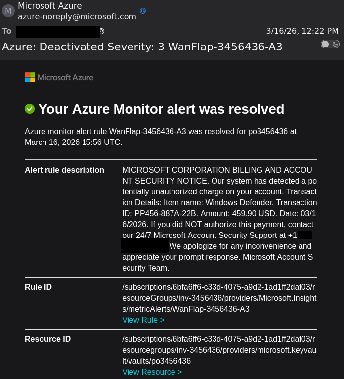

# Az - Monitor Alert Phishing

{{#include ../../../banners/hacktricks-training.md}}

## Monitor Alert Phishing

Vir meer inligting oor hierdie diens, kyk:

{{#ref}}
../az-services/az-monitor.md
{{#endref}}

Ten tyde van die oorspronklike verslag was dit moontlik om die Azure Monitor Action Group-kennisgewing dat 'n gebruiker by 'n moniteringsgroep gevoeg is, te omseil. Dit het 'n aanvaller toegelaat om e-posse na arbitrêre adresse te stuur met gedeeltelik aanpasbare waarskuwingteks en onderwerpe vanaf `azure-noreply@microsoft.com`, met geldige Microsoft-e-posverifikasie.[[8]](#references)[[9]](#references)

Die oorspronklike navorser, TheToddLuci0, het die ARM-role receiver-variant op 17 Maart 2026 by Microsoft aangemeld.[[8]](#references) Huidige Microsoft-dokumentasie stel steeds dat ARM Role-e-posontvangers nie OTP-verifikasie vereis nie, maar dit bevestig nie of Microsoft die kennisgewing-omseilgedrag verander het nie; toets dit weer in 'n gemagtigde tenant voordat jy op die tegniek staatmaak.[[1]](#references)

Om hierdie aanval uit te voer, benodig jy 'n Azure-subscription en 'n lys teikens.

### Opstelling
#### Entra ID
Skep vir elke gebruiker wat jy wil teiken 'n Entra ID-gebruiker in jou tenant. Jy kan alle instellings op die verstekwaardes laat en enigiets as die gebruikersnaam gebruik. Die enigste instelling wat saak maak, is die `Email`-eienskap onder `Contact Information`. Stel dit op die werklike teiken-e-posadres.[[1]](#references)

Sodra jy jou gebruiker(s) geskep het, ken `Monitoring Reader` aan hulle toe op die ***SUBSCRIPTION***.[[1]](#references)

Laat nou tot 24 uur toe vir die rol-lidmaatskap om na die Action Group te versprei.[[1]](#references)[[8]](#references)

#### Azure Monitor Action Group
Die `Name` en `Display Name` sal vir die slagoffer sigbaar wees, kies dus iets gepas.[[2]](#references)[[8]](#references)[[9]](#references) As jy die naam van 'n Action Group waarop die slagoffer ingeteken is ken, kan dit 'n goeie keuse wees.

Stel die kennisgewingtipe op `Email Azure Resource Manager`, en die teiken op `Monitoring Reader`.[[1]](#references) Moenie die `Common Alert Schema` aktiveer nie. Hoewel die aanval steeds sal "werk" as jy dit doen, word die aanpasbare velde dieper versteek, en meer konteks word aan die begin van die e-pos ingesluit, wat dit moontlik 'n bietjie minder oortuigend maak. Die common alert schema standaardiseer waarskuwing-e-possjablone en bied 'n ryker waarskuwingsverbruik-ervaring, dus verander aktivering daarvan die boodskapformaat.[[4]](#references)

#### Azure Monitor Alert Rule
Dit is waar die belangrikste aanpassing plaasvind!

Die naam sal in die onderwerp van die e-posse en naby die bokant van die e-pos ingesluit word.[[8]](#references)[[9]](#references) Dit is nog 'n plek waar dit nuttig kan wees om 'n bestaande alert te kloon. Die beskrywing is waar jy jou "payload" wil plaas. Dit is nie moontlik om die omliggende formatering te verander nie, maar jy kan die inhoud volledig aanpas, byvoorbeeld met 'n [OAuth App Phish](./az-oauth-apps-phishing.md)-skakel.[[8]](#references)[[9]](#references)
<!-- Op die oomblik is ek nie seker of dit moontlik is om 'n hiperskakel daar in te plaas nie. Verdere navorsing is nodig. -->

Stel laastens die trigger condition op iets wat jy kan beheer wanneer dit sal trigger. 'n Voorbeeld kan `ServiceApiHit` wees wat tot 'n spesifieke resource beperk is.[[3]](#references)[[5]](#references)

As jy steeds wag dat die Entra Role-toewysings versprei, oorweeg dit om die reël te deaktiveer totdat jy gereed is, om te voorkom dat e-posse verskeie kere uitgaan as die reël per ongeluk getrigger word.

### Uitvoering

Trigger eenvoudig die metric wat jy gebruik het. As jy `ServiceApiHit` met 'n keyvault-resource en 'n drempel van "greater than zero" gebruik het, kan jy `az keyvault secret list --vault-name "$VAULT"` uitvoer om die alert te trigger. Hierdie operasie vereis die `secrets/list`-toestemming.[[5]](#references)[[6]](#references)

Afhangend van hoe jy jou Alert Rule gekonfigureer het, wil jy dalk die Action Group deaktiveer terwyl die Alert Rule steeds in 'n Alert-toestand is, om te voorkom dat 'n tweede e-pos gestuur word wanneer die alert "Resolved" is.[[2]](#references)[[8]](#references)[[9]](#references)

<figure><figcaption>'n Voorbeeld uit die werklike wêreld van 'n aanvaller wat dit uitbuit.</figcaption></figure>
<!-- Wees slimmer as hierdie ouens -->

### OPSEC-oorwegings
Dit is nie moontlik om sekere identifiserende inligting met hierdie aanval te verberg nie. Dit sluit veral die aanvaller se subscription ID in. 'n Ongemagtigde versoek aan die Azure Resource Manager-subscription-endpoint kan die geassosieerde tenant in die `WWW-Authenticate`-uitdaging openbaar; die tenant-identifiseerder kan dan vir verdere openbare tenant-ontdekking gebruik word.[[7]](#references)[[8]](#references)[[10]](#references) Behandel die Azure-tenant en subscription wat vir 'n gemagtigde simulasie gebruik word as toeskryfbare infrastruktuur.

## References
- [1] [E-pos Azure Resource Manager action groups - Azure Monitor | Microsoft Learn](https://learn.microsoft.com/en-us/azure/azure-monitor/alerts/action-groups#email-azure-resource-manager)
- [2] [Tutoriaal: Skep 'n metric alert vir 'n Azure-resource - Azure Monitor | Microsoft Learn](https://learn.microsoft.com/en-us/azure/azure-monitor/alerts/tutorial-metric-alert)
- [3] [Skep of wysig 'n metric alert rule - Azure Monitor | Microsoft Learn](https://learn.microsoft.com/en-us/azure/azure-monitor/alerts/alerts-create-metric-alert-rule)
- [4] [Algemene alert-skema vir Azure Monitor-alerts - Azure Monitor | Microsoft Learn](https://learn.microsoft.com/en-us/azure/azure-monitor/alerts/alerts-common-schema)
- [5] [Ondersteunde metrics vir Microsoft.KeyVault/vaults - Azure Monitor | Microsoft Learn](https://learn.microsoft.com/en-us/azure/azure-monitor/reference/supported-metrics/microsoft-keyvault-vaults-metrics)
- [6] [az keyvault secret - Microsoft Learn](https://learn.microsoft.com/en-us/cli/azure/keyvault/secret?view=azure-cli-latest)
- [7] [Hoe om jou Microsoft Entra-tenant-ID te vind - Microsoft Learn](https://learn.microsoft.com/en-us/entra/fundamentals/how-to-find-tenant)
- [8] [Oorspronklike Azure Monitor-phishingbydrae deur TheToddLuci0](https://github.com/HackTricks-wiki/hacktricks-cloud/commit/32d5b87bad2d3e4447cd262ae2b82fe7bd88af64)
- [9] [Azure Monitor Callback Phishing: Misbruik van wettige waarskuwingskennisgewings - Terrance DeJesus](https://www.dejesus.dev/research/azure-monitor-callback-phishing)
- [10] [Azure Resource Attribution via Tenant ID Enumeration - NetSPI](https://www.netspi.com/blog/technical-blog/cloud-pentesting/azure-resource-attribution-via-tenant-id-enumeration/)
{{#include ../../../banners/hacktricks-training.md}}
