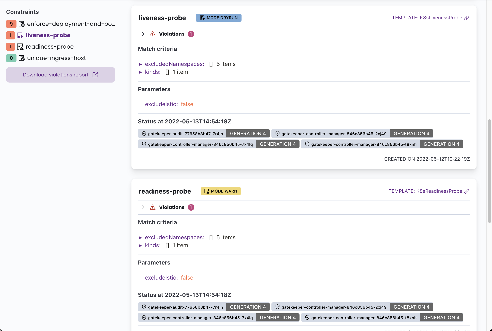

# Kubernetes OPA Gatekeeper bypass

**L'auteur original de cette page est** [**Guillaume**](https://www.linkedin.com/in/guillaume-chapela-ab4b9a196)

## Abus de mauvaise configuration

### Énumérer les règles

Avoir un aperçu peut aider à savoir quelles règles sont actives, dans quel mode et qui peut les contourner.

#### Avec le CLI
```bash
$ kubectl api-resources | grep gatekeeper
k8smandatoryannotations                                                             constraints.gatekeeper.sh/v1beta1                  false        K8sMandatoryAnnotations
k8smandatorylabels                                                                  constraints.gatekeeper.sh/v1beta1                  false        K8sMandatoryLabel
constrainttemplates                                                                 templates.gatekeeper.sh/v1                         false        ConstraintTemplate
```
**ConstraintTemplate** et **Constraint** peuvent être utilisés dans Open Policy Agent (OPA) Gatekeeper pour appliquer des règles sur les ressources Kubernetes.
```bash
$ kubectl get constrainttemplates
$ kubectl get k8smandatorylabels
```
#### Avec l'interface graphique

Une interface utilisateur graphique peut également être disponible pour accéder aux règles OPA avec **Gatekeeper Policy Manager.** C'est "une simple interface web _en lecture seule_ pour visualiser l'état des politiques OPA Gatekeeper dans un cluster Kubernetes."

<figure><figcaption></figcaption></figure>

Recherchez le service exposé :
```bash
$ kubectl get services -A | grep gatekeeper
$ kubectl get services -A | grep 'gatekeeper-policy-manager-system'
```
### Espaces de noms exclus

Comme illustré dans l'image ci-dessus, certaines règles peuvent ne pas être appliquées universellement à tous les espaces de noms ou utilisateurs. Au lieu de cela, elles fonctionnent sur une base de liste blanche. Par exemple, la contrainte `liveness-probe` est exclue de l'application aux cinq espaces de noms spécifiés.

### Contournement

Avec un aperçu complet de la configuration de Gatekeeper, il est possible d'identifier des erreurs de configuration potentielles qui pourraient être exploitées pour obtenir des privilèges. Recherchez des espaces de noms sur liste blanche ou exclus où la règle ne s'applique pas, puis effectuez votre attaque là-bas.

{{#ref}}
../abusing-roles-clusterroles-in-kubernetes/
{{#endref}}

## Abus de ValidatingWebhookConfiguration

Une autre façon de contourner les contraintes est de se concentrer sur la ressource ValidatingWebhookConfiguration :&#x20;

{{#ref}}
../kubernetes-validatingwebhookconfiguration.md
{{#endref}}

## Références

- [https://github.com/open-policy-agent/gatekeeper](https://github.com/open-policy-agent/gatekeeper)
- [https://github.com/sighupio/gatekeeper-policy-manager](https://github.com/sighupio/gatekeeper-policy-manager)
