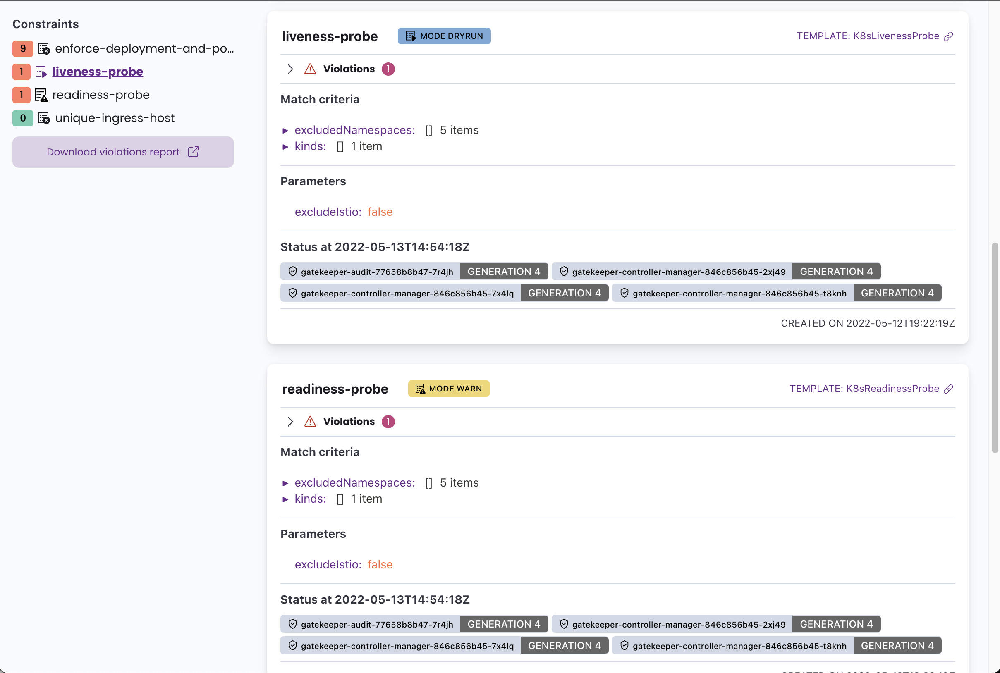

# Kubernetes OPA Gatekeeper bypass

{{#include ../../../banners/hacktricks-training.md}}

**Originalni autor ove stranice je** [**Guillaume**](https://www.linkedin.com/in/guillaume-chapela-ab4b9a196)

## Zloupotreba pogrešne konfiguracije

### Enumerisanje pravila

Pregled može pomoći da saznate koja su pravila aktivna, u kom režimu rade i ko ih može zaobići.

#### Pomoću CLI-ja
```bash
$ kubectl api-resources | grep gatekeeper
k8smandatoryannotations                                                             constraints.gatekeeper.sh/v1beta1                  false        K8sMandatoryAnnotations
k8smandatorylabels                                                                  constraints.gatekeeper.sh/v1beta1                  false        K8sMandatoryLabel
constrainttemplates                                                                 templates.gatekeeper.sh/v1                         false        ConstraintTemplate
```
**ConstraintTemplate** и **Constraint** су Gatekeeper CRD-ови који се користе за дефинисање и примену политика над Kubernetes ресурсима.<sup>[[1]](#references)[[3]](#references)</sup>
```bash
$ kubectl get constrainttemplates
$ kubectl get k8smandatorylabels
```
#### Sa GUI-jem

Grafički korisnički interfejs može biti dostupan i za pristup OPA pravilima pomoću **Gatekeeper Policy Manager.** To je web UI samo za čitanje, namenjen prikazu statusa OPA Gatekeeper politika u Kubernetes klasteru.<sup>[[2]](#references)</sup>

<figure><figcaption></figcaption></figure>

Pretražite izloženi servis:
```bash
$ kubectl get services -A | grep gatekeeper
$ kubectl get services -A | grep 'gatekeeper-policy-manager-system'
```
### Isključeni namespace-ovi

Kao što je prikazano na slici iznad, određena pravila možda se ne primenjuju univerzalno na sve namespace-ove ili korisnike. Gatekeeper kriterijumi za podudaranje mogu eksplicitno isključiti odabrane namespace-ove.<sup>[[4]](#references)</sup> Na primer, constraint `liveness-probe` je izuzet od primene na pet navedenih namespace-ova.

### Bypass

Uz sveobuhvatan pregled Gatekeeper konfiguracije, moguće je identifikovati potencijalne pogrešne konfiguracije koje bi mogle biti iskorišćene za dobijanje privilegija. Potražite whitelist-ovane ili isključene namespace-ove na koje se pravilo ne primenjuje.<sup>[[3]](#references)[[4]](#references)</sup> Zatim tamo izvedite svoj napad.

{{#ref}}
../abusing-roles-clusterroles-in-kubernetes/
{{#endref}}

## Abusing ValidatingWebhookConfiguration

Drugi način za zaobilaženje constraint-a jeste fokusiranje na resurs `ValidatingWebhookConfiguration` i njegovo ponašanje pri podudaranju.<sup>[[5]](#references)</sup>

{{#ref}}
../kubernetes-validatingwebhookconfiguration.md
{{#endref}}

## References

- [1] [Open Policy Agent Gatekeeper](https://github.com/open-policy-agent/gatekeeper)
- [2] [Gatekeeper Policy Manager](https://github.com/sighupio/gatekeeper-policy-manager)
- [3] [Kako koristiti Gatekeeper](https://open-policy-agent.github.io/gatekeeper/website/docs/howto/)
- [4] [Izuzimanje namespace-ova](https://open-policy-agent.github.io/gatekeeper/website/docs/exempt-namespaces/)
- [5] [ValidatingWebhookConfiguration | Kubernetes](https://kubernetes.io/docs/reference/kubernetes-api/admissionregistration/validating-webhook-configuration-v1/)
{{#include ../../../banners/hacktricks-training.md}}
