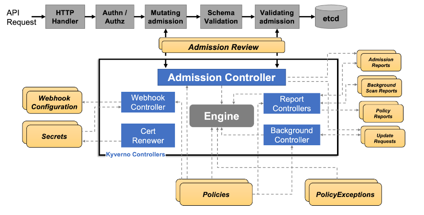

# Kubernetes ValidatingWebhookConfiguration

{{#include ../../banners/hacktricks-training.md}}

**El autor original de esta página es** [**Guillaume**](https://www.linkedin.com/in/guillaume-chapela-ab4b9a196)

## Definición

`ValidatingWebhookConfiguration` es un recurso de Kubernetes que registra uno o más validating admission webhooks. Estos webhooks reciben solicitudes AdmissionReview del API server después de la autenticación y autorización, pero antes de que el objeto se persista.

Los validating webhooks pueden rechazar una solicitud. Los mutating webhooks, configurados con `MutatingWebhookConfiguration`, pueden cambiar el objeto primero. Las security reviews normalmente deberían inspeccionar ambos recursos porque un mutating webhook malicioso o débil puede reescribir workloads, mientras que un validating webhook o policy engine puede bloquearlos o अनुमतिirlos.

## Propósito

El propósito de un `ValidatingWebhookConfiguration` es definir cuándo el API server debe llamar a un validating webhook y cómo debe manejar el resultado del webhook. La pregunta de seguridad importante no es solo "¿hay una policy instalada?", sino también:

- ¿Qué API groups, resources, operations y scopes coincide?
- ¿Qué namespaces u objetos quedan excluidos por selectors?
- ¿`matchConditions` omite alguna clase de solicitud?
- ¿`failurePolicy` falla abierto con `Ignore` o falla cerrado con `Fail`?
- ¿El servicio del webhook es accesible, está confiado por el `caBundle` configurado y se ejecuta con un service account muy privilegiado?
- ¿El policy engine también expone exception resources, usuarios excluidos o grupos excluidos?

**Ejemplo**

Aquí hay un ejemplo de un ValidatingWebhookConfiguration:
```yaml
apiVersion: admissionregistration.k8s.io/v1
kind: ValidatingWebhookConfiguration
metadata:
name: example-validation-webhook
webhooks:
- name: pods.example.local
admissionReviewVersions: ["v1"]
sideEffects: None
failurePolicy: Fail
timeoutSeconds: 5
clientConfig:
service:
namespace: webhook-system
name: example-validation-webhook
path: /validate
caBundle: <base64-ca-bundle>
rules:
- apiGroups: [""]
apiVersions: ["v1"]
operations: ["CREATE", "UPDATE"]
resources: ["pods"]
scope: "Namespaced"
namespaceSelector:
matchExpressions:
- key: kubernetes.io/metadata.name
operator: NotIn
values: ["kube-system"]
```
La principal diferencia entre un ValidatingWebhookConfiguration y policies :

<figure><figcaption><p>Kyverno.png</p></figcaption></figure>

- **ValidatingWebhookConfiguration (VWC)** : Un recurso de Kubernetes que define un validating webhook, que es un componente del lado del servidor que valida las solicitudes entrantes de la API de Kubernetes frente a un conjunto de reglas y restricciones predefinidas.
- **Kyverno ClusterPolicy**: Una definición de policy que especifica un conjunto de reglas y restricciones para validar y hacer cumplir recursos de Kubernetes, como pods, deployments y services

## Enumeration
```
$ kubectl get validatingwebhookconfigurations,mutatingwebhookconfigurations
$ kubectl get validatingwebhookconfiguration <name> -o yaml
$ kubectl get mutatingwebhookconfiguration <name> -o yaml
$ kubectl get svc,deploy,pod -A | grep -i webhook
```
Campos a inspeccionar:

- `rules`: Comprueba los grupos de API cubiertos, versiones, resources, subresources, operations y scope.
- `namespaceSelector` / `objectSelector`: Busca namespaces o labels que excluyan resources de la policy.
- `matchConditions`: Las expresiones CEL pueden omitir requests de forma intencional o accidental.
- `failurePolicy`: `Ignore` permite que las requests continúen si falla el webhook; `Fail` las bloquea.
- `sideEffects`: Los webhooks con side effects pueden no soportar pruebas dry-run.
- `timeoutSeconds`: Timeouts muy cortos combinados con `Ignore` pueden convertirse en comportamiento fail-open.
- `clientConfig`: Revisa si el webhook apunta a un Service dentro del cluster o a una URL externa, e inspecciona el workload y la service account de backend.
- `reinvocationPolicy`: Los mutating webhooks pueden ser reinvocados cuando una mutación posterior cambia el objeto.

### Native CEL admission policies

Los clusters modernos también pueden aplicar lógica de admission con objetos de policy nativos en `admissionregistration.k8s.io`, no solo con configuraciones de webhook. `ValidatingAdmissionPolicy` es una alternativa in-process basada en CEL a los validating webhooks y solo está activa cuando `ValidatingAdmissionPolicyBinding` la selecciona. `MutatingAdmissionPolicy` es estable en Kubernetes v1.36 y se activa mediante `MutatingAdmissionPolicyBinding` para mutations generadas por CEL.

Enumérelos con:
```bash
kubectl api-resources --api-group=admissionregistration.k8s.io -o wide
kubectl get validatingadmissionpolicies,validatingadmissionpolicybindings
kubectl get mutatingadmissionpolicies,mutatingadmissionpolicybindings 2>/dev/null || true
kubectl get validatingadmissionpolicy <name> -o yaml
kubectl get validatingadmissionpolicybinding <name> -o yaml
```
Security checks:

- Una policy sin un binding no aplica nada.
- `validationActions` en el binding decide si los validation failures son denied, warned, audited, o solo recorded.
- `failurePolicy: Ignore` permite que errores de evaluación CEL o una misconfiguration fallen open.
- `matchConstraints`, `matchConditions`, `namespaceSelector`, y `objectSelector` pueden excluir solicitudes sensibles.
- `paramKind` y `paramRef` pueden hacer que ConfigMaps o objetos de parámetros respaldados por CRD formen parte del límite de la policy; revisa quién puede modificar esos parameter objects.
- Las escrituras en policies, bindings y parameter resources deben tratarse como cambios privilegiados de admission-control.

### Abusing Kyverno and Gatekeeper VWC

Como podemos ver, todos los operators instalados tienen al menos un ValidatingWebHookConfiguration(VWC).

**Kyverno** y **Gatekeeper** son ambos Kubernetes policy engines que proporcionan un framework para definir y aplicar policies en todo un cluster.

Las Exceptions se refieren a reglas o condiciones específicas que permiten que una policy sea bypassed o modified bajo ciertas circunstancias, pero ¡esta no es la única forma!

Para **kyverno**, cuando existe una validating policy, el webhook `kyverno-resource-validating-webhook-cfg` se rellena.

Para Gatekeeper, existe el archivo YAML `gatekeeper-validating-webhook-configuration`.

Ambos vienen con valores por defecto, pero los equipos de Administrators podrían haber actualizado esos 2 archivos.

### Use Case
```bash
$ kubectl get validatingwebhookconfiguration kyverno-resource-validating-webhook-cfg -o yaml
```
Por favor, proporciona el contenido de salida que quieres que identifique.
```yaml
namespaceSelector:
matchExpressions:
- key: kubernetes.io/metadata.name
operator: NotIn
values:
- default
- TEST
- YOYO
- kube-system
- MYAPP
```
Aquí, `kubernetes.io/metadata.name` se refiere a la etiqueta del nombre del namespace. Los namespaces con nombres en la lista `values` serán excluidos de la policy:

Check namespaces existence. A veces, debido a automatización o misconfiguration, algunos namespaces podrían no haberse creado. Si tienes permiso para create namespace, podrías crear un namespace con un nombre en la lista `values` y las policies no se aplicarán a tu nuevo namespace.

El objetivo de este attack es explotar la **misconfiguration** dentro de VWC para bypass las restricciones de operators y luego elevar tus privilegios con otras técnicas

Otros patrones comunes de bypass o abuso:

- Un `objectSelector` que permite a los users añadir una etiqueta de opt-out a sus propios objects.
- `failurePolicy: Ignore` en validación crítica de security, especialmente cuando el webhook Service no tiene endpoints o la networking es poco fiable.
- Excepciones del policy engine para users, groups, service accounts, namespaces o roles que son más amplias de lo previsto.
- Falta de cobertura para workload controller templates, `pods/ephemeralcontainers`, `pods/exec`, custom resources u operaciones de update.
- Write access a `validatingwebhookconfigurations`, `mutatingwebhookconfigurations`, Gatekeeper constraints, Kyverno policies o exception resources.
- Un mutating webhook malicioso que inyecta containers, cambia images, monta secrets, añade tolerations o cambia la selección de service account antes de la validation.

Recuerda que admission solo protege las requests que pasan por la API server admission chain. Static Pods, node-local runtime socket access, direct kubelet abuse y direct etcd access son rutas de confianza diferentes y necesitan hardening y monitoring por separado.

{{#ref}}
abusing-roles-clusterroles-in-kubernetes/
{{#endref}}

## References

- [https://github.com/open-policy-agent/gatekeeper](https://github.com/open-policy-agent/gatekeeper)
- [https://kyverno.io/](https://kyverno.io/)
- [https://kubernetes.io/docs/reference/access-authn-authz/extensible-admission-controllers/](https://kubernetes.io/docs/reference/access-authn-authz/extensible-admission-controllers/)
- [https://kubernetes.io/docs/concepts/cluster-administration/admission-webhooks-good-practices/](https://kubernetes.io/docs/concepts/cluster-administration/admission-webhooks-good-practices/)
- [https://kubernetes.io/docs/reference/access-authn-authz/validating-admission-policy/](https://kubernetes.io/docs/reference/access-authn-authz/validating-admission-policy/)
- [https://kubernetes.io/docs/reference/access-authn-authz/mutating-admission-policy/](https://kubernetes.io/docs/reference/access-authn-authz/mutating-admission-policy/)
- [https://kubernetes.io/docs/reference/using-api/cel/](https://kubernetes.io/docs/reference/using-api/cel/)


{{#include ../../banners/hacktricks-training.md}}
