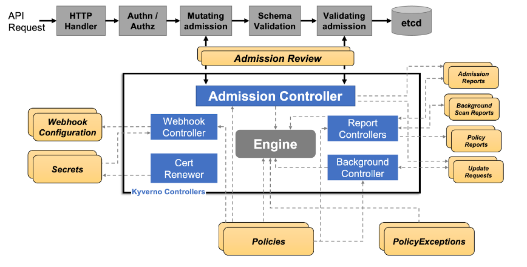

# Kubernetes ValidatingWebhookConfiguration

{{#include ../../banners/hacktricks-training.md}}

**이 페이지의 원저자는** [**Guillaume**](https://www.linkedin.com/in/guillaume-chapela-ab4b9a196)

## 정의

`ValidatingWebhookConfiguration`은 하나 이상의 validating admission webhook을 등록하는 Kubernetes 리소스입니다. 이러한 webhook은 API server에서 authentication 및 authorization을 수행한 후, 객체가 저장되기 전에 AdmissionReview 요청을 수신합니다.<sup>[[3]](#references)[[10]](#references)</sup>

Validating webhook은 요청을 거부할 수 있습니다. `MutatingWebhookConfiguration`으로 구성된 Mutating webhook은 먼저 객체를 변경할 수 있습니다. 악의적이거나 취약한 mutating webhook이 workload를 다시 작성할 수 있고, validating webhook 또는 policy engine이 이를 차단하거나 허용할 수 있으므로, 보안 검토에서는 일반적으로 두 리소스를 모두 확인해야 합니다.<sup>[[3]](#references)</sup>

## 목적

`ValidatingWebhookConfiguration`의 목적은 API server가 validating webhook을 호출해야 하는 시점과 webhook 결과를 처리하는 방식을 정의하는 것입니다.<sup>[[3]](#references)[[8]](#references)</sup> 중요한 보안 질문은 단순히 "policy가 설치되어 있는가?"뿐만 아니라 다음과 같습니다.

- 어떤 API group, resource, operation 및 scope와 일치하는가?<sup>[[8]](#references)</sup>
- selector에 의해 어떤 namespace 또는 객체가 제외되는가?<sup>[[8]](#references)</sup>
- `matchConditions`가 특정 요청 클래스를 건너뛰는가?<sup>[[7]](#references)[[8]](#references)</sup>
- `failurePolicy`가 `Ignore`를 사용하여 fail open하는가, 아니면 `Fail`을 사용하여 fail closed하는가?<sup>[[3]](#references)[[8]](#references)</sup>
- webhook service에 연결할 수 있고, 구성된 `caBundle`이 신뢰되며, 높은 권한을 가진 service account가 이를 실행하는가?
- policy engine이 exception resource, 제외된 user 또는 제외된 group도 노출하는가?

**예시**

다음은 ValidatingWebhookConfiguration의 예시입니다.
```yaml
apiVersion: admissionregistration.k8s.io/v1
kind: ValidatingWebhookConfiguration
metadata:
name: example-validation-webhook
webhooks:
- name: pods.example.local
admissionReviewVersions: ["v1"]
sideEffects: None
failurePolicy: Fail
timeoutSeconds: 5
clientConfig:
service:
namespace: webhook-system
name: example-validation-webhook
path: /validate
caBundle: <base64-ca-bundle>
rules:
- apiGroups: [""]
apiVersions: ["v1"]
operations: ["CREATE", "UPDATE"]
resources: ["pods"]
scope: "Namespaced"
namespaceSelector:
matchExpressions:
- key: kubernetes.io/metadata.name
operator: NotIn
values: ["kube-system"]
```
이 예제는 요청 매칭, service/CA transport, failure handling 및 dry-run semantics에 v1 webhook fields를 사용합니다.<sup>[[3]](#references)[[8]](#references)</sup>

ValidatingWebhookConfiguration과 policies의 주요 차이점:

<figure><figcaption><p>Kyverno.png</p></figcaption></figure>

- **ValidatingWebhookConfiguration (VWC)** : validating webhook을 정의하는 Kubernetes resource입니다. validating webhook은 사전 정의된 rules 및 constraints에 따라 들어오는 Kubernetes API requests를 검증하는 server-side component입니다.<sup>[[8]](#references)</sup>
- **Kyverno ClusterPolicy**: pods, deployments 및 services와 같은 Kubernetes resources를 검증하고 적용하기 위한 rules 및 constraints 집합을 지정하는 policy definition입니다.<sup>[[13]](#references)</sup>

## 열거
```
$ kubectl get validatingwebhookconfigurations,mutatingwebhookconfigurations
$ kubectl get validatingwebhookconfiguration <name> -o yaml
$ kubectl get mutatingwebhookconfiguration <name> -o yaml
$ kubectl get svc,deploy,pod -A | grep -i webhook
```
두 webhook configuration 종류를 모두 나열하고, 해당 YAML과 참조된 service 또는 URL을 검사합니다:<sup>[[3]](#references)[[4]](#references)</sup>

검사할 필드:

- `rules`: 적용되는 API groups, versions, resources, subresources, operations 및 scope를 확인합니다.<sup>[[8]](#references)</sup>
- `namespaceSelector` / `objectSelector`: 리소스가 policy에서 제외되는 namespace 또는 label을 확인합니다.<sup>[[8]](#references)</sup>
- `matchConditions`: CEL expressions가 요청을 의도적으로 또는 우발적으로 건너뛸 수 있습니다.<sup>[[7]](#references)[[8]](#references)</sup>
- `failurePolicy`: `Ignore`는 webhook에 장애가 발생해도 요청을 계속 진행하며, `Fail`은 요청을 차단합니다.<sup>[[3]](#references)[[8]](#references)</sup>
- `sideEffects`: side effects가 있는 webhook은 dry-run testing을 지원하지 않을 수 있습니다.<sup>[[3]](#references)</sup>
- `timeoutSeconds`: `Ignore`와 결합된 매우 짧은 timeout은 fail-open 동작이 될 수 있습니다.<sup>[[3]](#references)[[4]](#references)</sup>
- `clientConfig`: webhook이 클러스터 내부 Service를 가리키는지, external URL을 가리키는지 검토합니다.<sup>[[3]](#references)</sup> 연결된 workload와 service account를 검사합니다.
- `reinvocationPolicy`: 이후 mutation으로 object가 변경되면 mutating webhook이 다시 호출될 수 있습니다.<sup>[[3]](#references)</sup>

### Native CEL admission policies

Modern clusters는 webhook configurations뿐만 아니라 `admissionregistration.k8s.io`의 native policy objects를 사용해 admission logic을 적용할 수도 있습니다. `ValidatingAdmissionPolicy`는 validating webhooks를 대체하는 in-process CEL 기반 방식입니다.<sup>[[5]](#references)[[7]](#references)</sup> 이는 `ValidatingAdmissionPolicyBinding`이 해당 policy를 선택하는 경우에만 활성화됩니다.<sup>[[5]](#references)</sup> `MutatingAdmissionPolicy`는 Kubernetes v1.36에서 stable 상태입니다.<sup>[[6]](#references)</sup> 이는 CEL-generated mutations를 위해 `MutatingAdmissionPolicyBinding`으로 활성화됩니다.<sup>[[6]](#references)</sup>

다음 명령으로 나열합니다:
```bash
kubectl api-resources --api-group=admissionregistration.k8s.io -o wide
kubectl get validatingadmissionpolicies,validatingadmissionpolicybindings
kubectl get mutatingadmissionpolicies,mutatingadmissionpolicybindings 2>/dev/null || true
kubectl get validatingadmissionpolicy <name> -o yaml
kubectl get validatingadmissionpolicybinding <name> -o yaml
```
정책을 binding과 함께 검사해야 합니다. binding이 scope와 enforcement behavior를 제공하기 때문입니다.<sup>[[5]](#references)[[6]](#references)</sup>

Security checks:

- binding이 없는 policy는 아무것도 enforce하지 않습니다.<sup>[[5]](#references)[[6]](#references)</sup>
- binding의 `validationActions`는 validation failure를 거부, 경고, audit하거나 기록만 할지를 결정합니다.<sup>[[5]](#references)</sup>
- `failurePolicy: Ignore`는 CEL evaluation error 또는 misconfiguration이 fail open되도록 합니다.<sup>[[5]](#references)</sup>
- `matchConstraints`, `matchConditions`, `namespaceSelector`, `objectSelector`는 민감한 request를 제외할 수 있습니다.<sup>[[5]](#references)[[7]](#references)</sup>
- `paramKind`와 `paramRef`는 ConfigMap 또는 CRD-backed parameter object를 policy boundary의 일부로 만들 수 있습니다. 해당 parameter object를 누가 수정할 수 있는지 확인해야 합니다.<sup>[[5]](#references)[[6]](#references)</sup>
- policy, binding, parameter resource에 대한 write는 privileged admission-control 변경처럼 취급해야 합니다.<sup>[[4]](#references)[[5]](#references)</sup>

### Kyverno 및 Gatekeeper VWC 악용

실무적인 점검으로, policy operator는 일반적으로 하나 이상의 `ValidatingWebhookConfiguration` object를 설치합니다. 모든 installation이 그렇게 한다고 가정하지 말고 실제 object를 확인해야 합니다.<sup>[[11]](#references)[[12]](#references)</sup>

**Kyverno**와 **Gatekeeper**는 모두 cluster 전체에서 policy를 정의하고 enforce하기 위한 framework를 제공하는 Kubernetes policy engine입니다.<sup>[[1]](#references)[[2]](#references)</sup>

Exception은 특정 상황에서 policy를 bypass하거나 수정할 수 있도록 하는 특정 rule 또는 condition을 의미하지만, 이것이 유일한 방법은 아닙니다!<sup>[[12]](#references)[[13]](#references)</sup>

**Kyverno**의 경우 resource webhook configuration `kyverno-resource-validating-webhook-cfg`는 resource와 match하는 policy에서 채워집니다.<sup>[[11]](#references)</sup>

Gatekeeper의 경우 기본 validating webhook configuration은 `gatekeeper-validating-webhook-configuration`입니다.<sup>[[12]](#references)</sup>

둘 다 기본값과 함께 제공되지만, administrator team이 이 두 configuration을 업데이트할 수 있습니다.<sup>[[11]](#references)[[12]](#references)</sup>

### 사용 사례
```bash
$ kubectl get validatingwebhookconfiguration kyverno-resource-validating-webhook-cfg -o yaml
```
이제 다음 출력을 식별하세요:
```yaml
namespaceSelector:
matchExpressions:
- key: kubernetes.io/metadata.name
operator: NotIn
values:
- default
- TEST
- YOYO
- kube-system
- MYAPP
```
여기서 `kubernetes.io/metadata.name`은 변경할 수 없는 namespace label이며, 그 값은 namespace 이름입니다. 이름이 `values` 목록에 있는 namespace는 webhook의 match set에서 제외됩니다.<sup>[[8]](#references)[[9]](#references)</sup>

Namespaces가 존재하는지 확인하세요. 자동화 또는 잘못된 구성으로 인해 일부 namespaces가 생성되지 않았을 수 있습니다. namespace를 생성할 권한이 있다면 `values` 목록에 있는 이름으로 namespace를 생성할 수 있으며, 이 webhook의 policies는 해당 namespace의 workloads에 적용되지 않습니다.<sup>[[8]](#references)</sup>

이 attack의 목표는 VWC 내부의 **misconfiguration**을 exploit하여 operators restrictions를 우회한 다음, 다른 techniques로 privileges를 elevate하는 것입니다.

기타 일반적인 bypass 또는 abuse 패턴:

- 사용자가 자신의 objects에 opt-out label을 추가할 수 있도록 허용하는 `objectSelector`.<sup>[[8]](#references)</sup>
- 특히 webhook Service에 endpoints가 없거나 networking이 불안정할 때, security-critical validation에 `failurePolicy: Ignore`를 사용하는 경우.<sup>[[3]](#references)[[4]](#references)</sup>
- users, groups, service accounts, namespaces 또는 roles에 대한 policy engine exceptions가 의도한 범위보다 넓은 경우.<sup>[[12]](#references)[[13]](#references)[[14]](#references)</sup>
- workload controller templates, `pods/ephemeralcontainers`, `pods/exec`, custom resources 또는 update operations에 대한 coverage가 누락된 경우.<sup>[[4]](#references)[[8]](#references)</sup>
- `validatingwebhookconfigurations`, `mutatingwebhookconfigurations`, Gatekeeper constraints, Kyverno policies 또는 exception resources에 대한 write access.<sup>[[4]](#references)[[5]](#references)</sup>
- validation 전에 containers를 inject하거나, images를 변경하거나, secrets를 mount하거나, tolerations를 추가하거나, service account selection을 변경하는 malicious mutating webhook.<sup>[[3]](#references)</sup>

admission은 API server admission chain을 통과하는 requests만 보호한다는 점을 기억하세요. Static Pods, node-local runtime socket access, direct kubelet abuse 및 direct etcd access는 서로 다른 trust paths이며, 별도의 hardening 및 monitoring이 필요합니다.

{{#ref}}
abusing-roles-clusterroles-in-kubernetes/
{{#endref}}

## References

- [1] [Open Policy Agent Gatekeeper](https://github.com/open-policy-agent/gatekeeper)
- [2] [Kyverno](https://kyverno.io/)
- [3] [Dynamic Admission Control | Kubernetes](https://kubernetes.io/docs/reference/access-authn-authz/extensible-admission-controllers/)
- [4] [Admission Webhook Good Practices | Kubernetes](https://kubernetes.io/docs/concepts/cluster-administration/admission-webhooks-good-practices/)
- [5] [Validating Admission Policy | Kubernetes](https://kubernetes.io/docs/reference/access-authn-authz/validating-admission-policy/)
- [6] [Mutating Admission Policy | Kubernetes](https://kubernetes.io/docs/reference/access-authn-authz/mutating-admission-policy/)
- [7] [Common Expression Language in Kubernetes](https://kubernetes.io/docs/reference/using-api/cel/)
- [8] [ValidatingWebhookConfiguration | Kubernetes](https://kubernetes.io/docs/reference/kubernetes-api/admissionregistration/validating-webhook-configuration-v1/)
- [9] [Namespaces | Kubernetes](https://kubernetes.io/docs/concepts/overview/working-with-objects/namespaces/)
- [10] [Controlling Access to the Kubernetes API | Kubernetes](https://kubernetes.io/docs/concepts/security/controlling-access/)
- [11] [Kubernetes Admission Controllers | Kyverno](https://kyverno.io/docs/guides/admission-controllers/)
- [12] [Gatekeeper Admission Webhook에서 Namespaces 제외](https://open-policy-agent.github.io/gatekeeper/website/docs/v3.15.x/exempt-namespaces/)
- [13] [ClusterPolicy 개요 | Kyverno](https://kyverno.io/docs/policy-types/cluster-policy/overview/)
- [14] [Rules 검증 | Kyverno](https://kyverno.io/docs/policy-types/cluster-policy/validate/)
{{#include ../../banners/hacktricks-training.md}}
