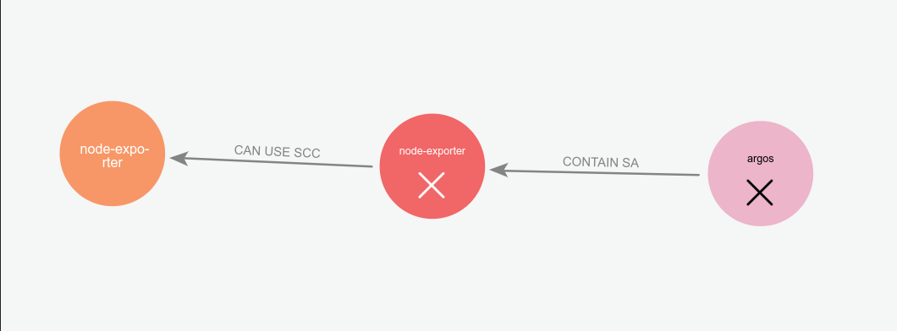

# OpenShift - Missing Service Account

## Missing Service Account

यह होता है कि क्लस्टर को पूर्व-निर्धारित टेम्पलेट के साथ तैनात किया गया है जो स्वचालित रूप से Roles, RoleBindings और यहां तक कि SCC को सेवा खाते के लिए सेट करता है जो अभी तक बनाया नहीं गया है। यदि आप उन्हें बना सकते हैं तो यह विशेषाधिकार वृद्धि का कारण बन सकता है। इस मामले में, आप नए बनाए गए SA का टोकन और संबंधित भूमिका या SCC प्राप्त कर सकेंगे। समान मामला तब होता है जब गायब SA एक गायब प्रोजेक्ट का हिस्सा होता है, इस मामले में यदि आप प्रोजेक्ट बना सकते हैं और फिर SA बना सकते हैं, तो आप संबंधित Roles और SCC प्राप्त करते हैं।

<figure><figcaption></figcaption></figure>

पिछले ग्राफ में हमारे पास कई AbsentProject हैं जिसका अर्थ है कि कई प्रोजेक्ट हैं जो Roles Bindings या SCC में दिखाई देते हैं लेकिन अभी तक क्लस्टर में बनाए नहीं गए हैं। उसी संदर्भ में हमारे पास एक AbsentServiceAccount भी है।

यदि हम एक प्रोजेक्ट और उसमें गायब SA बना सकते हैं, तो SA उस भूमिका या SCC से विरासत में मिलेगा जो AbsentServiceAccount को लक्षित कर रहा था। जो विशेषाधिकार वृद्धि का कारण बन सकता है।

निम्नलिखित उदाहरण एक गायब SA को दिखाता है जिसे node-exporter SCC दिया गया है:

<figure><figcaption></figcaption></figure>

## Tools

इस समस्या को सूचीबद्ध करने और सामान्य रूप से OpenShift क्लस्टर को ग्राफ करने के लिए निम्नलिखित उपकरण का उपयोग किया जा सकता है:

{{#ref}}
https://github.com/maxDcb/OpenShiftGrapher
{{#endref}}
