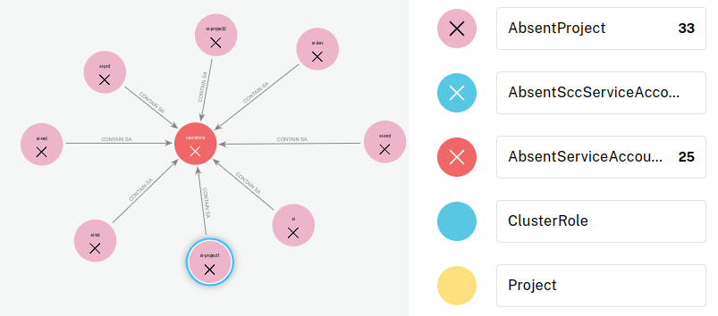
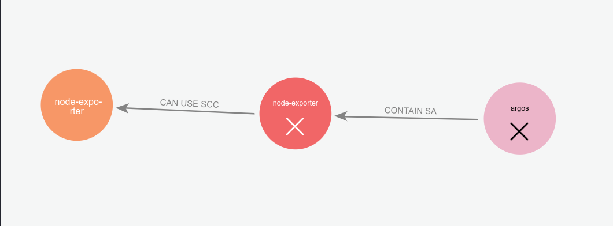

# OpenShift - Missing Service Account

## Missing Service Account

OpenShift service account는 `system:serviceaccount:<project>:<name>`으로 식별됩니다. RBAC binding을 통해 해당 identity에 Role을 부여할 수 있으며, Security Context Constraint (SCC)에 대한 access는 직접 부여하거나 RBAC를 통해 부여할 수 있습니다.[[1]](#references)[[2]](#references)[[3]](#references)

따라서 사전 구성된 template과 오래된 cluster object로 인해 아직 존재하지 않는 service account를 참조하는 RoleBinding, ClusterRoleBinding 또는 SCC grant가 남을 수 있습니다. RoleBinding은 해당 account를 기존 project에서 지정할 수 있으며, cluster 범위의 ClusterRoleBinding 또는 직접 SCC grant는 아직 존재하지 않는 project의 account도 지정할 수 있습니다. 공격자가 참조된 service account를 생성할 수 있거나, cluster 범위의 참조인 경우 먼저 누락된 project를 생성할 수 있다면, 생성된 identity는 기존 grant와 일치하여 해당 role 또는 SCC permission을 부여받습니다. OpenShiftGrapher는 이러한 dangling-reference attack pattern을 문서화하고 누락된 object를 `AbsentProject` 및 `AbsentServiceAccount` node로 나타냅니다.[[4]](#references)[[5]](#references)


service account를 생성하는 것만으로는 공격자가 해당 account로 authenticate할 수 있다고 보장되지 않습니다. Exploitation을 위해서는 해당 account로 workload를 생성할 permission이나 `serviceaccounts/token` TokenRequest를 생성할 permission 등 account를 사용할 방법도 필요합니다. OpenShift 4.16 이상에서는 각 새 service account에 대해 더 이상 수명이 긴 API-token Secret을 자동으로 생성하지 않습니다.[[2]](#references)[[6]](#references)


<figure><figcaption></figcaption></figure>

위 graph는 authorization relationship에서 참조하는 여러 누락된 project와 누락된 service account를 보여줍니다. 정확히 참조된 이름으로 project와 account를 생성하면 기존 grant를 활성화하여 privilege escalation으로 이어질 수 있습니다.[[4]](#references)[[5]](#references)

다음 예제는 `node-exporter` SCC를 사용할 수 있는 누락된 service account를 보여줍니다.

<figure><figcaption></figcaption></figure>

## 도구

관리되는 OpenShiftGrapher project는 OpenShift object와 relationship을 열거하여 Neo4j에 저장합니다. 문서화된 query에는 absent project와 service account에서 cluster role 및 사용 가능한 SCC로 이어지는 path가 포함되어 있습니다.[[5]](#references)

## 참고 자료

- [1] [RBAC Authorization 사용 - Kubernetes](https://kubernetes.io/docs/reference/access-authn-authz/rbac/)
- [2] [Service account 이해 및 생성 - OpenShift Container Platform 4.22](https://docs.redhat.com/en/documentation/openshift_container_platform/4.22/html/authentication_and_authorization/understanding-and-creating-service-accounts)
- [3] [Security context constraint 관리 - OpenShift Container Platform 4.22](https://docs.redhat.com/en/documentation/openshift_container_platform/4.22/html/authentication_and_authorization/managing-pod-security-policies)
- [4] [OpenShiftGrapher - 원본 repository](https://github.com/maxDcb/OpenShiftGrapher)
- [5] [OpenShiftGrapher - 유지 관리되는 repository](https://github.com/AmadeusITGroup/OpenShiftGrapher)
- [6] [Role Based Access Control Good Practices - Kubernetes](https://kubernetes.io/docs/concepts/security/rbac-good-practices/)

{{#include ../../../banners/hacktricks-training.md}}
