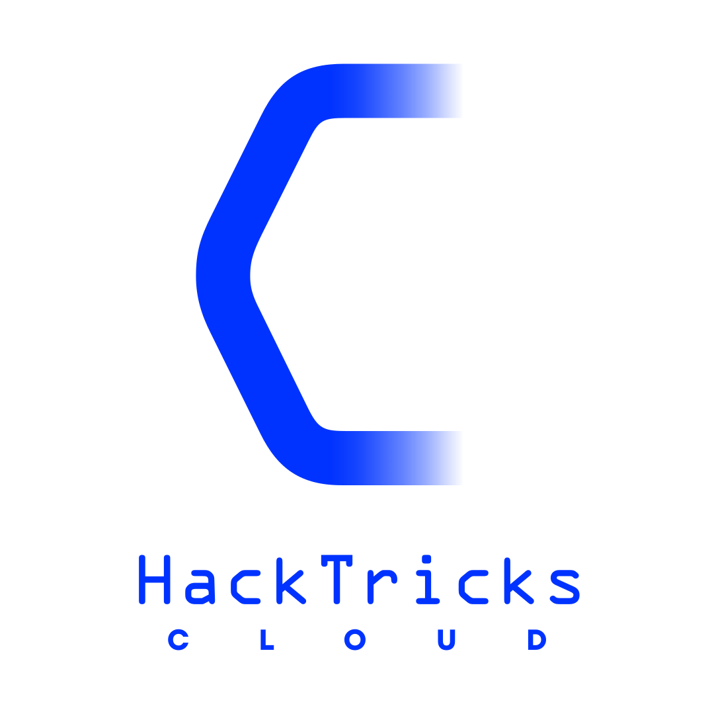

# Pentesting Cloud-metodologie

{{#include ../banners/hacktricks-training.md}}

<figure><figcaption></figcaption></figure>

## Basiese metodologie

Elke cloud het sy eie eienaardighede, maar oor die algemeen is daar ’n paar **algemene dinge wat ’n pentester moet nagaan** wanneer ’n cloud-omgewing getoets word:

- **Benchmark-kontroles**
- Dit sal jou help om die **grootte van die omgewing** en die **dienste wat gebruik word** te verstaan
- Dit sal jou ook toelaat om ’n paar **vinnige misconfigurations** te vind, aangesien jy die meeste van hierdie toetse met **geoutomatiseerde tools** kan uitvoer
- **Dienste-enumerasie**
- Jy sal waarskynlik nie veel meer misconfigurations hier vind as jy die benchmark-toetse korrek uitgevoer het nie, maar jy kan sommige vind waarna daar nie in die benchmark-toets gesoek is nie.
- Dit sal jou toelaat om te weet **wat presies in die cloud-omgewing gebruik word**
- Dit sal baie help met die volgende stappe
- **Kontroleer blootgestelde bates**
- Dit kan tydens die vorige afdeling gedoen word; jy moet **uitvind wat potensieel aan die Internet blootgestel is** en hoe dit toeganklik kan wees.
- Hier verwys ek na **handmatig blootgestelde infrastruktuur**, soos instances met webblaaie of ander blootgestelde poorte, asook ander **cloud managed services wat gekonfigureer kan word** om blootgestel te word (soos DBs of buckets)
- Vervolgens moet jy nagaan **of daardie resource blootgestel kan word of nie** (vertroulike inligting? vulnerabilities? misconfigurations in die blootgestelde diens?)
- **Kontroleer permissions**
- Hier moet jy **al die permissions van elke role/user** binne die cloud uitvind en hoe dit gebruik word
- Te **veel highly privileged** (beheer alles) accounts? Gegenereerde keys wat nie gebruik word nie?... Die meeste van hierdie kontroles moes reeds in die benchmark-toetse gedoen gewees het
- As die client OpenID, SAML of ander **federation** gebruik, moet jy hulle dalk vir verdere **inligting** vra oor **hoe elke role toegeken word** (dit is nie dieselfde as die admin role aan 1 user of aan 100 toegeken word nie)
- Dit is **nie genoeg om te vind** watter users **admin** permissions "\*:\*" het nie. Daar is baie **ander permissions** wat, afhangend van die dienste wat gebruik word, baie **sensitief** kan wees.
- Verder is daar **potensiële privesc**-maniere wat gevolg kan word deur permissions te abuse. Al hierdie dinge moet in ag geneem word en **soveel privesc paths as moontlik** moet gerapporteer word.
- **Kontroleer integrasies**
- Dit is hoogs waarskynlik dat **integrasies met ander clouds of SaaS** binne die cloud-omgewing gebruik word.
- Vir **integrasies van die cloud wat jy oudit** met ander platforms, moet jy aandui **wie toegang het om daardie integrasie te (ab)use** en vra **hoe sensitief** die handeling is wat uitgevoer word.\
Byvoorbeeld, wie kan in ’n AWS-bucket skryf waarvandaan GCP data kry (vra hoe sensitief die handeling in GCP is wanneer daardie data hanteer word).
- Vir **integrasies binne die cloud wat jy oudit** vanaf eksterne platforms, moet jy vra **wie ekstern toegang het om daardie integrasie te (ab)use** en nagaan hoe daardie data gebruik word.\
Byvoorbeeld, as ’n diens ’n Docker-image gebruik wat in GCR gehuisves word, moet jy vra wie toegang het om dit te wysig en watter sensitiewe inligting en toegang daardie image sal verkry wanneer dit binne ’n AWS-cloud uitgevoer word.

### Soek outonome datastrome wat na globaal-unieke storage skryf

Tydens post-exploitation moet jy langlewende exports, soos log sinks, subscriptions, replication jobs, Firehose streams en diagnostic settings, nagaan wat na buckets of storage accounts met ’n globaal-unieke naam skryf. As die bestemming deleted kan word en dieselfde naam onder die attacker se beheer herskep kan word, kan die upstream-diens voortgaan om sensitiewe data aan die vervangingsbestemming te lewer, selfs wanneer die attacker nie self die router-resource kan update nie.<sup>[[1]](#references)[[2]](#references)[[3]](#references)[[4]](#references)</sup>

Fokus hierdie kontrole op die relevante diensbladsye:

{{#ref}}
gcp-security/gcp-post-exploitation/gcp-logging-post-exploitation.md
{{#endref}}

{{#ref}}
gcp-security/gcp-post-exploitation/gcp-pub-sub-post-exploitation.md
{{#endref}}

{{#ref}}
gcp-security/gcp-post-exploitation/gcp-storage-post-exploitation.md
{{#endref}}

{{#ref}}
aws-security/aws-post-exploitation/aws-s3-post-exploitation/README.md
{{#endref}}

{{#ref}}
azure-security/az-post-exploitation/az-blob-storage-post-exploitation.md
{{#endref}}

## Multi-Cloud-tools

Daar is verskeie tools wat gebruik kan word om verskillende cloud-omgewings te toets. Die installasiestappe en links sal in hierdie afdeling aangedui word.

### [PurplePanda](https://github.com/carlospolop/purplepanda)

’n Tool om **slegte konfigurasies en privesc paths in clouds en oor clouds/SaaS heen te identifiseer.**<sup>[[5]](#references)</sup>

{{#tabs }}
{{#tab name="Install" }}
```bash
# You need to install and run neo4j also
git clone https://github.com/carlospolop/PurplePanda
cd PurplePanda
python3 -m venv .
source bin/activate
python3 -m pip install -r requirements.txt
export PURPLEPANDA_NEO4J_URL="bolt://neo4j@localhost:7687"
export PURPLEPANDA_PWD="neo4j_pwd_4_purplepanda"
python3 main.py -h # Get help
```
{{#endtab }}

{{#tab name="GCP" }}
```bash
export GOOGLE_DISCOVERY=$(echo 'google:
- file_path: ""

- file_path: ""
service_account_id: "some-sa-email@sidentifier.iam.gserviceaccount.com"' | base64)

python3 main.py -a -p google #Get basic info of the account to check it's correctly configured
python3 main.py -e -p google #Enumerate the env
```
{{#endtab }}
{{#endtabs }}

### [Prowler](https://github.com/prowler-cloud/prowler)

Dit ondersteun **AWS, GCP & Azure**. Kyk hoe om elke provider op te stel by [https://docs.prowler.cloud/en/latest/#aws](https://docs.prowler.cloud/en/latest/#aws)<sup>[[6]](#references)[[7]](#references)</sup>.
```bash
# Install
pip install prowler
prowler -v

# Run
prowler <provider>
# Example
prowler aws --profile custom-profile [-M csv json json-asff html]

# Get info about checks & services
prowler <provider> --list-checks
prowler <provider> --list-services
```
### [CloudSploit](https://github.com/aquasecurity/cloudsploit)

AWS, Azure, Github, Google, Oracle, Alibaba<sup>[[8]](#references)</sup>

{{#tabs }}
{{#tab name="Install" }}
```bash
# Install
git clone https://github.com/aquasecurity/cloudsploit.git
cd cloudsploit
npm install
./index.js -h
## Docker instructions in github
```
{{#endtab }}

{{#tab name="GCP" }}
```bash
## You need to have creds for a service account and set them in config.js file
./index.js --cloud google --config </abs/path/to/config.js>
```
{{#endtab }}
{{#endtabs }}

### [ScoutSuite](https://github.com/nccgroup/ScoutSuite)

AWS, Azure, GCP, Alibaba Cloud, Oracle Cloud Infrastructure<sup>[[9]](#references)</sup>

{{#tabs }}
{{#tab name="Install" }}
```bash
mkdir scout; cd scout
virtualenv -p python3 venv
source venv/bin/activate
pip install scoutsuite
scout --help
## Using Docker: https://github.com/nccgroup/ScoutSuite/wiki/Docker-Image
```
{{#endtab }}

{{#tab name="GCP" }}
```bash
scout gcp --report-dir /tmp/gcp --user-account --all-projects
## use "--service-account KEY_FILE" instead of "--user-account" to use a service account

SCOUT_FOLDER_REPORT="/tmp"
for pid in $(gcloud projects list --format="value(projectId)"); do
echo "================================================"
echo "Checking $pid"
mkdir "$SCOUT_FOLDER_REPORT/$pid"
scout gcp --report-dir "$SCOUT_FOLDER_REPORT/$pid" --no-browser --user-account --project-id "$pid"
done
```
{{#endtab }}
{{#endtabs }}

### [Steampipe](https://github.com/turbot)

{{#tabs }}
{{#tab name="Install" }}
Laai Steampipe af en installeer dit ([https://steampipe.io/downloads](https://steampipe.io/downloads)). Of gebruik Brew:<sup>[[10]](#references)</sup>
```
brew tap turbot/tap
brew install steampipe
```
{{#endtab }}

{{#tab name="GCP" }}
```bash
# Install gcp plugin
steampipe plugin install gcp

# Use https://github.com/turbot/steampipe-mod-gcp-compliance.git
git clone https://github.com/turbot/steampipe-mod-gcp-compliance.git
cd steampipe-mod-gcp-compliance
# To run all the checks from the dashboard
steampipe dashboard
# To run all the checks from rhe cli
steampipe check all
```
<details>

<summary>Kontroleer alle Projects</summary>

Om alle Projects te kontroleer, moet jy die `gcp.spc`-lêer genereer wat al die Projects aandui wat getoets moet word. Jy kan eenvoudig die aanwysings in die volgende script volg.<sup>[[11]](#references)[[12]](#references)</sup>
```bash
FILEPATH="/tmp/gcp.spc"
rm -rf "$FILEPATH" 2>/dev/null

# Generate a json like object for each project
for pid in $(gcloud projects list --format="value(projectId)"); do
echo "connection \"gcp_$(echo -n $pid | tr "-" "_" )\" {
plugin  = \"gcp\"
project = \"$pid\"
}" >> "$FILEPATH"
done

# Generate the aggragator to call
echo 'connection "gcp_all" {
plugin      = "gcp"
type        = "aggregator"
connections = ["gcp_*"]
}' >> "$FILEPATH"

echo "Copy $FILEPATH in ~/.steampipe/config/gcp.spc if it was correctly generated"
```
</details>

Om **ander GCP-insigte** na te gaan (nuttig vir die enumerasie van dienste), gebruik: [https://github.com/turbot/steampipe-mod-gcp-insights](https://github.com/turbot/steampipe-mod-gcp-insights)<sup>[[12]](#references)</sup>

Om Terraform GCP-kode na te gaan: [https://github.com/turbot/steampipe-mod-terraform-gcp-compliance](https://github.com/turbot/steampipe-mod-terraform-gcp-compliance)<sup>[[13]](#references)</sup>

Meer GCP-plugins van Steampipe: [https://github.com/turbot?q=gcp](https://github.com/turbot?q=gcp)<sup>[[18]](#references)</sup>
{{#endtab }}

{{#tab name="AWS" }}

Hierdie modules dek rekeninginsigte, internet-blootgestelde hulpbronne en nakomingsmaatstawwe.<sup>[[14]](#references)[[15]](#references)[[16]](#references)</sup>
```bash
# Install aws plugin
steampipe plugin install aws

# Modify the spec indicating in "profile" the profile name to use
nano ~/.steampipe/config/aws.spc

# Get some info on how the AWS account is being used
git clone https://github.com/turbot/steampipe-mod-aws-insights.git
cd steampipe-mod-aws-insights
steampipe dashboard

# Get the services exposed to the internet
git clone https://github.com/turbot/steampipe-mod-aws-perimeter.git
cd steampipe-mod-aws-perimeter
steampipe dashboard

# Run the benchmarks
git clone https://github.com/turbot/steampipe-mod-aws-compliance
cd steampipe-mod-aws-compliance
steampipe dashboard # To see results in browser
steampipe check all --export=/tmp/output4.json
```
Om Terraform AWS-kode na te gaan: [https://github.com/turbot/steampipe-mod-terraform-aws-compliance](https://github.com/turbot/steampipe-mod-terraform-aws-compliance)<sup>[[17]](#references)</sup>

Meer AWS plugins van Steampipe: [https://github.com/orgs/turbot/repositories?q=aws](https://github.com/orgs/turbot/repositories?q=aws)<sup>[[19]](#references)</sup>
{{#endtab }}
{{#endtabs }}

### [~~cs-suite~~](https://github.com/SecurityFTW/cs-suite)

AWS, GCP, Azure, DigitalOcean.<sup>[[20]](#references)</sup>\
Dit vereis python2.7 en lyk asof dit nie meer onderhou word nie.<sup>[[20]](#references)</sup>

### Nessus

Nessus het 'n _**Audit Cloud Infrastructure**_-skandering vir derdeparty-cloud-service-konfigurasie. Die oorspronklike bladsy het AWS, Azure, Office 365, Rackspace en Salesforce gelys; Tenable se huidige templatedokumentasie lys AWS, GCP, Azure, Rackspace, Salesforce.com en Zoom, dus moet jy die provider-matriks vir die geïnstalleerde Nessus-weergawe verifieer.<sup>[[21]](#references)</sup> Sommige ekstra konfigurasies in **Azure** word benodig om 'n **Client Id** te verkry.<sup>[[22]](#references)</sup>

### [**cloudlist**](https://github.com/projectdiscovery/cloudlist)

Cloudlist is 'n **multi-cloud tool om Assets** (Hostnames, IP Addresses) van Cloud Providers te verkry.<sup>[[23]](#references)</sup>

{{#tabs }}
{{#tab name="Cloudlist" }}
```bash
cd /tmp
wget https://github.com/projectdiscovery/cloudlist/releases/latest/download/cloudlist_1.0.1_macOS_arm64.zip
unzip cloudlist_1.0.1_macOS_arm64.zip
chmod +x cloudlist
sudo mv cloudlist /usr/local/bin
```
{{#endtab }}

{{#tab name="Second Tab" }}
```bash
## For GCP it requires service account JSON credentials
cloudlist -config </path/to/config>
```
{{#endtab }}
{{#endtabs }}

### [**cartography**](https://github.com/lyft/cartography)

Cartography is ’n Python-tool wat infrastruktuurbates en die verhoudings tussen hulle in ’n intuïtiewe grafiekaansig konsolideer, aangedryf deur ’n Neo4j-databasis.<sup>[[24]](#references)[[25]](#references)</sup>

{{#tabs }}
{{#tab name="Install" }}
```bash
# Installation
docker image pull ghcr.io/lyft/cartography
docker run --platform linux/amd64 ghcr.io/lyft/cartography cartography --help
## Install a Neo4j DB version 3.5.*
```
{{#endtab }}

{{#tab name="GCP" }}
```bash
docker run --platform linux/amd64 \
--volume "$HOME/.config/gcloud/application_default_credentials.json:/application_default_credentials.json" \
-e GOOGLE_APPLICATION_CREDENTIALS="/application_default_credentials.json" \
-e NEO4j_PASSWORD="s3cr3t" \
ghcr.io/lyft/cartography  \
--neo4j-uri bolt://host.docker.internal:7687 \
--neo4j-password-env-var NEO4j_PASSWORD \
--neo4j-user neo4j


# It only checks for a few services inside GCP (https://lyft.github.io/cartography/modules/gcp/index.html)
## Cloud Resource Manager
## Compute
## DNS
## Storage
## Google Kubernetes Engine
### If you can run starbase or purplepanda you will get more info
```
{{#endtab }}
{{#endtabs }}

### [**starbase**](https://github.com/JupiterOne/starbase)

Starbase versamel bates en verwantskappe van dienste en stelsels, insluitend cloud-infrastruktuur, SaaS-toepassings, sekuriteitskontroles en meer, in 'n intuïtiewe grafiekaansig wat deur die Neo4j-databasis ondersteun word.<sup>[[26]](#references)</sup>

{{#tabs }}
{{#tab name="Install" }}
```bash
# You are going to need Node version 14, so install nvm following https://tecadmin.net/install-nvm-macos-with-homebrew/
npm install --global yarn
nvm install 14
git clone https://github.com/JupiterOne/starbase.git
cd starbase
nvm use 14
yarn install
yarn starbase --help
# Configure manually config.yaml depending on the env to analyze
yarn starbase setup
yarn starbase run

# Docker
git clone https://github.com/JupiterOne/starbase.git
cd starbase
cp config.yaml.example config.yaml
# Configure manually config.yaml depending on the env to analyze
docker build --no-cache -t starbase:latest .
docker-compose run starbase setup
docker-compose run starbase run
```
{{#endtab }}

{{#tab name="GCP" }}
```yaml
## Config for GCP
### Check out: https://github.com/JupiterOne/graph-google-cloud/blob/main/docs/development.md
### It requires service account credentials

integrations:
- name: graph-google-cloud
instanceId: testInstanceId
directory: ./.integrations/graph-google-cloud
gitRemoteUrl: https://github.com/JupiterOne/graph-google-cloud.git
config:
SERVICE_ACCOUNT_KEY_FILE: "{Check https://github.com/JupiterOne/graph-google-cloud/blob/main/docs/development.md#service_account_key_file-string}"
PROJECT_ID: ""
FOLDER_ID: ""
ORGANIZATION_ID: ""
CONFIGURE_ORGANIZATION_PROJECTS: false

storage:
engine: neo4j
config:
username: neo4j
password: s3cr3t
uri: bolt://localhost:7687
#Consider using host.docker.internal if from docker
```
{{#endtab }}
{{#endtabs }}

### [**SkyArk**](https://github.com/cyberark/SkyArk)

Ontdek die mees bevoorregte gebruikers in die geskandeerde AWS- of Azure-omgewing, insluitend die AWS Shadow Admins. Dit gebruik powershell.<sup>[[27]](#references)</sup>
```bash
Import-Module .\SkyArk.ps1 -force
Start-AzureStealth

# in the Cloud Console
IEX (New-Object Net.WebClient).DownloadString('https://raw.githubusercontent.com/cyberark/SkyArk/master/AzureStealth/AzureStealth.ps1')
Scan-AzureAdmins
```
### [Cloud Brute](https://github.com/0xsha/CloudBrute)

'n Hulpmiddel om 'n maatskappy se (teiken) infrastruktuur, lêers en apps op die grootste cloud-verskaffers (Amazon, Google, Microsoft, DigitalOcean, Alibaba, Vultr, Linode) te vind.<sup>[[28]](#references)</sup>

### [CloudFox](https://github.com/BishopFox/cloudfox)

- CloudFox is 'n hulpmiddel om uitbuitbare aanvalspaaie in cloud-infrastruktuur te vind (tans word slegs AWS en Azure ondersteun, met GCP wat binnekort sal volg).<sup>[[29]](#references)</sup>
- Dit is 'n enumerasie-hulpmiddel wat bedoel is om handmatige pentesting aan te vul.<sup>[[29]](#references)</sup>
- Dit skep of wysig geen data binne die cloud-omgewing nie.<sup>[[29]](#references)</sup>

### Meer lyste van cloud-sekuriteitshulpmiddels

- [https://github.com/RyanJarv/awesome-cloud-sec](https://github.com/RyanJarv/awesome-cloud-sec)<sup>[[30]](#references)</sup>

## Google

### GCP

{{#ref}}
gcp-security/
{{#endref}}

### Workspace

{{#ref}}
workspace-security/
{{#endref}}

## AWS

{{#ref}}
aws-security/
{{#endref}}

## Azure

{{#ref}}
azure-security/
{{#endref}}

## Algemene cloud-sekuriteitskenmerke

### Confidential Computing

{{#ref}}
confidential-computing/luks2-header-malleability-null-cipher-abuse.md
{{#endref}}

## References

- [1] [Die risiko van die globale naamruimte: Universele bucket-kapingstegniek vir cloud-data-eksfiltrasie](https://unit42.paloaltonetworks.com/cloud-bucket-hijacking-risks/)
- [2] [Cloud Logging-roetering en sinks](https://docs.cloud.google.com/logging/docs/export/configure_export_v2)
- [3] [Amazon S3-replikasie](https://docs.aws.amazon.com/AmazonS3/latest/userguide/replication.html)
- [4] [Azure Monitor-diagnostiese instellings](https://learn.microsoft.com/en-us/azure/azure-monitor/platform/diagnostic-settings)
- [5] [PurplePanda-repository](https://github.com/carlospolop/purplepanda)
- [6] [Prowler-repository](https://github.com/prowler-cloud/prowler)
- [7] [Prowler-dokumentasie](https://docs.prowler.com/introduction)
- [8] [CloudSploit-repository](https://github.com/aquasecurity/cloudsploit)
- [9] [ScoutSuite-repository](https://github.com/nccgroup/ScoutSuite)
- [10] [Steampipe-aflaaie](https://steampipe.io/downloads)
- [11] [GCP Compliance Mod for Powerpipe](https://github.com/turbot/steampipe-mod-gcp-compliance)
- [12] [GCP Insights Mod for Powerpipe](https://github.com/turbot/steampipe-mod-gcp-insights)
- [13] [Terraform GCP Compliance Mod for Powerpipe](https://github.com/turbot/steampipe-mod-terraform-gcp-compliance)
- [14] [AWS Insights Mod for Powerpipe](https://github.com/turbot/steampipe-mod-aws-insights)
- [15] [AWS Perimeter Mod for Powerpipe](https://github.com/turbot/steampipe-mod-aws-perimeter)
- [16] [AWS Compliance Mod for Powerpipe](https://github.com/turbot/steampipe-mod-aws-compliance)
- [17] [Terraform AWS Compliance Mod for Powerpipe](https://github.com/turbot/steampipe-mod-terraform-aws-compliance)
- [18] [Turbot GCP-repositories](https://github.com/turbot?q=gcp)
- [19] [Turbot AWS-repositories](https://github.com/orgs/turbot/repositories?q=aws)
- [20] [Cloud Security Suite-repository](https://github.com/SecurityFTW/cs-suite)
- [21] [Skanderingsjablone (Tenable Nessus)](https://docs.tenable.com/nessus/Content/ScanAndPolicyTemplates.htm)
- [22] [Stel Azure op vir 'n nakomingsoudit](https://docs.tenable.com/integrations/Microsoft/Azure/Content/ConfigureAzureComplianceAudit.htm)
- [23] [Cloudlist-repository](https://github.com/projectdiscovery/cloudlist)
- [24] [Cartography-repository](https://github.com/lyft/cartography)
- [25] [Cartography-dokumentasie](https://docs.cartography.dev/)
- [26] [Starbase-repository](https://github.com/JupiterOne/starbase)
- [27] [SkyArk-repository](https://github.com/cyberark/SkyArk)
- [28] [CloudBrute-repository](https://github.com/0xsha/CloudBrute)
- [29] [CloudFox v1.8.1 README](https://github.com/BishopFox/cloudfox/blob/v1.8.1/README.md)
- [30] [awesome-cloud-sec-repository](https://github.com/RyanJarv/awesome-cloud-sec)
{{#include ../banners/hacktricks-training.md}}
