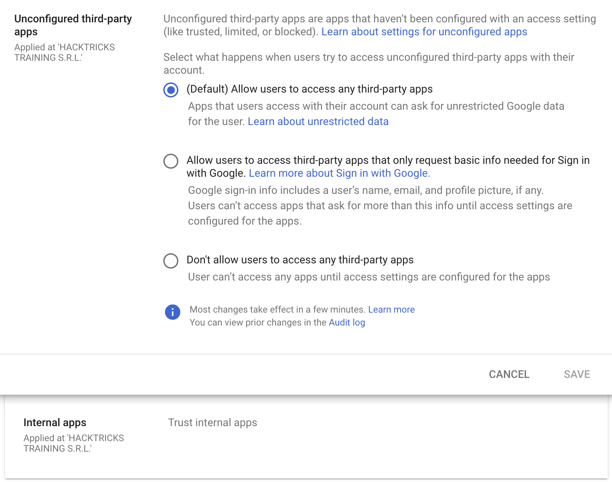

# GWS - Google Platforms Phishing

{{#include ../../../banners/hacktricks-training.md}}

## Загальна методологія Phishing

{{#ref}}
https://book.hacktricks.wiki/en/generic-methodologies-and-resources/phishing-methodology/index.html
{{#endref}}

## Google Groups Phishing

Схоже, за замовчуванням у workspace учасники [**can create groups**](https://groups.google.com/all-groups) **та запрошувати людей до них**. Потім ви можете змінити електронний лист, який буде надіслано користувачеві, **додавши деякі посилання.** **Електронний лист буде надіслано з адреси google**, тож він виглядатиме **легітимним** і люди можуть натиснути на посилання.

Також можливо встановити **FROM** адресу як **Google group email** щоб надіслати **більше листів користувачам всередині групи**, як на наведеному нижче зображенні, де групу **`google--support@googlegroups.com`** створено і **електронний лист було надіслано всім учасникам** групи (яких додали без їхньої згоди)

<figure><figcaption></figcaption></figure>

## Google Chat Phishing

Ви можете або **start a chat** з людиною, маючи лише її email, або надіслати **invitation to talk**. Крім того, можливо **create a Space**, яке може мати будь-яку назву (наприклад, "Google Support") і **invite** до нього учасників. Якщо вони приймуть, вони можуть подумати, що розмовляють із Google Support:

<figure><figcaption></figcaption></figure>

> [!TIP]
> Проте в моєму тестуванні запрошені учасники навіть не отримали запрошення.

Перевірити, як це працювало раніше, можна тут: [https://www.youtube.com/watch?v=KTVHLolz6cE\&t=904s](https://www.youtube.com/watch?v=KTVHLolz6cE&t=904s)

## Google Doc Phishing

Раніше можна було створити **виглядаючий легітимно документ** і в коментарі **mention some email (like @user@gmail.com)**. Google **sent an email to that email address** із повідомленням, що їх згадали в документі.\
Наразі це не працює, але якщо ви **give the victim email access to the document**, Google надішле відповідний лист. Ось повідомлення, яке з'являється при згадці:

<figure><figcaption></figcaption></figure>

> [!TIP]
> У жертв може бути механізм захисту, який не дозволяє приходити листам про те, що їм надали доступ до зовнішнього документу.

## Google Calendar Phishing

Ви можете **create a calendar event** і додати стільки email-адрес компанії, яку атакуєте, скільки маєте. Заплануйте цю подію календаря через **5 або 15 хв** від поточного часу. Зробіть подію правдоподібною і **додайте коментар та заголовок, що вказує на необхідність прочитати щось** (з **phishing link**).

Ось попередження, яке з'явиться в браузері з назвою зустрічі "Firing People", тож ви можете поставити більш фішинговий заголовок (і навіть змінити ім'я, пов'язане з вашим email).

<figure><figcaption></figcaption></figure>

Щоб це виглядало менш підозріло:

- Налаштуйте так, щоб **receivers cannot see the other people invited**
- НЕ надсилайте сповіщення про подію електронною поштою. Тоді люди побачать лише нагадування про зустріч за 5 хв і що їм треба прочитати це посилання.
- За допомогою API, судячи з усього, можна встановити **True**, що **people** **accepted** подію і навіть створювати **comments on their behalf**.

## App Scripts Redirect Phishing

Можна створити скрипт на [https://script.google.com/](https://script.google.com/) і **expose it as a web application accessible by everyone**, який буде використовувати легітимний домен **`script.google.com`**.\
За допомогою коду, як наведено нижче, атакуючий може змусити скрипт завантажувати довільний вміст на цю сторінку, не перестаючи використовувати домен:
```javascript
function doGet() {
return HtmlService.createHtmlOutput(
'<meta http-equiv="refresh" content="0;url=https://cloud.hacktricks.wiki/en/pentesting-cloud/workspace-security/gws-google-platforms-phishing/index.html#app-scripts-redirect-phishing">'
).setXFrameOptionsMode(HtmlService.XFrameOptionsMode.ALLOWALL)
}
```
For example accessing [https://script.google.com/macros/s/AKfycbwuLlzo0PUaT63G33MtE6TbGUNmTKXCK12o59RKC7WLkgBTyltaS3gYuH_ZscKQTJDC/exec](https://script.google.com/macros/s/AKfycbwuLlzo0PUaT63G33MtE6TbGUNmTKXCK12o59RKC7WLkgBTyltaS3gYuH_ZscKQTJDC/exec) you will see:

<figure><figcaption></figcaption></figure>

> [!TIP]
> Зверніть увагу, що з’явиться попередження, оскільки вміст завантажується всередині iframe.

## App Scripts OAuth Phishing

Можна створювати App Scripts, прикріплені до документів, щоб спробувати отримати доступ до OAuth-токена жертви; для отримання додаткової інформації див.:

{{#ref}}
gws-app-scripts.md
{{#endref}}

## OAuth Apps Phishing

Any of the previous techniques might be used to make the user access a **Google OAuth application** that will **request** the user some **access**. If the user **trusts** the **source** he might **trust** the **application** (even if it's asking for high privileged permissions).

> [!NOTE]
> Note that Google presents an ugly prompt asking warning that the application is untrusted in several cases and Workspace admins can even prevent people accepting OAuth applications.

**Google** дозволяє створювати додатки, які можуть **взаємодіяти від імені користувачів** з різними **Google services**: Gmail, Drive, GCP...

Коли створюється додаток, щоб **діяти від імені інших користувачів**, розробнику потрібно створити **OAuth app inside GCP** і вказати scopes (дозволи), які додаток повинен мати для доступу до даних користувачів.\
Коли **користувач** хоче **використовувати** цей **додаток**, йому **покажуть** запит на **погодження** того, що додаток отримає доступ до їхніх даних, зазначених у scopes.

Це дуже вигідний спосіб **phish** нетехнічних користувачів, щоб змусити їх використовувати **додатки, що отримують доступ до чутливої інформації**, оскільки вони можуть не розуміти наслідків. Однак в організаційних облікових записах існують способи запобігти цьому.

### Unverified App prompt

Як уже згадувалось, google завжди покаже **запит користувачу на підтвердження** дозволів, які він надає додатку від свого імені. Однак, якщо додаток вважається **небезпечним**, google спочатку покаже **повідомлення**, яке вказує, що він **небезпечний**, і **утруднить** для користувача надання дозволів цьому додатку.

Цей запит з'являється в додатках, які:

- Використовують будь-який scope, який може отримувати доступ до приватних даних (Gmail, Drive, GCP, BigQuery...)
- Apps with less than 100 users (apps > 100 a review process is also needed to stop showing the unverified prompt)

### Interesting Scopes

[**Here**](https://developers.google.com/identity/protocols/oauth2/scopes) you can find a list of all the Google OAuth scopes.

- **cloud-platform**: View and manage your data across **Google Cloud Platform** services. You can impersonate the user in GCP.
- **admin.directory.user.readonly**: See and download your organization's GSuite directory. Get names, phones, calendar URLs of all the users.

### Create an OAuth App

**Start creating an OAuth Client ID**

1. Go to [https://console.cloud.google.com/apis/credentials/oauthclient](https://console.cloud.google.com/apis/credentials/oauthclient) and click on configure the consent screen.
2. Then, you will be asked if the **user type** is **internal** (only for people in your org) or **external**. Select the one that suits your needs
- Internal might be interesting you have already compromised a user of the organization and you are creating this App to phish another one.
3. Give a **name** to the app, a **support email** (note that you can set a googlegroup email to try to anonymize yourself a bit more), a **logo**, **authorized domains** and another **email** for **updates**.
4. **Select** the **OAuth scopes**.
- This page is divided in non sensitive permissions, sensitive permissions and restricted permissions. Eveytime you add a new permisison it's added on its category. Depending on the requested permissions different prompt will appear to the user indicating how sensitive these permissions are.
- Both **`admin.directory.user.readonly`** and **`cloud-platform`** are sensitive permissions.
5. **Add the test users.** As long as the status of the app is testing, only these users are going to be able to access the app so make sure to **add the email you are going to be phishing**.

Now let's get **credentials for a web application** using the **previously created OAuth Client ID**:

1. Go back to [https://console.cloud.google.com/apis/credentials/oauthclient](https://console.cloud.google.com/apis/credentials/oauthclient), a different option will appear this time.
2. Select to **create credentials for a Web application**
3. Set needed **Javascript origins** and **redirect URIs**
- You can set in both something like **`http://localhost:8000/callback`** for testing
4. Get your application **credentials**

Finally, lets **run a web application that will use the OAuth application credentials**. You can find an example in [https://github.com/carlospolop/gcp_oauth_phishing_example](https://github.com/carlospolop/gcp_oauth_phishing_example).
```bash
git clone ttps://github.com/carlospolop/gcp_oauth_phishing_example
cd gcp_oauth_phishing_example
pip install flask requests google-auth-oauthlib
python3 app.py --client-id "<client_id>" --client-secret "<client_secret>"
```
Перейдіть на **`http://localhost:8000`**, натисніть кнопку Login with Google, вам буде показано повідомлення на кшталт цього:

<figure><figcaption></figcaption></figure>

Застосунок покаже **access and refresh token**, які можна легко використати. Для додаткової інформації про **how to use these tokens check**:

{{#ref}}
../../gcp-security/gcp-persistence/gcp-non-svc-persistence.md
{{#endref}}

#### Використання `glcoud`

Можна виконати ті ж дії за допомогою gcloud замість веб-консолі, див.:

{{#ref}}
../../gcp-security/gcp-privilege-escalation/gcp-clientauthconfig-privesc.md
{{#endref}}

#### OAuth app protections

За замовчуванням налаштовано, що будь-який користувач у організації Workspace **can accecpt any OAuth app with any permissions**, але можливо обмежити це лише для застосунків, що запитують базову інформацію, необхідну для Sign in with Google, або заборонити будь-які сторонні додатки.

Крім того, навіть якщо не дозволяти довіряти зовнішнім third-party apps, можна дозволити **trust any internal apps** (apps створені всередині організації). Ця довіра налаштована за **default**.

<figure><figcaption></figcaption></figure>

### OAuth Consent Grant Abuse: Detection & Response (Admin Reports)

Коли користувач авторизує OAuth app, Google Workspace реєструє це в **Admin Reports OAuth Token Audit Activity** (application name `token`) з `events.name`, встановленим у `authorize`. Ці події — найкраща телеметрія для виявлення consent phishing та відстеження client ID і scopes, які були надані.

Ключові поля для вилучення з події аудиту:

- `id.time`, `id.customerId`
- `actor.email`, `actor.profileId`
- `ipAddress`, `networkInfo.regionCode`, `networkInfo.subdivisionCode`
- `events[0]['parameters']` values for `client_id`, `app_name`, `scope`, `scope_data`

**Baseline first (reduce noise):** складіть інвентар існуючих client IDs і scopes, а потім налаштуйте оповіщення про нові/рідкісні consents.
```bash
gam all users print tokens todrive
```
**Ідеї виявлення (new/rare app + risky scopes):**

- Сповіщення, якщо `client_id` **не знаходиться в approved allowlist** і **не спостерігався протягом останніх X днів** (наприклад, 90).
- Сповіщення, якщо наданий `scope` містить **high-risk або rare** scopes, особливо ті, що дозволяють доступ до масових даних або вплив на supply-chain, наприклад:
- `https://mail.google.com/`
- `https://www.googleapis.com/auth/gmail.readonly`
- `https://www.googleapis.com/auth/drive`
- `https://www.googleapis.com/auth/drive.readonly`
- `https://www.googleapis.com/auth/chat.messages`
- `https://www.googleapis.com/auth/chromewebstore`
```text
client_id NOT IN approved_client_ids
AND client_id NOT IN last_seen_90d
AND scope CONTAINS any(high_risk_scopes OR rare_scopes)
```
**Реагування / стримування:**

- Відкликати tokens для зловмисного OAuth client ID:
```bash
gam all users delete tokens clientId <client_id>
```
- Заблокуйте OAuth client ID в Admin Console, відкликавши доступ додатка до Google data.

**Threat hunting pivots:**

- Перелік external apps, яким надали згоду менше ніж N користувачів (рідке поширення).
- Перевірте app name, publisher, permissions/scopes та unique application ID.
- Шукайте dormant apps, які раптово почали використовувати risky permissions (можливі подальші дії, як-от internal phishing або data theft).

**Mitigations:**

- Обмежте доступ third-party apps (лише admin-approved).
- Дозвольте обмежений доступ, щоб користувачі могли погоджуватися лише на базову інформацію профілю через “Sign in with Google”.

## Посилання

- [https://www.youtube-nocookie.com/embed/6AsVUS79gLw](https://www.youtube-nocookie.com/embed/6AsVUS79gLw) - Matthew Bryant - Hacking G Suite: The Power of Dark Apps Script Magic
- [https://www.youtube.com/watch?v=KTVHLolz6cE](https://www.youtube.com/watch?v=KTVHLolz6cE) - Mike Felch and Beau Bullock - OK Google, How do I Red Team GSuite?
- [https://redcanary.com/blog/threat-detection/google-workspace-oauth-attack/](https://redcanary.com/blog/threat-detection/google-workspace-oauth-attack/)
- [https://github.com/GAM-team/GAM](https://github.com/GAM-team/GAM)

{{#include ../../../banners/hacktricks-training.md}}
