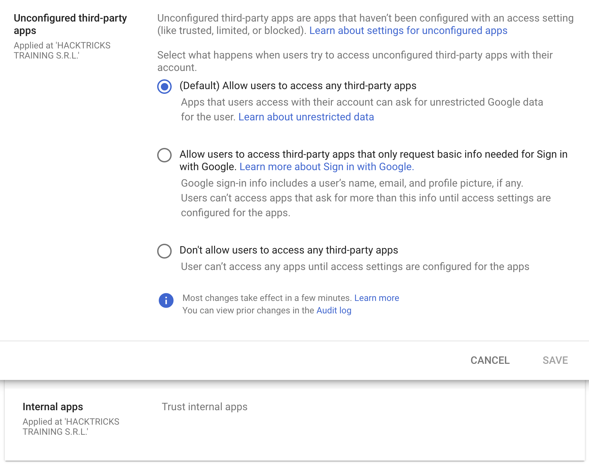

# GWS - Google Platforms Phishing

## Generic Phishing Methodology

{{#ref}}
https://book.hacktricks.wiki/en/generic-methodologies-and-resources/phishing-methodology/index.html
{{#endref}}

## Google Groups Phishing

जहाँ Workspace administrator Groups for Business को enable करता है और member management की अनुमति देता है, वहाँ कोई user एक group बना सकता है, members को invite या add कर सकता है और group address पर post कर सकता है। Group settings यह नियंत्रित करती हैं कि कौन join कर सकता है, कौन post कर सकता है और default sender group address होगा या नहीं, इसलिए कोई message सामान्य Workspace mail जैसा दिखाई दे सकता है।<sup>[[5]](#references)</sup> कोई attacker इन settings का दुरुपयोग करके targets को add कर सकता है और group message में phishing link शामिल कर सकता है।

**FROM** address को **Google group email** के रूप में configure करके group के अंदर मौजूद users को messages भेजना भी संभव है, जैसा कि निम्न image में दिखाया गया है, जहाँ **`google--support@googlegroups.com`** group बनाया गया और group के **सभी members को email भेजा गया** (जिन्हें बिना किसी consent के add किया गया था)।<sup>[[5]](#references)</sup>

<figure><figcaption></figcaption></figure>

## Google Chat Phishing

Workspace policy के आधार पर, कोई user email address दर्ज करके **chat शुरू** कर सकता है, नाम वाला **Space** बना सकता है (उदाहरण के लिए, "Google Support") और members को add कर सकता है। External guests के लिए संबंधित administrator settings आवश्यक होती हैं, और invitations या direct additions इस बात के अनुसार अलग-अलग होते हैं कि participants ने पहले chat किया है या नहीं और क्या वे एक ही organization से संबंधित हैं।<sup>[[6]](#references)[[7]](#references)</sup> Convincingly named space स्वीकार करने वाला target इसे support conversation समझ सकता है:

<figure><figcaption></figcaption></figure>

> [!TIP]
> **हालाँकि, मेरी testing में invited members को invitation प्राप्त नहीं हुआ।**

आप देख सकते हैं कि यह पहले कैसे काम करता था: [https://www.youtube.com/watch?v=KTVHLolz6cE\&t=904s](https://www.youtube.com/watch?v=KTVHLolz6cE&t=904s)।<sup>[[2]](#references)</sup>

## Google Doc Phishing

Historically, कोई attacker **apparently legitimate document** बना सकता था और comment में **email address का उल्लेख** कर सकता था (उदाहरण के लिए, `@user@gmail.com`)।<sup>[[2]](#references)</sup> Google Docs वर्तमान में उन comments के लिए notifications document करता है जिनमें किसी user का उल्लेख किया गया हो, हालाँकि recipient की notification settings और Workspace policies उन्हें suppress कर सकती हैं। अधिक direct lure के रूप में document को victim के address के साथ **share** किया जा सकता है: यदि sender notification option disable नहीं करता है, तो Google प्रत्येक address पर email भेजता है।<sup>[[8]](#references)[[9]](#references)</sup> किसी का उल्लेख करने पर दिखाई देने वाला message यह है:

<figure><figcaption></figcaption></figure>

> [!TIP]
> Victims के पास ऐसे protection mechanisms हो सकते हैं जो किसी external document को उनके साथ share किए जाने की सूचना देने वाले emails को उनके inbox तक पहुँचने से रोकते हैं।

## Google Calendar Phishing

आप **calendar event बना** सकते हैं और target email addresses को guests के रूप में add कर सकते हैं। इस calendar event को वर्तमान समय से **5 या 15 min** बाद schedule करें, इसे legitimate जैसा दिखाएँ और **एक comment तथा title डालें जिससे संकेत मिले कि उन्हें कुछ पढ़ना है** (जिसमें **phishing link** हो)। Google Calendar का invitation और notification behavior guest तथा account settings पर निर्भर करता है, इसलिए इसे target tenant में verify करें।<sup>[[10]](#references)</sup>

यह browser में दिखाई देने वाला alert है, जिसमें meeting title "Firing People" है, इसलिए आप अधिक phishing-जैसा title set कर सकते हैं (और अपने email से associated name भी बदल सकते हैं)।

<figure><figcaption></figcaption></figure>

इसे कम suspicious दिखाने के लिए:

- **See guest list** को off करें ताकि receivers अन्य invited लोगों को न देख सकें।<sup>[[11]](#references)</sup>
- **Event के बारे में सूचना देने वाले emails भेजें ही नहीं**। API event notifications को suppress करने का support करता है, लेकिन guest calendars और external calendars ऐसे events को अलग-अलग तरीके से handle कर सकते हैं।<sup>[[10]](#references)[[12]](#references)</sup>
- Calendar API का उपयोग करके, organizer किसी attendee का `responseStatus` `accepted` पर set कर सकता है और attendee का `comment` populate कर सकता है; target account settings इस status को reset कर सकती हैं और 200 से अधिक guests वाले events के लिए responses propagate नहीं किए जाते।<sup>[[12]](#references)</sup>

## App Scripts Redirect Phishing

[https://script.google.com/](https://script.google.com/) पर script बनाना और उसे **web application के रूप में deploy** करना संभव है, जिसमें **`script.google.com`** domain पर public `/exec` URL होता है। `doGet()` function ऐसा `HtmlOutput` return कर सकता है जिसमें arbitrary content का user-activated link हो, जबकि initial URL Google-hosted URL ही रहता है।<sup>[[13]](#references)[[14]](#references)</sup>

Historical Apps Script tradecraft के लिए Matthew Bryant का *Hacking G Suite: The Power of Dark Apps Script Magic* देखें।<sup>[[1]](#references)</sup>

वर्तमान HTML Service एक iframe sandbox के अंदर चलता है, जो automatic top-level navigation को restrict करता है। Current deployment के लिए `_top` या `_blank` target वाले link या button का उपयोग करें और user action आवश्यक रखें; यह assume न करें कि पुराना meta-refresh redirect अभी भी काम करेगा।<sup>[[23]](#references)</sup>
```javascript
function doGet() {
return HtmlService.createHtmlOutput(`
<base target="_top">
<p><a href="https://example.com/landing-page" target="_top">Continue</a></p>
`).setXFrameOptionsMode(HtmlService.XFrameOptionsMode.ALLOWALL)
}
```
स्क्रिप्ट की एक copy deploy करके `/exec` URL प्राप्त करें और जाँचें कि intermediate page और user-activated link recipient को कैसे दिखाई देते हैं।<sup>[[13]](#references)</sup>

<figure><figcaption></figcaption></figure>

> [!TIP]
> `ALLOWALL` अन्य sites को output को iframe करने की अनुमति देता है और default `X-Frame-Options` protection हटा देता है, इसलिए इसका उपयोग केवल controlled test में करें।<sup>[[15]](#references)</sup>

## App Scripts OAuth Phishing

Victim के OAuth token के माध्यम से access प्राप्त करने का प्रयास करने के लिए documents से जुड़े App Scripts बनाए जा सकते हैं। अधिक जानकारी के लिए देखें:

{{#ref}}
gws-app-scripts.md
{{#endref}}

## OAuth Apps Phishing

पिछली किसी भी technique का उपयोग user से ऐसी **Google OAuth application** access करवाने के लिए किया जा सकता है जो Google APIs तक **access का अनुरोध करती है**। OAuth consent screen application का नाम, services और अनुरोधित scopes दिखाती है; lure पर भरोसा करने वाला user ऐसी permissions approve कर सकता है जिन पर वह सामान्यतः सवाल उठाता।<sup>[[16]](#references)[[18]](#references)</sup>

> [!NOTE]
> Sensitive या restricted scopes का अनुरोध करने वाली applications के लिए Google unverified-app warning दिखा सकता है, और Workspace administrators app access controls के माध्यम से authorization को रोक या सीमित कर सकते हैं।<sup>[[19]](#references)[[21]](#references)</sup>

**Google** applications को कई **Google services**, जिनमें Gmail, Drive और Google Cloud APIs शामिल हैं, के साथ **users की ओर से कार्य करने** की अनुमति देता है।<sup>[[16]](#references)[[17]](#references)</sup>

अन्य users की **ओर से कार्य करने** वाली application बनाते समय, developer Google Cloud project में OAuth credentials बनाता है और केवल वे scopes (permissions) requests करता है जिनकी application को आवश्यकता होती है। इसके बाद user को उन scopes को grant या deny करने के लिए कहा जाता है; access token केवल उन resources और operations तक सीमित होता है जिन्हें वे scopes दर्शाते हैं।<sup>[[16]](#references)[[17]](#references)[[18]](#references)</sup>

यह non-technical users को **phish** करके ऐसी **applications approve** करवाने का उपयोगी तरीका है जो **sensitive information access करती हैं**, क्योंकि वे इसके परिणामों को नहीं समझ सकते। Workspace organizations में administrators app access controls के साथ इस risk को कम कर सकते हैं।

### Unverified App prompt

Google का OAuth flow user approval के लिए requested scopes दिखाता है। जब कोई app required verification के बिना sensitive या restricted scopes का अनुरोध करती है, तो consent screen से पहले **unverified-app** screen दिखाई दे सकती है, जिससे approval अधिक कठिन हो जाता है।<sup>[[18]](#references)[[19]](#references)</sup>

यह prompt उन apps में दिखाई देता है जो:

- Sensitive या restricted scopes का उपयोग करती हैं, या ऐसे scopes request करती हैं जो verification के लिए configured scopes से मेल नहीं खाते।
- **Testing** status में होती हैं, जहाँ Google test warning दिखाता है और अधिकतम 100 listed test users की अनुमति देता है; अलग से, verification पूरी होने तक किसी unverified app को 100 नए users तक सीमित किया जा सकता है।<sup>[[19]](#references)[[20]](#references)</sup>

### Interesting Scopes

[**यहाँ**](https://developers.google.com/identity/protocols/oauth2/scopes) आपको सभी Google OAuth scopes की सूची मिल सकती है।<sup>[[17]](#references)</sup>

- **cloud-platform**: Scope में शामिल user के Google Cloud data को देखें, edit, configure और delete करें।<sup>[[17]](#references)</sup>
- **admin.directory.user.readonly**: Organization की directory में users से संबंधित information देखें।<sup>[[17]](#references)</sup>

### Create an OAuth App

**OAuth Client ID बनाना शुरू करें**

1. [OAuth consent screen](https://console.cloud.google.com/apis/credentials/consent) पर जाएँ और app audience configure करें।<sup>[[20]](#references)</sup>
2. **Internal** (केवल organization के accounts) या **External** चुनें। External project की शुरुआत testing में होती है और यह आपके द्वारा जोड़े गए test users तक सीमित रहता है; internal projects संबंधित organization तक सीमित होते हैं।<sup>[[20]](#references)</sup>
- यदि आपने पहले ही किसी organization account को compromise कर लिया है और किसी अन्य organization का authorized assessment कर रहे हैं, तो Internal relevant हो सकता है।
3. App का **name**, **support email**, **logo**, **authorized domains** और updates के लिए contact information प्रदान करें। ये values consent और verification के दौरान दिखाई जाती हैं या उपयोग की जाती हैं।<sup>[[19]](#references)[[20]](#references)</sup>
4. Test के लिए आवश्यक न्यूनतम **OAuth scopes** **Select** करें।
- Cloud Console requested scopes को non-sensitive, sensitive या restricted के रूप में classify करता है; requested classification consent और verification flow को प्रभावित करती है।<sup>[[17]](#references)[[19]](#references)</sup>
5. यदि project **Testing** में है, तो flow का उपयोग करने वाले **test users add करें**। Google वर्तमान में अधिकतम 100 listed test users की अनुमति देता है, और test-user authorizations सात दिनों के बाद expire हो जाते हैं।<sup>[[20]](#references)</sup>

अब **पहले बनाए गए OAuth Client ID** का उपयोग करके **web application के लिए credentials** प्राप्त करें:

1. उसी Cloud project में [Credentials](https://console.cloud.google.com/apis/credentials) खोलें।<sup>[[16]](#references)</sup>
2. **Create credentials** > **OAuth client ID** > **Web application** चुनें।<sup>[[16]](#references)</sup>
3. आवश्यक **JavaScript origins** और **redirect URIs** सेट करें।
- Local testing के लिए **`http://localhost:8000/callback`** का उपयोग कर सकते हैं।
- Redirect URI को registered value से बिल्कुल match करना चाहिए, जिसमें scheme, case और trailing slash भी शामिल हैं।<sup>[[18]](#references)</sup>
4. Client ID और client secret को application **credentials** के रूप में save करें।<sup>[[16]](#references)</sup>

अंत में, **OAuth application credentials का उपयोग करने वाली web application run करें**। इसका एक example [https://github.com/carlospolop/gcp_oauth_phishing_example](https://github.com/carlospolop/gcp_oauth_phishing_example) में मिल सकता है।
```bash
git clone https://github.com/carlospolop/gcp_oauth_phishing_example
cd gcp_oauth_phishing_example
pip install flask requests google-auth-oauthlib
python3 app.py --client-id "<client_id>" --client-secret "<client_secret>"
```
**`http://localhost:8000`** पर जाएँ, **Login with Google** बटन पर क्लिक करें, और आपको अनुरोधित scopes देने के लिए **prompted** किया जाएगा।<sup>[[18]](#references)</sup>

<figure><figcaption></figcaption></figure>

Application को एक **access token** मिलता है और, जब offline access का अनुरोध किया जाता है, तो एक **refresh token** भी मिलता है। दोनों को credentials की तरह मानें: access token अपने दिए गए scopes तक सीमित होता है, जबकि refresh token तब तक नए access tokens प्राप्त कर सकता है, जब तक वह valid रहता है।<sup>[[16]](#references)</sup> इन tokens का **उपयोग कैसे करें, इसकी अधिक जानकारी के लिए देखें**:

{{#ref}}
../../gcp-security/gcp-persistence/gcp-non-svc-persistence.md
{{#endref}}

#### `gcloud` का उपयोग

Web console के बजाय gcloud से भी कुछ कार्य किए जा सकते हैं, देखें:

{{#ref}}
../../gcp-security/gcp-privilege-escalation/gcp-clientauthconfig-privesc.md
{{#endref}}

#### OAuth app protections

Workspace administrators **App access control** का उपयोग करके apps को Trusted, Specific Google data, Limited या Blocked के रूप में चिह्नित कर सकते हैं और Gmail, Drive और Chat जैसी services के लिए high-risk scopes को restrict कर सकते हैं।<sup>[[21]](#references)</sup> अधिक सख्त policy केवल उन third-party apps को अनुमति दे सकती है जो Sign in with Google के लिए basic profile information का अनुरोध करती हैं, या third-party apps को तब तक block कर सकती है जब तक कोई administrator उन्हें configure न कर दे।<sup>[[21]](#references)</sup>

Administrators organization में बनाए गए internal applications के लिए **Trust internal apps** भी enable कर सकते हैं। यह assume न करें कि target tenant में ये settings enabled या disabled हैं; assessment के दौरान effective policy की जाँच करें।<sup>[[21]](#references)</sup>

<figure><figcaption></figcaption></figure>

### OAuth Consent Grant Abuse: Detection & Response (Admin Reports)

जब कोई user किसी OAuth app को authorize करता है, तो Google Workspace **Admin Reports OAuth Token Audit Activity** में एक `authorize` event record करता है (application name `token`)। यह event app name, client ID और granted scopes दिखाता है, जिससे consent phishing की जाँच के लिए उपयोगी telemetry मिलती है।<sup>[[3]](#references)[[22]](#references)</sup>

Audit event से extract किए जाने वाले key fields में निम्न शामिल हैं। उपलब्ध होने पर detailed event payload में `networkInfo` fields मौजूद होते हैं।<sup>[[3]](#references)[[22]](#references)</sup>

- `id.time`, `id.customerId`
- `actor.email`, `actor.profileId`
- `ipAddress`, `networkInfo.regionCode`, `networkInfo.subdivisionCode`
- `events[0].name` और `events[0]['parameters']` में `client_id`, `app_name`, `scope`, `scope_data` values

**पहले baseline तैयार करें (noise कम करने के लिए):** मौजूदा client IDs और scopes की inventory बनाएँ, फिर नए या rare consents पर alert करें। निम्न GAM command इस inventory के लिए एक practical starting point है।<sup>[[3]](#references)[[4]](#references)</sup>
```bash
gam all users print tokens todrive
```
**Detection ideas (new/rare app + risky scopes):**

- Alert करें यदि कोई `client_id` **approved allowlist में नहीं है** और **पिछले X दिनों में देखा नहीं गया है** (उदाहरण के लिए, 90)।<sup>[[3]](#references)</sup>
- Alert करें यदि प्रदान किया गया `scope` **high-risk या rare** scopes को शामिल करता है, विशेष रूप से वे जो bulk data access या supply-chain impact की अनुमति देते हैं। उदाहरणों में शामिल हैं:<sup>[[3]](#references)</sup>
- `https://mail.google.com/`
- `https://www.googleapis.com/auth/gmail.readonly`
- `https://www.googleapis.com/auth/drive`
- `https://www.googleapis.com/auth/drive.readonly`
- `https://www.googleapis.com/auth/chat.messages`
- `https://www.googleapis.com/auth/chromewebstore`

निम्न pseudo-logic इन दोनों signals को जोड़ता है और केवल एक illustrative baseline है; इसे tenant के सामान्य applications और scopes के अनुसार tune करें।<sup>[[3]](#references)</sup>
```text
client_id NOT IN approved_client_ids
AND client_id NOT IN last_seen_90d
AND scope CONTAINS any(high_risk_scopes OR rare_scopes)
```
**Response / containment:**

- Audit event से प्राप्त client ID का उपयोग करके malicious OAuth client ID के tokens revoke करें।<sup>[[3]](#references)[[4]](#references)</sup>
```bash
gam all users delete tokens clientId <client_id>
```
- Admin Console में OAuth client ID को block करके application की Google data तक access revoke करें।<sup>[[3]](#references)[[21]](#references)</sup>

**Threat hunting pivots:**

Rare adoption और app metadata को pivots के रूप में उपयोग करें, फिर उन dormant apps की जांच करें जो अचानक risky permissions का अनुरोध करती हैं।<sup>[[3]](#references)</sup>

- उन external apps की सूची बनाएं जिन्हें N से कम users ने consent दिया है (rare adoption)।
- App name, publisher, permissions/scopes और unique application ID की समीक्षा करें।
- ऐसे dormant apps की तलाश करें जो अचानक risky permissions का उपयोग करने लगती हैं (संभावित follow-on actions जैसे internal phishing या data theft)।

**Mitigations:**

Tenant की risk tolerance के अनुसार app access control configure करें:<sup>[[21]](#references)</sup>

- सभी third-party app access को restrict करें (केवल admin-approved)।
- Limited access की अनुमति दें, ताकि users केवल basic “Sign in with Google” profile info के लिए consent कर सकें।

## References

- [1] [Hacking G Suite: The Power of Dark Apps Script Magic](https://www.youtube-nocookie.com/embed/6AsVUS79gLw)
- [2] [OK Google, How Do I Red Team GSuite?](https://www.youtube.com/watch?v=KTVHLolz6cE)
- [3] [Malicious Google Workspace OAuth app का उपयोग करने वाले supply chain attack का विश्लेषण](https://redcanary.com/blog/threat-detection/google-workspace-oauth-attack/)
- [4] [GAM: Google Workspace के लिए command line management](https://github.com/GAM-team/GAM)
- [5] [Group बनाएं और group settings चुनें](https://support.google.com/groups/answer/2464926?hl=en)
- [6] [Google Chat में external guests को invite करें](https://support.google.com/chat/answer/16997417?hl=en)
- [7] [किसी व्यक्ति को space में add या remove करें](https://support.google.com/chat/answer/7653881?hl=en)
- [8] [Google Drive से files share करें](https://support.google.com/docs/answer/2494822?hl=en)
- [9] [अपनी notifications manage करें](https://support.google.com/docs/answer/91588?hl=en)
- [10] [अपने Calendar event में लोगों को invite करें](https://support.google.com/calendar/answer/37161?hl=en)
- [11] [अपना calendar share करें](https://support.google.com/calendar/answer/37082?hl=en)
- [12] [Events: insert](https://developers.google.com/workspace/calendar/api/v3/reference/events/insert)
- [13] [Web Apps](https://developers.google.com/apps-script/guides/web)
- [14] [HTML Service: HTML बनाएं और serve करें](https://developers.google.com/apps-script/guides/html)
- [15] [XFrameOptionsMode](https://developers.google.com/apps-script/reference/html/x-frame-options-mode)
- [16] [Google APIs तक access के लिए OAuth 2.0 का उपयोग](https://developers.google.com/identity/protocols/oauth2)
- [17] [Google APIs के लिए OAuth 2.0 Scopes](https://developers.google.com/identity/protocols/oauth2/scopes)
- [18] [Web Server Applications के लिए OAuth 2.0 का उपयोग](https://developers.google.com/identity/protocols/oauth2/web-server)
- [19] [Unverified apps](https://support.google.com/cloud/answer/7454865?hl=en)
- [20] [App Audience manage करें](https://support.google.com/cloud/answer/15549945?hl=en)
- [21] [कौन-से apps Google Workspace data access कर सकते हैं, इसे control करें](https://support.google.com/a/answer/7281227?hl=en&p=app_access_apps)
- [22] [OAuth Token Audit Activity Events](https://developers.google.com/workspace/admin/reports/v1/appendix/activity/token)
- [23] [HTML Service: Restrictions](https://developers.google.com/apps-script/guides/html/restrictions)

{{#include ../../../banners/hacktricks-training.md}}
