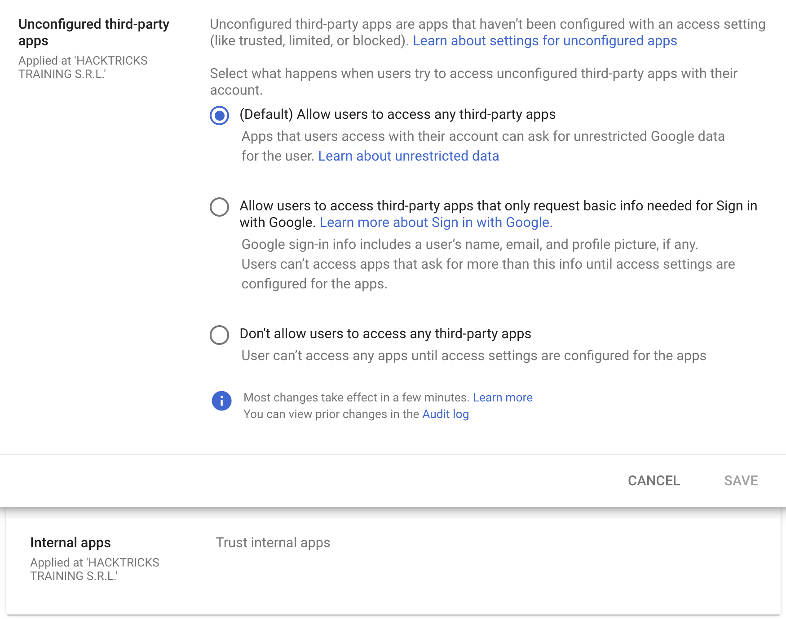

# GWS - Google Platforms Phishing

{{#include ../../../banners/hacktricks-training.md}}

## Generic Phishing Methodology

{{#ref}}
https://book.hacktricks.wiki/en/generic-methodologies-and-resources/phishing-methodology/index.html
{{#endref}}

## Google Groups Phishing

Kada Workspace administrator omogući Groups for Business i dozvoli upravljanje članovima, korisnik može da kreira grupu, pozove ili doda članove i objavi poruku na adresi grupe. Podešavanja grupe određuju ko može da se pridruži, ko može da objavljuje poruke i da li je podrazumevani pošiljalac adresa grupe, tako da poruka može izgledati kao uobičajena Workspace pošta.<sup>[[5]](#references)</sup> Napadač bi mogao da zloupotrebi ta podešavanja da doda mete i uključi phishing link u poruku grupe.

Takođe je moguće konfigurisati adresu **FROM** kao **Google group email** za slanje poruka korisnicima unutar grupe, kao na sledećoj slici, gde je kreirana grupa **`google--support@googlegroups.com`** i **email je poslat svim članovima** grupe (koji su dodati bez ikakve saglasnosti).<sup>[[5]](#references)</sup>

<figure><figcaption></figcaption></figure>

## Google Chat Phishing

U zavisnosti od Workspace politike, korisnik može da **započne chat** unosom email adrese, kreira imenovani **Space** (na primer, "Google Support") i doda članove. Spoljni gosti zahtevaju odgovarajuća administratorska podešavanja, a pozivi ili direktno dodavanje zavise od toga da li su učesnici ranije razgovarali i da li pripadaju istoj organizaciji.<sup>[[6]](#references)[[7]](#references)</sup> Meta koja prihvati prostor sa uverljivim nazivom mogla bi da ga pomeša sa razgovorom sa podrškom:

<figure><figcaption></figcaption></figure>

> [!TIP]
> **Međutim, tokom mog testiranja pozvani članovi nisu primili pozivnicu.**

Možete proveriti kako je ovo ranije funkcionisalo na: [https://www.youtube.com/watch?v=KTVHLolz6cE\&t=904s](https://www.youtube.com/watch?v=KTVHLolz6cE&t=904s).<sup>[[2]](#references)</sup>

## Google Doc Phishing

Istorijski gledano, napadač je mogao da kreira **naizgled legitimni dokument** i da u komentaru **pomene email adresu** (na primer, `@user@gmail.com`).<sup>[[2]](#references)</sup> Google Docs trenutno dokumentuje obaveštenja za komentare u kojima je korisnik pomenut, iako podešavanja obaveštenja primaoca i Workspace politike mogu da ih blokiraju. Direktniji mamac je **deljenje dokumenta** sa adresom žrtve: Google svakoj adresi šalje email, osim ako pošiljalac ne onemogući opciju obaveštavanja.<sup>[[8]](#references)[[9]](#references)</sup> Ovo je poruka koja se pojavljuje kada nekoga pomenete:

<figure><figcaption></figcaption></figure>

> [!TIP]
> Žrtve mogu imati zaštitne mehanizme koji sprečavaju da emailovi o deljenju eksternog dokumenta sa njima stignu u njihovo prijemno sanduče.

## Google Calendar Phishing

Možete **kreirati kalendarski događaj** i dodati ciljne email adrese kao goste. Zakažite ovaj kalendarski događaj za **5 ili 15 min** od trenutnog vremena, učinite da izgleda legitimno i **dodajte komentar i naslov koji ukazuju na to da treba nešto da pročitaju** (sa **phishing linkom**). Ponašanje pozivnica i obaveštenja u Google Calendar-u zavisi od podešavanja gosta i naloga, zato ga proverite u ciljnom tenant-u.<sup>[[10]](#references)</sup>

Ovo je upozorenje koje će se pojaviti u browser-u sa naslovom sastanka "Firing People", pa biste mogli da postavite naslov koji više liči na phishing (i čak promenite ime povezano sa emailom).

<figure><figcaption></figcaption></figure>

Da bi izgledalo manje sumnjivo:

- Isključite opciju **See guest list** kako primaoci ne bi mogli da vide ostale pozvane osobe.<sup>[[11]](#references)</sup>
- **NEMOJTE slati emailove sa obaveštenjem o događaju**. API podržava potiskivanje obaveštenja o događaju, ali kalendari gostiju i eksterni kalendari mogu različito da obrađuju takve događaje.<sup>[[10]](#references)[[12]](#references)</sup>
- Korišćenjem Calendar API-ja, organizator može da postavi `responseStatus` učesnika na `accepted` i popuni njegov `comment`; podešavanja ciljnog naloga mogu resetovati status, a odgovori se ne prosleđuju za događaje sa više od 200 gostiju.<sup>[[12]](#references)</sup>

## App Scripts Redirect Phishing

Moguće je kreirati script na [https://script.google.com/](https://script.google.com/) i **deploy-ovati ga kao web aplikaciju** sa javnim `/exec` URL-om na domenu **`script.google.com`**. Funkcija `doGet()` može da vrati `HtmlOutput` koji sadrži link ka sadržaju po izboru koji korisnik aktivira, dok početni URL ostaje Google-hosted URL.<sup>[[13]](#references)[[14]](#references)</sup>

Za istorijski Apps Script tradecraft pogledajte delo Matthewa Bryanta *Hacking G Suite: The Power of Dark Apps Script Magic*.<sup>[[1]](#references)</sup>

Trenutni HTML Service radi unutar iframe sandbox-a koji ograničava automatsku navigaciju na najvišem nivou. Za trenutni deployment koristite link ili dugme sa `_top` ili `_blank` targetom i zahtevajte radnju korisnika; nemojte pretpostavljati da će stariji meta-refresh redirect i dalje funkcionisati.<sup>[[23]](#references)</sup>
```javascript
function doGet() {
return HtmlService.createHtmlOutput(`
<base target="_top">
<p><a href="https://example.com/landing-page" target="_top">Continue</a></p>
`).setXFrameOptionsMode(HtmlService.XFrameOptionsMode.ALLOWALL)
}
```
Deploy a copy of the script to obtain an `/exec` URL and test how the intermediate page and user-activated link appear to a recipient.<sup>[[13]](#references)</sup>

<figure><figcaption></figcaption></figure>

> [!TIP]
> `ALLOWALL` permits other sites to iframe the output and removes the default `X-Frame-Options` protection, so use it only in a controlled test.<sup>[[15]](#references)</sup>

## App Scripts OAuth Phishing

It's possible to create App Scripts attached to documents to try to get access over a victims OAuth token, for more information check:

{{#ref}}
gws-app-scripts.md
{{#endref}}

## OAuth Apps Phishing

Any of the previous techniques might be used to make the user access a **Google OAuth application** that **requests access** to Google APIs. The OAuth consent screen shows the application name, services, and scopes being requested; a user who trusts the lure might approve permissions they would otherwise question.<sup>[[16]](#references)[[18]](#references)</sup>

> [!NOTE]
> Google can display an unverified-app warning for applications requesting sensitive or restricted scopes, and Workspace administrators can prevent or limit authorization through app access controls.<sup>[[19]](#references)[[21]](#references)</sup>

**Google** allows applications to **act on behalf of users** with several **Google services**, including Gmail, Drive, and Google Cloud APIs.<sup>[[16]](#references)[[17]](#references)</sup>

When creating an application to **act on behalf of other users**, the developer creates OAuth credentials in a Google Cloud project and requests only the scopes (permissions) the application needs. The user is then prompted to grant or deny those scopes; an access token is limited to the resources and operations they describe.<sup>[[16]](#references)[[17]](#references)[[18]](#references)</sup>

This is a useful way to **phish** non-technical users into approving **applications that access sensitive information** because they might not understand the consequences. In Workspace organizations, administrators can reduce this risk with app access controls.

### Unverified App prompt

Google's OAuth flow presents the requested scopes for user approval. An **unverified-app** screen can appear before the consent screen when an app requests sensitive or restricted scopes without the required verification, making approval more difficult.<sup>[[18]](#references)[[19]](#references)</sup>

This prompt appears in apps that:

- Use sensitive or restricted scopes, or request scopes that do not match the scopes configured for verification.
- Are in **Testing** status, where Google shows a test warning and allows up to 100 listed test users; separately, an unverified app can be capped at 100 new users until verification is completed.<sup>[[19]](#references)[[20]](#references)</sup>

### Interesting Scopes

[**Ovde**](https://developers.google.com/identity/protocols/oauth2/scopes) možete pronaći listu svih Google OAuth scopes.<sup>[[17]](#references)</sup>

- **cloud-platform**: See, edit, configure, and delete the user's Google Cloud data covered by the scope.<sup>[[17]](#references)</sup>
- **admin.directory.user.readonly**: See information about users in the organization's directory.<sup>[[17]](#references)</sup>

### Create an OAuth App

**Start creating an OAuth Client ID**

1. Go to the [OAuth consent screen](https://console.cloud.google.com/apis/credentials/consent) and configure the app audience.<sup>[[20]](#references)</sup>
2. Choose **Internal** (only accounts in the organization) or **External**. An external project starts in testing and is limited to the test users you add; internal projects are limited to the associated organization.<sup>[[20]](#references)</sup>
- Internal may be relevant if you have already compromised one organization account and are conducting an authorized assessment of another.
3. Provide an app **name**, **support email**, **logo**, **authorized domains**, and contact information for updates. These values are shown or used during consent and verification.<sup>[[19]](#references)[[20]](#references)</sup>
4. **Select** the minimum **OAuth scopes** needed by the test.
- The Cloud Console classifies requested scopes as non-sensitive, sensitive, or restricted; the requested classification affects the consent and verification flow.<sup>[[17]](#references)[[19]](#references)</sup>
5. If the project is in **Testing**, **add the test users** who will exercise the flow. Google currently allows up to 100 listed test users, and test-user authorizations expire after seven days.<sup>[[20]](#references)</sup>

Now let's get **credentials for a web application** using the **previously created OAuth Client ID**:

1. Open [Credentials](https://console.cloud.google.com/apis/credentials) in the same Cloud project.<sup>[[16]](#references)</sup>
2. Select **Create credentials** > **OAuth client ID** > **Web application**.<sup>[[16]](#references)</sup>
3. Set the required **JavaScript origins** and **redirect URIs**.
- You can use **`http://localhost:8000/callback`** for local testing.
- The redirect URI must exactly match the registered value, including scheme, case, and trailing slash.<sup>[[18]](#references)</sup>
4. Save the client ID and client secret as application **credentials**.<sup>[[16]](#references)</sup>

Finally, let's **run a web application that uses the OAuth application credentials**. You can find an example in [https://github.com/carlospolop/gcp_oauth_phishing_example](https://github.com/carlospolop/gcp_oauth_phishing_example).
```bash
git clone https://github.com/carlospolop/gcp_oauth_phishing_example
cd gcp_oauth_phishing_example
pip install flask requests google-auth-oauthlib
python3 app.py --client-id "<client_id>" --client-secret "<client_secret>"
```
Idite na **`http://localhost:8000`**, kliknite na dugme **Login with Google** i bićete **upitani** da odobrite zatražene scopes.<sup>[[18]](#references)</sup>

<figure><figcaption></figcaption></figure>

Aplikacija prima **access token** i, kada se zatraži offline pristup, **refresh token**. Prema oba postupajte kao prema credentialima: access token je ograničen na dodeljene scopes, dok refresh token može da pribavlja nove access tokene dok god je važeći.<sup>[[16]](#references)</sup> Više informacija o tome **kako koristiti ove tokene potražite na**:

{{#ref}}
../../gcp-security/gcp-persistence/gcp-non-svc-persistence.md
{{#endref}}

#### Zaštite OAuth aplikacija

Workspace administratori mogu koristiti **App access control** za označavanje aplikacija kao Trusted, Specific Google data, Limited ili Blocked, kao i za ograničavanje rizičnih scopes za servise kao što su Gmail, Drive i Chat.<sup>[[21]](#references)</sup> Stroža policy može dozvoliti samo third-party aplikacije koje zahtevaju osnovne informacije o profilu za Sign in with Google ili blokirati third-party aplikacije dok ih administrator ne konfiguriše.<sup>[[21]](#references)</sup>

Administratori takođe mogu omogućiti **Trust internal apps** za interne aplikacije kreirane u organizaciji. Nemojte pretpostaviti da su ova podešavanja omogućena ili onemogućena u ciljnom tenantu; tokom assessmenta proverite efektivnu policy.<sup>[[21]](#references)</sup>

<figure><figcaption></figcaption></figure>

## References

- [1] [Hakovanje G Suite: Moć magije Dark Apps Script-a](https://www.youtube-nocookie.com/embed/6AsVUS79gLw)
- [2] [OK Google, kako da radim Red Team testiranje GSuite-a?](https://www.youtube.com/watch?v=KTVHLolz6cE)
- [3] [Razlaganje supply chain napada koji koristi zlonamernu Google Workspace OAuth aplikaciju](https://redcanary.com/blog/threat-detection/google-workspace-oauth-attack/)
- [4] [GAM: upravljanje Google Workspace-om iz komandne linije](https://github.com/GAM-team/GAM)
- [5] [Kreiranje grupe i izbor podešavanja grupe](https://support.google.com/groups/answer/2464926?hl=en)
- [6] [Pozivanje eksternih gostiju u Google Chat](https://support.google.com/chat/answer/16997417?hl=en)
- [7] [Dodavanje ili uklanjanje osobe iz prostora](https://support.google.com/chat/answer/7653881?hl=en)
- [8] [Deljenje fajlova iz Google Drive-a](https://support.google.com/docs/answer/2494822?hl=en)
- [9] [Upravljanje obaveštenjima](https://support.google.com/docs/answer/91588?hl=en)
- [10] [Pozivanje osoba na događaj u Calendar-u](https://support.google.com/calendar/answer/37161?hl=en)
- [11] [Deljenje kalendara](https://support.google.com/calendar/answer/37082?hl=en)
- [12] [Događaji: insert](https://developers.google.com/workspace/calendar/api/v3/reference/events/insert)
- [13] [Web aplikacije](https://developers.google.com/apps-script/guides/web)
- [14] [HTML Service: kreiranje i posluživanje HTML-a](https://developers.google.com/apps-script/guides/html)
- [15] [XFrameOptionsMode](https://developers.google.com/apps-script/reference/html/x-frame-options-mode)
- [16] [Korišćenje OAuth 2.0 za pristup Google API-jima](https://developers.google.com/identity/protocols/oauth2)
- [17] [OAuth 2.0 Scopes za Google API-je](https://developers.google.com/identity/protocols/oauth2/scopes)
- [18] [Korišćenje OAuth 2.0 za Web Server aplikacije](https://developers.google.com/identity/protocols/oauth2/web-server)
- [19] [Neverifikovane aplikacije](https://support.google.com/cloud/answer/7454865?hl=en)
- [20] [Upravljanje publikom aplikacije](https://support.google.com/cloud/answer/15549945?hl=en)
- [21] [Kontrola aplikacija koje pristupaju Google Workspace podacima](https://support.google.com/a/answer/7281227?hl=en&p=app_access_apps)
- [22] [Događaji aktivnosti OAuth Token Audit-a](https://developers.google.com/workspace/admin/reports/v1/appendix/activity/token)
- [23] [HTML Service: ograničenja](https://developers.google.com/apps-script/guides/html/restrictions)
{{#include ../../../banners/hacktricks-training.md}}
